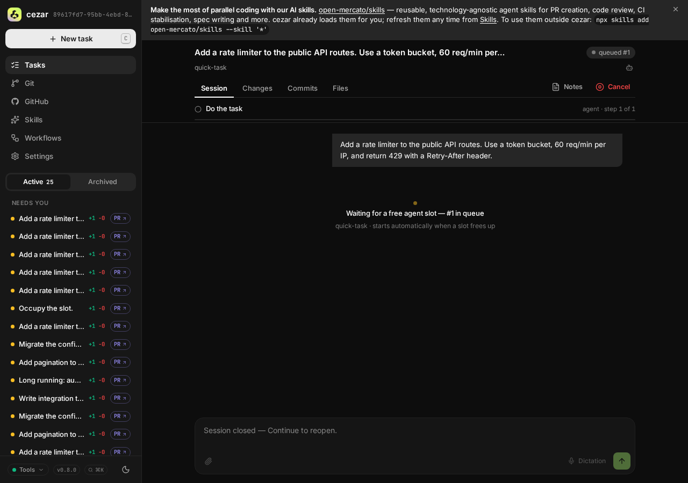
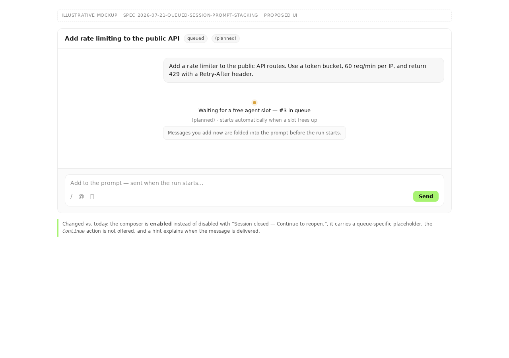
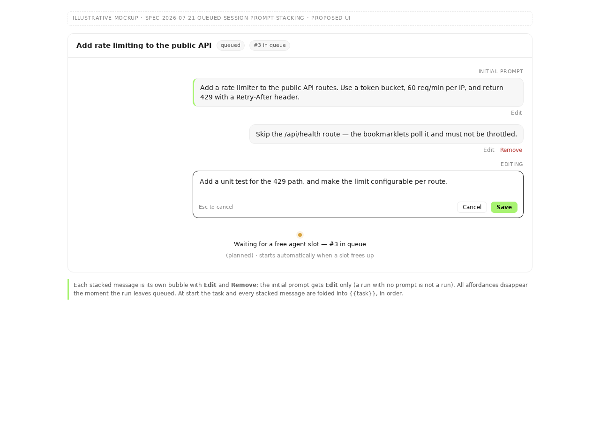

# Stack, edit and remove prompt messages on a queued run

> FR: #472 · Slug: `queued-session-prompt-stacking`

## TLDR

A run that is waiting for a free agent slot has not started: nothing has been sent to
any backend, no worktree exists, no session is open. Yet the cockpit shows the queued
run with a **disabled** composer reading *"Session closed — Continue to reopen."* — the
one moment where changing the prompt is free is the one moment the UI forbids it. This
spec makes the queued window editable: **append** extra prompt messages onto the run,
**edit** or **remove** the ones already stacked, and **edit the initial prompt itself**,
all until the scheduler picks the run up. At start, the stack is folded into `{{task}}`,
so every step of the chain sees the amended prompt.

## Problem Statement

`pump()` (`src/workflows/run.ts:389-426`) admits at most `maxParallel` runs (default 2);
everything else sits in a FIFO `queue` (`run.ts:232`) as `status: 'queued'`. On a busy
cockpit a run can sit there for many minutes — the issue's screenshot shows *#3 in
queue*.

During that window the user has exactly one lever: cancel the run and retype the whole
task. The composer is gated by

```ts
const sessionOpen = run.status === 'running' || run.status === 'waiting'   // task-thread.tsx:136
```

so a `queued` run falls into the closed branch and gets `disabled` plus the
`"Session closed — Continue to reopen."` placeholder (`task-thread.tsx:233-246`,
`composer.tsx:114,460`). The message is also *wrong* on its own terms: the session is
not closed, it was never opened, and "Continue" does not apply to a run that has not
run. Server-side the same wall exists — `POST /api/runs/:id/messages` answers `409
session closed` (`server.ts:870`) because `manager.sendMessage` bails on the absent
`ActiveRun` (`run.ts:654`).

Meanwhile the thing the user wants to change is sitting in plain JSON: `run.task` in
`runs.json`, already rendered as the thread's first bubble
(`buildThreadRows`, `task-thread.tsx:101-102`).

Evidence it matters: this is exactly what people do with a queued job in every
comparable tool (see Research), and the workaround — cancel and re-file — loses the
run's queue position, its id, its inbox linkage and any PR/issue chips already
extracted by `refineTaskRefs` (`run.ts:348-354`).

## Proposed Solution

Give a queued run a **persisted prompt stack**:

```
effective task  =  run.task  +  run.queuedMessages[]      (in order, blank-line joined)
```

- `run.task` stays what it is today — the initial prompt, now editable while queued.
- `queuedMessages` is a new **optional** array on `RunRecord`; each entry is
  `{ id, text, images?, createdAt }`. Append / edit / remove act on it.
- The composer is **enabled** for `status === 'queued'`, with its own placeholder and a
  hint that the message will be delivered when the run starts.
- At the moment `pump()` dequeues the run, the engine **rehydrates the job input from
  the store** and folds the stack into `input.task` (and `input.images`).

### Why fold into `{{task}}` rather than send follow-up turns

The rejected alternative was to start the run normally and then push each stacked
message as a separate `session.sendMessage` after the opening turn. It loses on three
counts:

1. **Chains.** `{{task}}` is substituted from the same `input.task` on every pass of
   the step loop (`applyTemplate`, called at `run.ts:1299`, defined at `:1791`). A
   follow-up turn reaches only the *first* step's session; steps 2..n of a workflow
   would run against the un-amended task.
2. **Races.** "Right after the opening turn" has no defined point — the agent may
   already be editing files by then. Folding happens before the backend is spawned, so
   the amendment is deterministic.
3. **Intent.** The issue asks to *"extend or fix the prompt before the session starts"*
   — that is prompt authoring, not conversation.

### Why rehydrate at dequeue rather than dual-write

A queued run's prompt lives in two places: `RunRecord.task` (persisted, today read only
by `recover()`, `run.ts:457-470`) and `pendingJobs.get(id).input.task` (in memory —
**this is the copy that actually executes**, `run.ts:240`, `:1299`). An edit that
PATCHed only the record would silently do nothing until a restart.

Rather than dual-writing, `pump()` gains one line: rebuild `job.input` from the store
immediately before `execute()`. The record becomes the single source of truth for a
queued run's prompt, which also collapses the `recover()` rebuild path onto the same
code. One seam, one truth, and edits are honored right up to the last instant.

**Folding is read-only and therefore idempotent.** `hydrateQueuedInput` composes the
effective task into the in-memory `input` and **never writes it back to
`RunRecord.task`**; `run.task` and `queuedMessages` stay separate on disk for the life
of the run. Without that rule a restart would re-append the whole stack onto an
already-folded `task` and compound on every recovery — so it is asserted directly by a
test (Step 4).

## Architecture

| Layer | File | Change |
|---|---|---|
| State | `src/runs/store.ts:43-145` | `queuedMessages?: QueuedMessage[]` on `runRecordSchema` (optional — `BACKWARD_COMPATIBILITY.md:40`) |
| Engine | `src/workflows/run.ts` | `enqueueMessage` / `editQueuedMessage` / `removeQueuedMessage` / `editTask`; `hydrateQueuedInput()` called from `pump()` before `execute()` |
| Images | `src/workflows/run.ts:1665` | `persistImage` loses its hard `ActiveRun` dependency so a queued run can persist attachments with no session (see *Image sequencing* below) |
| API | `src/server/server.ts` | `POST /api/runs/:id/messages` appends when queued; new `PATCH`/`DELETE /api/runs/:id/queued-messages/:msgId`; `patchRunSchema` gains optional `task` |
| Client | `web/app/src/api/{types,client,queries}.ts` | mirrored types + hooks (house convention: hand-mirrored, `api-types.test.ts` guards them) |
| Cockpit | `web/app/src/routes/task-thread/task-thread.tsx` | queued branch for the composer; stacked bubbles with edit/remove; editable initial bubble |

Nothing else moves. No new file-format, no migration, no config key — consistent with
*Zero config* (`AGENTS.md`): the feature is discovered from the run's own status.

### Image sequencing without a session

`persistImage` uses its `ActiveRun` for exactly one thing — `state.imageSeq`, the
counter behind `pasted-<n>.png` (`run.ts:1679-1680`; `imageSeq` has no other reader in
the repo). A queued run has no `ActiveRun`, so the counter moves to a
`queuedImageSeq: Map<runId, number>` on the manager, seeded on first use from the
highest numeric suffix already present in `<id>-images/` — **not** from the file count,
because `screenshot-*` and `pasted-*` share one numbering space today and a count would
re-issue a live number after any deletion.

Two concurrent pastes cannot collide: `persistImage`'s body is fully synchronous
(`mkdirSync` + `writeFileSync`), so Node's single thread cannot interleave two calls
between the read of the counter and the write of the file. The seeding read is
belt-and-braces for the *restart* case, where the in-memory map is empty but files
exist. The write additionally uses an exclusive-create flag and retries with the next
suffix, so a stale seed degrades to a renamed file rather than a silent overwrite.

### Ordering & the scheduler

The stack does **not** touch queue position. `queuePosition` stays a `createdAt`
re-derivation (`run-actions.ts:127-133`) and `pump()` keeps its FIFO. Editing a prompt
must never let a run jump the queue — that would make the displayed position a lie
(the known divergence between `queue[]` and the `createdAt` ordering is out of scope
here and untouched).

## Data Model

```ts
/** One prompt message stacked onto a run while it waits for a slot (#472).
 *  Folded into `{{task}}` at dequeue; never delivered as its own turn. */
const queuedMessageSchema = z.object({
  id: z.string(),
  text: z.string(),
  /** `/api/runs/:id/images/…` URLs — the base64 never enters `runs.json`. */
  images: z.array(z.string()).optional(),
  createdAt: z.string(),
})

// on runRecordSchema:
queuedMessages: z.array(queuedMessageSchema).optional(),
```

Bounds (enforced at the route, mirroring `messageSchema`, `server.ts:307-324`):

| Bound | Value | Why |
|---|---|---|
| text per message | ≤ 100 000 chars | same as the live-session message bound |
| images per message | ≤ 4 | same as `messageSchema` |
| messages per run | ≤ 20 | keeps `runs.json` (an index, not a log) small |
| images across the stack | ≤ 8 | bounds the opening message the backend receives |
| **folded task total** | **≤ 200 000 chars** | the bound that actually matters — see below |

The per-message bounds alone would permit a ~2 M-character `{{task}}`. So the composed
result is bounded too: an append or edit that would push `run.task` + the stack past
**200 000 characters** is rejected with `400 { error: 'prompt too long — 200000
character limit across the task and its queued messages' }`, reporting the current
total. The check runs against the *prospective* composition, so the user is stopped
before the state is written rather than at dequeue, where there would be no one to tell.
`hydrateQueuedInput` never truncates: a run that somehow exceeds the bound (a
hand-edited `runs.json`) starts anyway and emits a `note` event — degrade, never fail
the boot.

Initial-prompt images (`taskImages`, already bounded at 4 by `startRunSchema`) are
**not** counted against the ≤ 8 stack bound and are not editable in v1 — see Future work.

**Redaction.** `text` is the user's own prompt and is replayed into `{{task}}`, so like
`task` it is deliberately **not** scrubbed — scrubbing it would corrupt the run
(`store.ts:326-331` states the same rule for `task`). It is therefore never added to
`redactPatch`'s field list. Attached images are written to the existing
`.ai/cezar/runs/<id>-images/` directory with the `pasted` prefix, exactly like
live-session attachments (#357), and are removed with the run — no new cleanup path,
no new `.gitignore` entry.

## API Contracts

All additive (`BACKWARD_COMPATIBILITY.md:34` — additive routes and response fields are
always allowed). Every mutating route `safeParse`s and returns `{ error }` with
400/404/409, per `AGENTS.md`.

### `POST /api/runs/:id/messages` — behavior extended, shape unchanged

Body is today's `messageSchema`. The route now branches on the *engine's* answer, not
on a status read in the handler — the handler cannot observe the dequeue safely, the
engine can:

```
manager.sendMessage(id, content)        // live session   → { delivered: true }
  ↓ false
manager.enqueueMessage(id, content)     // still queued   → { queued: true, message }
  ↓ false
manager.deferMessage(id, content)       // starting up    → { deferred: true }
  ↓ false
409 { error: 'session closed' }         // every other status — unchanged
```

Existing clients keep working: a `running`/`waiting` run answers exactly as before, and
a non-queued closed run still 409s. `queued`/`deferred` are additive response fields.

**Why the third rung exists.** There are two distinct pre-session states, and only the
first is `queued`:

1. **In the queue** — `pendingJobs` holds the job. `enqueueMessage` appends to the
   stack; the message will be *folded into the prompt*.
2. **Starting** — `pump()` has dequeued the run, `hydrateQueuedInput` has already
   folded, `execute()` is spawning the backend, and `state.session` is not open yet
   (`run.ts:399-426` → `execute`). This is asynchronous and can span seconds.

Without rung 3, a message submitted during (2) would 409 — a real dropped message, and
precisely the failure this feature exists to prevent. `deferMessage` buffers it in
memory on the `ActiveRun` and the engine flushes it via the normal `session.sendMessage`
path the instant the session opens, so it arrives as an ordinary follow-up turn. That is
the correct semantics *here*: the run has started, so the interaction is a conversation
rather than prompt authoring, and the chain/race objections that ruled follow-up turns
out for the queued case no longer apply.

The buffer is in-memory only and is dropped if the run fails to start — the message is
reported back to the user as `deferred`, and a run that never opens a session surfaces
its own failure through the existing error path.

### `PATCH /api/runs/:id/queued-messages/:msgId`

`{ text?: string (≤100 000), images?: ImageInput[] (≤4) }` — at least one of text/images
non-empty, same refinement as `messageSchema`. → `200 { message }` · `404` unknown run
or msgId · `409 { error: 'run already started' }`.

### `DELETE /api/runs/:id/queued-messages/:msgId`

→ `200 { removed: true }` · `404` · `409 { error: 'run already started' }`.

### `PATCH /api/runs/:id` — gains optional `task`

```ts
const patchRunSchema = z.object({
  title: z.string().trim().min(1).max(300).optional(),
  task: z.string().trim().min(1).max(100_000).optional(),   // queued runs only
})
```

`task` is rejected with `409 { error: 'run already started' }` unless
`status === 'queued'`. `title` keeps working on any status (no regression to #389).

Side effects of a `task` edit, in the engine (not the route):
- re-derive the heuristic `title` via `makeRunTitle` **unless the user has edited the
  title by hand** (`titleSummary` set by a prior PATCH wins — edits always win, #389);
- re-run `refineTaskRefs` so PR/issue chips follow the new prompt (`run.ts:348-354`) —
  a pure local regex refinement over the prompt string, no network, no rate limit, so
  it cannot fail the edit;
- do **not** re-run the LLM `autoNameRun` — it already fired at creation and a second
  model call per keystroke-batch is unjustified cost.

### SSE

**No new SSE event name** — renaming or adding to that set is the breaking axis
(`BACKWARD_COMPATIBILITY.md` §2). Every mutation goes through `store.updateRun` →
`touch` → the existing `run` event, so the cockpit's global stream and the TanStack
cache patch pick it up for free (`AGENTS.md` web-UI rules). The degrade paths above emit
`note`, which is an existing v1 run-event `type` carried by the existing `run-event`
stream — no new name, no new consumer.

## UI/UX

Only what is unique to this feature; standard composer behavior is inherited.

| | |
|---|---|
| **Today** — the queued thread, composer disabled |  |
| **Proposed** — composer enabled with a queue-specific placeholder and hint |  |
| **Proposed** — stacked messages with edit / remove, one mid-edit |  |

The mockups are static illustrative HTML in `assets/queued-session-prompt-stacking/`
(no app code, no build step) — layout and flow only, not pixel-perfect design.

**Composer, `status === 'queued'`** — enabled, with:

- placeholder: `Add to the prompt — sent when the run starts…`
- a `data-slot="queued-hint"` line under the queued placeholder:
  `Messages you add now are folded into the prompt before the run starts.`
- the engine pills (`<ContinueAction>`) are **not** rendered — Continue is
  meaningless for a run that has not run.

The existing `"Session closed — Continue to reopen."` copy stays exactly as-is for
`review` / `done` / `failed` / `cancelled`. (`composer.e2e.ts:242` asserts that string
against a run already driven to `done`, so it is unaffected — confirmed, not assumed.)

> **Superseded for the closed statuses.** A later change (the closed-composer prompt,
> below in *Resolved assumptions* Q3) made the composer authorable on a closed run that
> HAS a resumable session too, so that copy now survives only on a closed run with no
> session to resume — where it reads `"Session closed — no session to resume."`. The
> `queued` branch described here is unchanged.

**Thread rows** — `buildThreadRows` (`task-thread.tsx:97-124`) already renders the
initial prompt from the record rather than an event; stacked messages extend the same
pattern:

```
[task bubble]            ← run.task            · edit (queued only)
[stacked bubble ×N]      ← run.queuedMessages  · edit + remove (queued only)
[QueuedPlaceholder]      ← "Waiting for a free agent slot — #3 in queue"
```

Edit is inline on the bubble (textarea + Save/Cancel); remove is a destructive icon
button with no confirm dialog — the action is cheap to redo and the run has not
started. The initial prompt is **editable but not removable**: a run with no prompt is
not a run.

Once the run leaves `queued`, the affordances disappear on the next `run` SSE frame and
the bubbles render read-only — the stack has become history.

**No duplication after start.** The engine writes *no* `user-message` event for the
opening message — the record IS that message, which is why `buildThreadRows` renders it
from `run.task` in the first place (the comment at `task-thread.tsx:99-101` states this
explicitly). So the folded prompt that goes to the backend never comes back as an event,
and the thread keeps showing exactly one bubble per authored message: the task, then
each stacked message. `hydrateQueuedInput`'s read-only rule (above) is what keeps those
bubbles matching what was actually sent.

Accessibility: edit/remove are real buttons with `aria-label`s, reachable by keyboard;
the inline editor traps nothing and Escape cancels. Keyboard access and light/dark
theming are mandatory per `AGENTS.md`.

## Edge Cases & Failure Scenarios

| Scenario | Behavior |
|---|---|
| **Dequeue race** — the user submits at the instant `pump()` starts the run | The three-rung ladder covers all three states (queued → fold, starting → defer, open → deliver). `hydrateQueuedInput` and `execute()`'s spawn are entered in the same synchronous tick as the `pendingJobs.delete`, so no handler can observe a half-dequeued run. No window where a message is silently dropped. |
| Edit/remove arrives after start | `409 run already started`; the cockpit refetches and re-renders read-only. Text already in flight is *not* auto-converted into a live message — silently turning an *edit* into a *new turn* would put words in the agent's context the user never approved. The error names the transition so the user can resend deliberately. |
| **Concurrent editors** — two cockpit tabs, or cockpit + `curl` | Last-write-wins, no ETag or version precondition. Deliberate: cezar is a single-user local cockpit bound to `127.0.0.1`, both writers are the same person, and every write fans out over SSE within a frame so the losing tab re-renders the winning state immediately. Optimistic concurrency here would be a knob without a demonstrated need. |
| Run cancelled while queued | `cancel()` (`run.ts:623-639`) splices the queue and drops `pendingJobs`; `queuedMessages` stays on the record as history and is deleted with the run. No orphan cleanup. |
| Stacked message removed or its images replaced by an edit | The orphaned files under `<id>-images/` are deleted best-effort at the same time (tolerate failure — a leftover file is harmless and is removed with the run anyway). Never delete a file still referenced by another entry or by `taskImages`. |
| Variant group created from a queued run | Variants are minted by `startVariants` at submit time (`run.ts:373-382`), before any stacking is possible, so there is nothing to copy. Each sibling then stacks independently. |
| Server restart while queued | `recover()` (`run.ts:439-524`) rebuilds `input` from the record — and now through the same `hydrateQueuedInput`, so the stack survives a restart. This is a *fix* for an existing latent gap, not new risk. |
| Image file unreadable at dequeue (user deleted `.ai/cezar/`) | Rehydration skips that image, emits a `note` event naming it, and the run starts with the text. Degrade, never fail the boot (`AGENTS.md`). |
| Old `runs.json` with no `queuedMessages` | Field is optional; `undefined` reads as an empty stack. Old cezar reading a new `runs.json` ignores the unknown key — the schema is `z.object` on a record whose loader `safeParse`s per element, so the extra key is stripped, not fatal. |
| Stack bound hit (20 messages / 8 images) | `400` with the bound named; the composer surfaces it inline. |
| `text` is whitespace only | Rejected by the same refinement as `messageSchema`. |
| Variant group (`groupId`) | Edits are **per run**. Editing variant A does not touch B/C. Called out in Future work. |

## Risks & Impact Review

- **Blast radius: small and additive.** One optional record field, one changed branch in
  a route that keeps its existing contract, two new routes, one composer gate. The only
  behavioral change to an existing path is that `POST /messages` on a *queued* run now
  succeeds instead of 409-ing — a strict widening.
- **Protected surfaces** (`BACKWARD_COMPATIBILITY.md`): §2 API lists the breaking axes —
  removing/renaming a route, making an optional body field required, removing a response
  field, changing an SSE event name — and prescribes *"additive first"*. Everything here
  is on the additive side of that line: new routes, a new optional body field, new
  response fields, no SSE name change. §3 `runs.json` — new field optional, per the
  explicit rule at `:40`. No `CEZ_*` var, so no `.env.example` change.
- **The one real hazard** is the dual-prompt hazard the current code already carries
  (`pendingJobs` vs the record). This spec removes it rather than adding to it; the
  regression to guard against is an edit that "works" in the UI but does not reach the
  agent. Step 4's test asserts the delivered `{{task}}` string end-to-end.
- **Cost/exposure**: none. No network, no new process, no new port, no model call.

### Rollback

Reversibility gets the same detail as the execute path, because the failure mode is
silent (a prompt amendment that stops reaching the agent).

| Reverted | Effect | User-visible |
|---|---|---|
| **Phase 2 only** (UI), Phase 1 live | Stacking still works over the API; the cockpit shows the queued composer as disabled again. Already-stacked messages still fold at dequeue and still render as read-only bubbles (the row builder is the reverted piece — so they render *not at all*, and the prompt the agent receives is longer than the thread shows). **Therefore: never ship or revert Phase 2 alone against a live Phase 1** — revert both, or revert Phase 1's `hydrateQueuedInput` fold with it. |
| **Phase 1 + 2** | Existing `runs.json` entries carrying `queuedMessages` are re-read by the reverted schema, which strips the unknown key on the next write. Runs parse and start on `task` alone. Amendments are lost — that is the data loss, and it is exactly what a user would expect from reverting the feature that created them. |
| The `persistImage` seq change (Step 2) | The counter returns to `ActiveRun.imageSeq`, seeded at 0 for a session. Files written under the queued numbering already exist on disk, so a reverted run could re-issue a used suffix — the exclusive-create + retry from *Image sequencing* is what makes that a renamed file rather than an overwrite, and it is the reason that guard is specified rather than assumed. |

No step requires a migration, a manual repair, or a "delete `.ai/cezar/`" instruction —
the constraint `BACKWARD_COMPATIBILITY.md` §3 names explicitly.

## Research — what comparable tools do

- **CI/CD queues (GitHub Actions, Buildkite, Jenkins)** — a queued job's *parameters*
  are frozen at submit; the only lever is cancel + re-submit. That is precisely the
  behavior this issue complains about, and it is a consequence of those systems
  distributing the job spec to workers at enqueue time. cezar's job spec never leaves
  the process until `pump()` fires, so it can do better — this is the whole opportunity.
- **Print spoolers / task managers (macOS Print Queue, `at`/`atq`)** — allow editing or
  deleting a pending job in place, and lock it the moment it starts. The status-gated
  edit window adopted here is the same model.
- **Chat agents with a send-while-busy composer (ChatGPT, Claude Code's own queued
  input, Cursor)** — they *stack* messages and flush them when the agent frees up, but
  most do not let you edit or delete a stacked message afterwards. The edit/remove
  affordance is the deliberate step past the state of the art, and it is cheap here
  because the stack is persisted state rather than an in-flight buffer.
- **Complexity skipped on purpose**: no reordering (drag-and-drop), no per-message
  scheduling, no templating of stacked messages, no cross-variant propagation. Each is
  a knob without a demonstrated need — *never trade a working default for a knob*.

## Phasing

- **Phase 1 — engine + API.** Persisted stack, rehydration at dequeue, three routes.
  Shippable alone: usable via `curl`, and it fixes the restart-consistency gap.
- **Phase 2 — cockpit.** Composer gate, stacked bubbles, inline edit/remove. Shippable
  alone on top of Phase 1; this is what closes #472 for a user.
- **Phase 3 — coverage + docs.** E2E spec, README/AGENTS touch-ups.

## Implementation Plan

### Phase 1 — engine + API

1. **`queuedMessage` schema + record field** — add `queuedMessageSchema` and the
   optional `queuedMessages` array to `src/runs/store.ts`. Confirm it is *not* added to
   `redactPatch`'s field list (comment the reason, as `task` is commented).
   *Test* (`src/runs/store.test.ts`): a `runs.json` without the field parses; a record
   with the field round-trips; a secret in `text` survives verbatim (matching `task`).

2. **`persistImage` without a session** — move the counter to `queuedImageSeq:
   Map<runId, number>`, seeded from the highest existing numeric suffix in
   `<id>-images/` (across both `screenshot-*` and `pasted-*`), and write with an
   exclusive-create flag that retries on the next suffix.
   *Test* (`src/workflows/run.test.ts`): two persists with no `ActiveRun` produce
   distinct filenames; a persist into a directory that already holds `pasted-3.png`
   yields `pasted-4.png`, not `pasted-2.png` (the count-based bug); a pre-existing file
   at the computed name causes a retry, never an overwrite.

3. **`RunManager` stack mutators** — `enqueueMessage(runId, content): QueuedMessage |
   null`, `editQueuedMessage`, `removeQueuedMessage`, `editTask`, `deferMessage`; the
   first four return `null`/`false` unless the run is still queued (checked against
   `queue`/`pendingJobs`, not against the record's status). `editTask` re-derives `title`
   (unless hand-edited) and re-runs `refineTaskRefs`. Removal deletes the entry's orphaned
   image files best-effort.
   *Test*: mutators succeed while queued and refuse once dequeued; `deferMessage` buffers
   only in the starting window; removal unlinks the entry's images and leaves images
   referenced elsewhere alone.

4. **`hydrateQueuedInput` + `pump()` wiring** — fold `run.task` + stack into
   `input.task` (blank-line joined) and re-encode stacked images into `input.images`
   (unreadable file → skipped + `note` event); call it from `pump()` before `execute()`,
   and route `recover()`'s rebuild through the same helper. Flush any `deferMessage`
   buffer when the session opens.
   *Test* (`src/workflows/run.test.ts`, `CEZ_DRY_RUN=1`): a run with a stack delivers a
   `{{task}}` containing every message in order to the mock backend; an edit applied
   after enqueue but before dequeue is the version delivered; **hydration leaves
   `RunRecord.task` byte-identical and re-hydrating the same run twice yields the same
   folded string** (the compounding-on-restart guard); a run recovered after restart
   carries its stack exactly once; a deferred message arrives as a follow-up turn after
   the opening one.

5. **Routes** — extend `POST /api/runs/:id/messages` with the `sendMessage →
   enqueueMessage → deferMessage → 409` ladder; add `PATCH`/`DELETE
   /api/runs/:id/queued-messages/:msgId` (registered before any conflicting `/:id`
   route, per `server.ts:652-654`); add optional `task` to `patchRunSchema` with the
   queued-only 409 guard; enforce the per-message and folded-total bounds.
   *Test* (`src/server/request-validation.test.ts` + a new
   `src/server/queued-messages.test.ts`): each bound rejects with 400 and a named
   reason; the folded-total bound rejects an append that individually fits; non-queued
   statuses 409; a queued POST returns `{ queued: true }`; a running run still returns
   `{ delivered: true }` (the no-regression assertion).

6. **Client types + hooks** — mirror `QueuedMessage`, the new inputs and responses in
   `web/app/src/api/types.ts`, add client methods and TanStack mutations.
   *Test*: extend `src/server/api-types.test.ts` with the new payloads so the mirror is
   asserted, not merely un-broken — a compile-time equivalence assertion per existing
   entry, plus a case that fails if a field is added server-side and not mirrored.

### Phase 2 — cockpit

7. **Composer queued branch** — in `task-thread.tsx`, split the closed-composer
   decision into `sessionOpen` / `queued` / `closed`; queued renders enabled with the
   new placeholder and hint and no `ContinueAction`.
   *Test* (`task-thread.test.tsx`): queued fixture → composer enabled, no
   `composer-disabled-action`; `done` fixture → unchanged disabled copy.

8. **Stacked bubbles** — extend `buildThreadRows` to emit a row per `queuedMessages`
   entry after the task row.
   *Test*: rows appear in order with their images; a run with no stack is byte-identical
   to today's output.

9. **Inline edit / remove** — add the affordances to `UserBubble` (rendered only when
   `run.status === 'queued'`), wired to the Phase 1 mutations; the task bubble gets edit
   only.
   *Test*: edit calls `PATCH` with the new text and optimistically re-renders; remove
   calls `DELETE`; both affordances are absent on a `running` fixture; Escape cancels an
   open editor.

### Phase 3 — coverage + docs

10. **E2E** — extend `web/app/e2e/composer.e2e.ts`: with one run occupying the only
    slot, a second run is queued → stack a message, edit it, remove it, then let it
    start and assert the delivered prompt. The harness forces the queue by writing
    `{"maxParallel": 1}` into the throwaway instance's `.ai/cezar/config.json` before
    boot (`.ai/scripts/test-env-up.sh`) — `config.json` is optional user-owned state
    with a working default, so a *test* pinning it does not make the feature
    configuration. The existing `"Session closed — Continue to reopen."` assertion at
    `composer.e2e.ts:242` needs **no change**: that fixture drives the run to `done` via
    `/finish` before asserting (`:232-246`), so it is never queued — verify it still
    passes rather than editing it.

11. **Docs** — note the queued-edit window in `AGENTS.md`'s runs-store row and add
    `queuedMessages` to `BACKWARD_COMPATIBILITY.md` §3's `runs.json` description.

Every step leaves the application working: Phase 1 steps are additive and inert until
step 4 wires them; the UI steps degrade to today's read-only thread if reverted.

## Resolved assumptions (autonomous defaults)

This spec was produced by `om-auto-write-spec` in autonomous mode. The Open Questions
raised against the skeleton were resolved with the defaults below rather than gating on
a human. Each is cheap to reverse — override any of them on the PR and the affected
step is a local change.

| # | Question | Resolved default | Rationale |
|---|---|---|---|
| Q1 | Are stacked messages folded into the opening prompt, or delivered as separate turns after it? | **Folded into `{{task}}` at dequeue** | Follow-up turns reach only the first step of a chain and race the opening turn; folding is deterministic and matches "extend the prompt". Rejected alternative documented in Proposed Solution. |
| Q2 | Is the initial prompt (`run.task`) itself editable? Removable? | **Editable, not removable** | The issue explicitly asks to "fix the prompt"; a run with no prompt is not a run. |
| Q3 | Does the enabled composer apply to any other closed status (`review`, `done`, `cancelled`)? | **`queued` only** — *later superseded, see below* | Narrowest scope that closes the issue; those statuses have a working answer already (Continue). |
| Q4 | Where does the stack live — new record field, or replayed from the NDJSON event log? | **New optional `queuedMessages` array on `RunRecord`** | Edits and deletes are mutations; the NDJSON log is append-only and must never be rewritten (`BACKWARD_COMPATIBILITY.md` §3). |
| Q5 | New routes, or overload `POST /api/runs/:id/messages`? | **Both — overload POST, add PATCH/DELETE for edit/remove** | The overload keeps one submit path in the composer; edit/remove need addressable ids, so they get their own routes. All additive. |
| Q6 | Do edits propagate across a variant group (`groupId`)? | **No — per run** | Variants exist to diverge; silent cross-writes would be surprising. Listed as future work. |
| Q7 | Should an edited task re-derive the run title / re-run the LLM namer? | **Re-derive the heuristic title (unless hand-edited) + refs; do not re-run the namer** | Keeps the title honest at zero model cost; hand edits keep winning, per #389. |
| Q8 | Does this brief bundle more than one independently deployable capability (split required)? | **No split** — see the note below | Append, edit and remove are one capability over one new piece of state; separating them would ship a stack the user cannot correct. |
| Q9 | What happens to a message submitted in the gap between dequeue and session-open? | **Buffered in memory and flushed as a follow-up turn when the session opens** (`deferMessage`) | The alternative — 409 — is a genuinely dropped message in the exact feature meant to stop dropping them. Follow-up semantics are correct once the run has started. |
| Q10 | Do the mutations need optimistic concurrency (ETag / version)? | **No — last-write-wins** | Single-user cockpit on `127.0.0.1`; both writers are the same person and SSE re-syncs the losing view within a frame. |

**On the split test, applied to the one part that could survive alone.** Editing
`run.task` (`PATCH /api/runs/:id`) is the piece that *would* function with zero
`queuedMessages` support — it has its own route, its own schema field and its own side
effects, so the split test does not dismiss it automatically. It stays in this spec
because the issue asks for both in one breath (*"to extend or fix the prompt"*), because
both are gated by the identical `status === 'queued'` window and rely on the identical
`hydrateQueuedInput` seam, and because shipping either alone leaves an obviously
half-open door: a user who can append but not fix a typo in the original, or vice versa,
will file the other half as a bug. One capability — *amend a queued run's prompt* —
expressed over two fields.

None of these assumptions is high-stakes: no protected surface is broken, no data is
migrated, and every one of them is a reversible design choice rather than a commitment.

### Q3 superseded — the closed composer also takes a prompt

Q3 scoped the enabled composer to `queued` on the grounds that the closed statuses "have a
working answer already (Continue)". They did not, quite: Continue was a bare button beside a
**disabled** textarea, so "reopen it and tell it what to do next" meant continuing blind and
then typing once the session came back — and `POST /continue` had accepted a `text` prompt
since spec 003. The composer was the only thing not offering it.

So the closed-but-resumable case now works like `queued`: the composer stays enabled, and its
send button IS Continue.

- placeholder: `Continue — add a prompt, or send to just reopen the session…`
- gated on `runActionFlags(run).continueRun` — a session to resume, exactly the gate the
  header's Continue button already used. A closed run with **no** session keeps a disabled
  composer, now reading `"Session closed — no session to resume."` (the old copy offered a
  Continue that run could not perform).
- an empty draft still posts no `text`, so one-click Continue is byte-identical to before.
- `<ContinueAction>` became the `useContinueAction` hook: the runner/model pills moved into
  the enabled footer (`footerEnd`), so the typed prompt and the picked engine reach
  `POST /continue` in ONE request. Its own ▶ button is gone — the composer's send replaces
  it; the header keeps a labelled one for the one-click path.
- `POST /continue` gained `images` (≤ 4, same bound and shape as `messageSchema`). Without
  it the newly-enabled paperclip would have silently dropped pasted screenshots. They are
  persisted as `pasted-<n>` like every other attachment, ride the `user-message` event so the
  bubble renders them, and reach the reopened session both inline and as absolute paths.

Still additive on every protected surface: one new optional body field, no new route, no SSE
name, no record field.

## Future work (explicitly out of scope)

- **Editing the initial prompt's images.** `PATCH /api/runs/:id` takes `task` text only,
  so a wrong screenshot on the original prompt still cannot be corrected — the user's
  workaround is to remove nothing and stack a message carrying the right image. Worth
  revisiting if it is reported; it needs `taskImages` mutation plus its own orphan
  cleanup, which is a second helping of Step 3 for a case nobody has hit yet.
- Reordering stacked messages (drag-and-drop).
- Propagating an edit across a variant group.
- Reconciling the displayed `createdAt`-derived queue position with the engine's real
  `queue[]` order — a pre-existing divergence this spec deliberately does not disturb.
- Editing a queued run's model/runner/workflow — a different capability with a
  different blast radius.
