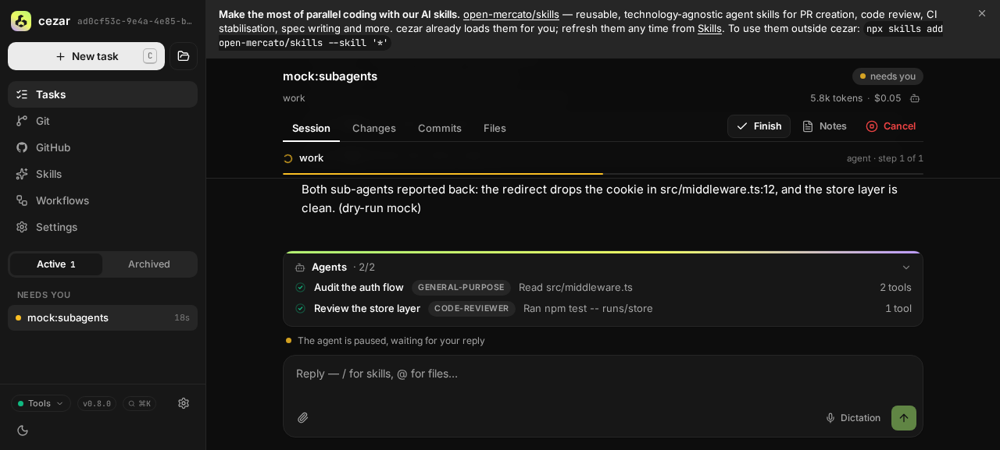
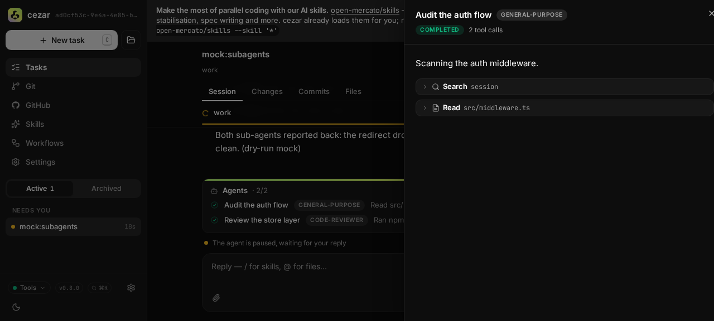
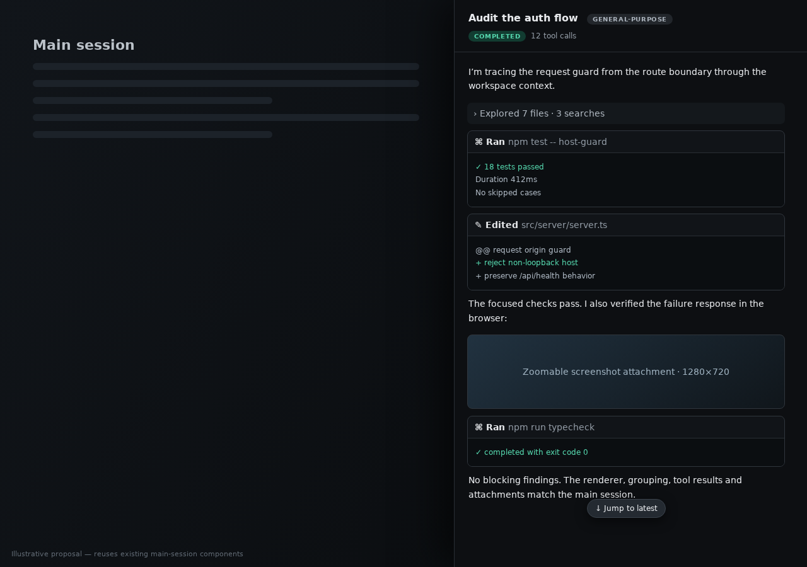

# Shared session renderer for main and agent transcripts

> FR: #557 · Slug: `shared-session-renderer`

## TLDR

Replace the task thread's split rendering paths with one reusable session-transcript renderer used by both the main session and the sub-agent sheet. The shared boundary owns entry dispatch, tool grouping and results, image attachments, card state, long-session scaling, and follow-tail scrolling; each surface supplies only its transcript sections and surrounding chrome. It consumes the existing normalized `UiEvent` reducer output, so Claude, Codex, and OpenCode receive identical behavior without backend branches in React.

## Resolved assumptions (autonomous defaults)

This spec was produced by an autonomous `om-auto-write-spec` run. The questions below were resolved with conservative, reversible defaults; reviewers can override them before implementation.

| # | Question | Applied default | Why |
|---|---|---|---|
| Q1 | Should the reusable boundary own only entry dispatch, or the complete transcript viewport? | **Own the complete transcript pipeline:** section-to-row grouping, entry rendering, card cache, scaling, follow-tail, jump affordance, and scrollbar | Extracting only the switch statement preserves the current drift in grouping and scrolling; the issue explicitly asks to maintain the session renderer in one place |
| Q2 | Which entry kinds should the agent drill-down support? | **Every `ThreadEntry` kind supported by the main session**, including images and `ask` cards when attributed in the future | Capability-based degradation is the repository contract; silently dropping a normalized kind creates another backend/surface fork |
| Q3 | Should the main thread and sheet share scroll position? | **No. Share the scroll implementation, but namespace independent positions by surface and run/agent id** | A reader can inspect an old agent entry without moving the main transcript; independent state is reversible and matches current behavior |
| Q4 | Is a new protocol, API, or persistence surface needed? | **No.** Reuse `ThreadState`, `ThreadEntry`, `groupThreadItems`, and the existing `UiEvent` vocabulary | The defect is presentation duplication; backend mappers already provide normalized tools, results, images, and parent attribution where available |
| Q5 | Should nested-agent navigation be redesigned? | **No. Keep the current one-level sheet and render deeper attributed task items as ordinary shared tool cards** | Multi-level navigation is independently deployable and not required to fix renderer parity |
| Q6 | One spec or two? | **One cohesive spec**, phased as extraction first and sheet migration second | The extraction is useful only when both consumers migrate, while phases keep every commit working |

## Problem Statement

Issue #557 shows a completed agent sheet with many placeholder-like tool rows, interleaved assistant prose, no useful tool-result presentation, and no visible vertical scrollbar. This is architectural drift, not an isolated CSS defect.

The main session and sub-agent sheet currently consume the same reducer vocabulary through different rendering pipelines:

- `task-thread.tsx` builds top-level rows with `buildThreadRows`, applies `groupThreadItems`, dispatches `ThreadBlock` variants, wraps rows in `ThreadCardCache`, switches between flat and virtual rendering, and uses `useThreadScroll` plus `JumpToLatestPill`.
- `subagent-sheet.tsx` maps raw children directly through `NestedEntry` inside its own `SubagentStream`, implements a second follow-tail calculation, and owns separate overflow CSS.
- `NestedEntry` in `thread-items.tsx` is intentionally a restricted one-level child renderer. It does not apply top-level context grouping or tool streaks, drops `ask`, and has become an accidental second session renderer.

This split means fixes to tool grouping, output expansion, attachment display, entry kinds, virtualization thresholds, scroll sticking, or accessibility can land in the main session without reaching the agent pane. The issue asks for the opposite invariant: session rendering is maintained once and reused everywhere.

### Existing contracts to preserve

- `AGENT_PROTOCOL.md` requires backend-neutral rendering over normalized v2 `UiEvent`s and capability-level degradation rather than React branches on `claude`, `codex`, or `opencode`.
- `thread-state.ts` remains the one reducer from replay/live wire events to `ThreadState` and `ThreadEntry`.
- `groupThreadItems` remains the canonical presentation grouping for context tools, tool streaks, and parent/child task cards.
- `ToolCard`, `AssistantMessage`, `ReasoningItem`, `ImageItem`, `AskCard`, and `UserBubble` remain the visual primitives; this work composes them rather than redesigning them.
- Open-card state stays session-scoped and non-persistent. Scroll state remains view-scoped and in memory.

## Goals and Non-goals

### Goals

- One exported transcript component renders both main and agent sessions.
- Tool calls, outputs/errors/diffs, context groups, nested work, assistant/reasoning text, lifecycle notes, asks, and image attachments have the same behavior in both surfaces.
- Both surfaces use the same long-transcript strategy and follow-tail rules, including an operable visible scrollbar and jump-to-latest affordance.
- Claude, Codex, and OpenCode fixtures prove equivalent component behavior from their normalized output.
- Future entry types create one exhaustive TypeScript failure point rather than multiple drifting switches.

### Non-goals

- No mapper, runner, `UiEvent`, SSE, API, NDJSON, or `RunRecord` change.
- No new backend-specific presentation.
- No redesign of the Agents dock, sheet header, main run header, composer, plan dock, review panel, or footer.
- No cross-run sub-agent route, deep link, new nested-agent navigation model, or persisted scroll position.
- No visual redesign of tool cards; the issue's visual symptoms are repaired through reuse.

## Research and Precedent

The durable pattern across coding-agent interfaces is a session composed from typed, ordered content rather than a backend-shaped transcript:

- Claude's streaming JSON exposes a structured message stream, and Anthropic's tool-use contract pairs a stable tool-use id with a following result whose content may contain text or images. A renderer therefore needs one lifecycle-aware tool surface rather than prose-only rows. Sources: [Claude Code CLI reference](https://docs.anthropic.com/en/docs/claude-code/cli-usage), [Anthropic tool-use implementation](https://docs.anthropic.com/en/docs/agents-and-tools/tool-use/implement-tool-use).
- OpenCode models sub-agents as child sessions and provides parent/child session navigation. That supports keeping the agent pane as a focused view over the same session vocabulary, not inventing a reduced presentation language for it. Source: [OpenCode agents documentation](https://opencode.ai/docs/agents/).
- Cezar's strongest precedent is internal: `AGENT_PROTOCOL.md` already normalizes all three backends into one `UiEvent`/`UiItem` model, while the grouped-subagent spec (`2026-07-20-grouped-subagent-display.md`) requires the sheet to reuse existing thread renderers. This spec completes that boundary at the transcript level rather than at one nested entry.

Complexity deliberately skipped: terminal-grade arbitrary-depth session navigation, server-side transcript projection, and backend-authored HTML. None is needed for a local cockpit rendering normalized items.

## Proposed Solution

Create a `SessionTranscript` component that receives presentation-ready transcript sections, owns the entire reusable rendering pipeline, and exposes small layout options for the main page versus a bounded sheet. Migrate both consumers to it, then delete `NestedEntry`, `SubagentStream`, `buildThreadRows`, `ThreadBlockView`, and `ThreadEntryView` as independent render paths.

The important boundary is:

```text
UiEvent replay/live stream
        │
        ▼
reduceThread (unchanged, backend-neutral)
        │
        ├── main adapter: initial task + all turns
        └── agent adapter: attributed children as one section
                         │
                         ▼
             SessionTranscript (one renderer)
        grouping · tools/results · attachments · cards
        virtualization · follow-tail · scrollbar · jump pill
                         │
             ┌───────────┴───────────┐
             ▼                       ▼
      main task body           sub-agent sheet body
```

## Architecture

### 1. Transcript input model

Add `web/app/src/routes/task-thread/session-transcript.tsx` with a small view model that preserves grouping scopes without importing `ApiRun` or backend identity:

```ts
export interface TranscriptSection {
  id: string
  userMessage?: {
    text: string
    imageCount?: number
    images?: readonly string[]
  }
  entries: readonly ThreadEntry[]
}

export interface SessionTranscriptProps {
  runId: string
  viewId: string
  sections: readonly TranscriptSection[]
  mode: 'document' | 'panel'
  empty?: ReactNode
}
```

`viewId` is a stable, validated in-process namespace such as `main` or `agent:${agent.id}`. It separates scroll and virtualizer state without changing persisted data. `runId` namespaces the existing card cache and enables `AskCard` replies. Neither field selects a backend.

Pure adapters live beside the component and are unit-tested:

```ts
mainTranscriptSections(run: ApiRun, thread: ThreadState): TranscriptSection[]
agentTranscriptSections(agentId: string, entries: readonly ThreadEntry[]): TranscriptSection[]
buildTranscriptRows(sections: readonly TranscriptSection[], runId: string): ThreadRow[]
```

The main adapter represents `run.task` as the first section's `userMessage`, including `taskImages`, then maps every `ThreadTurn`. The agent adapter creates one section from `subagentChildren`; it does not pre-render or filter entry kinds.

### 2. One exhaustive entry renderer

`SessionTranscript` owns one module-private exhaustive dispatcher for every `ThreadEntry` and one dispatcher for every `ThreadBlock`. It applies `groupThreadItems(section.entries)` for both main and agent sections.

- `message`: assistant → `AssistantMessage`; user → `UserBubble`.
- `reasoning`: `ReasoningItem`.
- `tool`: `ToolCard`, including output, error, diffs, exit code, and grouped children.
- `note`: `NoteLine`.
- `image`: `ImageItem`/`ZoomableImage`.
- `ask`: `AskCard` with the same `runId` for the currently supported top-level case. The exhaustive dispatcher prevents silent loss if attribution changes later, but functional nested-ask routing is not promised by this spec.
- `context-group` and `streak`: the same `ContextGroup` and `ToolStreak` recursion used by the main session today.

The switch must be exhaustive (`assertNever` or a `satisfies` map). Adding a future `ThreadEntry` or `ThreadBlock` kind fails typecheck in this one module. `thread-items.tsx` keeps only the leaf visual primitives and removes `NestedEntry`.

For a task card's `nested` children, `ToolCard` must call the same shared row/block renderer rather than `NestedEntry`. Avoid a circular import by moving the recursive block renderer into `session-transcript-renderers.tsx` or by passing a `renderNested(entries, scope)` callback from `SessionTranscript` into `ToolCard`. Prefer the callback: `thread-items.tsx` remains a leaf module, while the session renderer remains the sole orchestration owner.

### 3. Shared grouping semantics

The agent sheet currently bypasses `groupThreadItems`; after migration it receives the same:

- consecutive completed read/search calls collapse into `ContextGroup`;
- older tool streaks fold consistently;
- task items group attributed children by `parentItemId`;
- stream order and stable keys remain section-scoped;
- tool outputs and failures use the canonical `ToolCard` body instead of placeholder-like rows.

The grouping function stays pure and unchanged unless tests reveal an assumption that only holds for full turns. Any required generalization must be phrased in terms of `ThreadEntry[]`, not a surface or backend.

### 4. Shared viewport and scrolling

Extract the reusable mechanics from `thread-scroller.tsx`/`thread-scroll.ts` into a surface-neutral `TranscriptViewport` used internally by `SessionTranscript`.

Both modes share:

- the same `isNearBottom` threshold;
- follow-tail while stuck and no forced movement after the reader scrolls upward;
- `JumpToLatestPill` when detached;
- flat rendering below the existing threshold and `virtua` above it;
- row measurement and stable keys;
- keyboard and resize resticking hooks where the containing surface can resize;
- an actual scroll container with `min-h-0 overflow-y-auto` and `scrollbar-gutter: stable` (Tailwind arbitrary property is acceptable) so the vertical scrollbar does not disappear when content exceeds the panel.

The modes differ only in layout ownership:

- `document`: fills the main route's available body and cooperates with the sticky dock; preserves current max width and spacing.
- `panel`: fills `SheetContent` below its fixed header (`flex min-h-0 flex-1`) and owns the bounded vertical overflow.

Scroll stores key by `${runId}:${viewId}`. The main transcript and an open agent sheet never mutate one another's position. The sheet closes without destroying the main scroll cache; reopening an agent may restore that agent view for the current browser session, but no state is persisted.

The sheet's bespoke content-length `signature`, `stuck` ref, `onScroll` math, and overflow container are deleted. This makes scrollbar and streaming fixes land once.

### 5. Surface composition

`TaskThreadRoute` and `ThreadView` retain data loading, headers, docks, review state, composer, and sub-agent selection. The body changes from a locally built `ThreadRows` tree to:

```tsx
<SessionTranscript
  runId={run.id}
  viewId="main"
  sections={mainTranscriptSections(run, thread)}
  mode="document"
  empty={<MainThreadEmptyState run={run} />}
/>
```

`SubagentSheet` retains its `Sheet`, title, agent type/status/tool count, close behavior, and empty copy. Its body becomes:

```tsx
<SessionTranscript
  runId={runId}
  viewId={`agent:${agent.id}`}
  sections={agentTranscriptSections(agent.id, entries)}
  mode="panel"
  empty={<SubagentEmpty />}
/>
```

`SubagentSheet` therefore gains `runId`; no network or store dependency is introduced. The two surfaces may style outer padding via the mode, but neither maps entries itself.

### 6. Backend parity

No React component inspects `run.runner`, `UiBackend`, a tool's raw backend name, or transport payload. The renderer sees only normalized fields.

| Capability | Claude | Codex | OpenCode | Shared-renderer behavior |
|---|---|---|---|---|
| Tool lifecycle/results | `tool_use` + `tool_result` | typed app-server items and updates | tool parts and states | `ToolCard` shows status/output/error using normalized snapshots |
| Live command output | unavailable from current Claude stream | output deltas | running metadata/output where present | live tail when `output` grows; completed output otherwise |
| Diffs | Edit normalization | `fileChange` | patch parts | one `InlineDiffPreview` path |
| Images/attachments | tool-result images normalized to image events | image event when mapper emits one | image event when mapper emits one | one `ImageItem` path; missing capability degrades to no image, not a broken backend UI |
| Sub-agent children | `parent_tool_use_id` | no wire parent attribution today | child-session parts | attributed entries render in sheet; Codex honestly retains the existing empty-state until its mapper gains attribution |
| Reasoning/messages | normalized items | normalized items | normalized parts | same Markdown/reasoning components |

Codex's lack of child attribution is not repaired in React. The existing Codex review row and empty state remain honest; when Codex provides parent attribution, only its mapper/fixture changes and this renderer begins displaying it automatically. OpenCode child sessions and Claude task children take the same component path.

## Data Model

No persisted model changes. `TranscriptSection` and renderer props are in-memory view types only.

No migration, optional config key, state file, or environment variable is introduced. `.env.example` is untouched.

## API Contracts

None. Existing run fetch and SSE replay/live contracts are unchanged. The protected `ui-event` event name, `UiEvent` discriminators, `ThreadState`, and NDJSON snapshots do not change.

## UI/UX

### Main session

- Visually unchanged: same message widths, tool cards, grouping, max-width, footer/review panel placement, sticky docks, virtualization threshold, and jump pill.
- This is the compatibility baseline for the extracted renderer. Main-session screenshot tests must show no intentional pixel/layout change.

### Agent sheet

- Header remains fixed and unchanged.
- Body uses the same transcript spacing and cards as the main session, constrained to sheet width.
- Tool results expand/collapse identically, including long-output fade and “Show all N lines.”
- Consecutive context calls and old tool streaks group identically.
- Agent-produced screenshots and image attachments render as zoomable images rather than being omitted.
- The body displays a normal vertical scrollbar whenever content overflows; reserve gutter space to avoid content width jumping.
- Streaming follows the tail until the reader scrolls up; the shared jump-to-latest pill appears inside the panel when detached.
- The empty state remains “No attributed output — see the thread card for this agent's result.”

### Accessibility and responsiveness

- Keep Radix Sheet focus trap, accessible title/description, Escape/overlay close, and mobile full width.
- The transcript scroll region is keyboard-scrollable and has an accessible label such as `aria-label="Agent transcript"` or `"Session transcript"`.
- Tool card triggers, status words, image alt text, and Ask cards retain their existing semantics.
- Scrollbars are not hidden with vendor pseudo-elements; system high-contrast and platform scrollbar preferences win.
- On mobile, `min-h-0` propagates from `SheetContent` through header/body so the transcript scrolls inside the viewport rather than extending beneath the close affordance.

### Visual evidence plan

Capture and attach:

1. Current main session showing canonical grouped tools/results and an attachment.
2. Current agent sheet reproducing the issue's long transcript and missing/weak result presentation.
3. Proposed agent sheet using the canonical grouped cards, visible scrollbar, attachment, and jump-to-latest pill.

The proposed mockup is illustrative; implementation styling comes from the existing main renderer, not the mockup.

Current main-session baseline:



Current sub-agent sheet:



Illustrative shared-renderer proposal:



## Edge Cases and Failure Scenarios

- **No attributed children (current Codex review mode):** render the existing agent empty state; do not fabricate output from the parent task result.
- **Late parent attribution:** new children appended while the sheet is open join the same section and follow-tail only if stuck.
- **Unknown/orphan parent id:** retain `subagentChildren` behavior; the main transcript still renders the item top-level rather than losing it.
- **Very long agent run:** panel crosses the same virtualization threshold as main; stable item keys prevent card-state and measurement churn.
- **Duplicate item ids across turns/runs:** section scope + run/view namespace continues to prevent cache collisions.
- **User scrolls up during streaming:** neither delta nor image arrival forces a jump; pill announces that newer content exists.
- **Image fails to load:** `ZoomableImage`'s existing fallback applies; transcript layout and remaining entries survive.
- **Tool has output and nested children:** one `ToolCard` renders both in canonical order; no parallel renderer chooses a different order.
- **Future `ThreadEntry` variant:** exhaustive compilation fails in `session-transcript.tsx` until its behavior is decided once.
- **Ask unexpectedly attributed to a sub-agent:** exhaustive rendering must not silently discard the normalized entry, but functional reply routing is explicitly outside acceptance for this spec and requires a separate protocol decision if the current top-level invariant changes.
- **Route changes while sheet is open:** existing selection reset on `run.id` remains; scroll/cache namespaces prevent leakage into the next run.

## Risks and Impact Review

### Main risk: compatibility regression during extraction

The main thread is a high-traffic surface. Moving orchestration can alter row keys, spacing, card open-state keys, virtualizer measurements, or sticky-dock interaction even if leaf components are unchanged.

Mitigation:

- freeze current main DOM/data-slot and screenshot behavior in tests before migration;
- preserve row keys exactly (`task`, `${turn.id}:user`, `${turn.id}:${block.id}`);
- migrate main first behind the same exported `buildTranscriptRows` tests, then migrate the sheet;
- keep leaf components unchanged in Phase 1;
- run focused E2E on a short and virtualized long transcript.

### Other risks

- **Circular imports:** avoided by keeping orchestration in `session-transcript.tsx` and injecting nested rendering into leaf `ToolCard` rather than importing upward.
- **Nested virtualization complexity:** only top-level rows virtualize. A tool card's attributed children remain inside that card, matching today; agent-sheet top-level children can virtualize because they are its section rows.
- **Scroll ownership ambiguity:** explicit `document`/`panel` modes and view-scoped keys prevent two active scroll controllers on one element.
- **Interactive Ask routing:** behavior is unchanged for current top-level asks; speculative nested routing is not introduced.

### Compatibility and rollback

- Protected protocol, file, API, environment, and CLI surfaces: unchanged.
- Runtime behavior change: the sheet gains capabilities; the main session should be behavior-identical.
- Rollback is a pure code revert with no state migration. Existing NDJSON replay remains readable before and after.

## Test Strategy

### Pure/unit tests

- `mainTranscriptSections` preserves initial task images, turn user messages, entry order, and exact stable section ids.
- `agentTranscriptSections` accepts every `ThreadEntry` kind without filtering.
- `buildTranscriptRows` applies `groupThreadItems` equally to main and agent sections and preserves existing keys.
- The sole entry dispatcher is compile-time exhaustive.
- Scroll math covers empty, near-bottom, detached, append, resize, and view-key reset cases.

### Component tests

- Render one identical normalized section in `document` and `panel` modes; assert the same tool-card, context-group, message, reasoning, note, image, diff, error, exit-code, and attachment data slots.
- Agent sheet with 30 tool calls groups results and exposes a vertical scroll region rather than 30 empty rows.
- Long completed output retains “Show all”; live output follows until manual scroll-up.
- Sheet shows a zoomable normalized image and retains ordering around adjacent prose/tools.
- Main thread keeps current row keys, card cache behavior, footer/dock layout, and short/virtualized modes.

### Cross-backend fixtures

Replay representative `.expected.json` fixtures through `reduceThread` for all three backends:

- Claude: tool result with text/image plus a sub-agent parent id.
- Codex: command output, diff, and review task without attributed children.
- OpenCode: tool lifecycle, patch, and subtask child session.

Assert that differences are only normalized capability presence, never a different renderer/component tree selected by backend. Retain `src/core/ui-parity.test.ts`; no parity row is weakened.

### E2E and visual checks

- `CEZ_DRY_RUN=1` short main transcript: no visual regression.
- `mock:subagents` agent sheet: open a row, confirm grouped tools/results, attachment interaction, scrollbar, scroll-up detachment, jump-to-latest, and close/reopen behavior.
- Force the virtual threshold with a long fixture in both main and panel modes.
- Capture desktop dark/light and mobile panel screenshots for PR QA during implementation.

## Phasing

### Phase 1 — Canonical renderer without behavior change

Extract transcript sections, row building, exhaustive dispatch, card-cache orchestration, and viewport into `SessionTranscript`. Migrate the main task thread first and prove DOM, keys, scrolling, virtualization, and screenshot parity.

### Phase 2 — Agent sheet migration

Pass `runId` into `SubagentSheet`, replace `SubagentStream`/`NestedEntry` with `SessionTranscript mode="panel"`, enable canonical grouping/attachments/tool results, and delete the duplicate scroll implementation.

### Phase 3 — Parity and regression gate

Add cross-backend reducer/component fixtures, long-session E2E, responsive screenshots, and remove dead exports/tests tied to the old render paths.

## Implementation Plan

### Phase 1 — Extract and stabilize the shared renderer

1. Add regression tests around current `buildThreadRows`, main transcript data slots, row keys, short/virtual switch, card cache, scroll detachment, and initial-task attachments. This is a test-only step; the app remains unchanged.
2. Add `TranscriptSection`, `mainTranscriptSections`, `agentTranscriptSections`, and pure row-building tests in `session-transcript.tsx` (or a sibling `.ts` module if JSX separation improves testability). No consumer migration yet.
3. Move the `ThreadBlock` and `ThreadEntry` exhaustive dispatch into the new renderer. Add the nested-render callback seam to `ToolCard` while preserving its current default behavior and snapshots.
4. Generalize `ThreadRows`/`useThreadScroll` behind `TranscriptViewport` with view-scoped keys and `document`/`panel` layout modes. Keep the main mode output byte/DOM-equivalent in focused tests.
5. Migrate `ThreadView` to `SessionTranscript mode="document"`; retain header, empty/queued state, footer, review panel, docks, and composer outside it. Run focused unit/component tests and main-session screenshot comparison.

### Phase 2 — Use it in the agent pane

6. Add `runId` to `SubagentSheet` and render `agentTranscriptSections` through `SessionTranscript mode="panel"`; preserve header, close behavior, and empty state.
7. Remove `SubagentStream` and its signature/ref/onScroll implementation. Add the panel flex-height chain, stable scrollbar gutter, internal jump pill placement, and accessible transcript label.
8. Delete `NestedEntry` and update `ToolCard` nested children to route through the canonical shared renderer callback. Prove grouping, outputs/errors/diffs, images, asks, and cache keys in sheet component tests.

### Phase 3 — Backend and scale verification

9. Add one reducer-to-component scenario per Claude, Codex, and OpenCode golden fixture. Assert no backend id reaches `SessionTranscript`, document Codex's attribution empty state, and keep UI parity tests green.
10. Extend the dry-run sub-agent scenario with enough tool results and one image event to reproduce #557; add E2E assertions for visible overflow scrolling, follow-tail detachment, and jump-to-latest in the agent sheet.
11. Run the repository validation gate, `npm run test:e2e`, and implementation screenshots in dark/light desktop plus mobile. Update comments in the grouped-subagent spec only where they name the retired `NestedEntry` boundary.

Each step leaves the application working: Phase 1 is a behavior-preserving extraction, Phase 2 switches one consumer, and Phase 3 strengthens parity and scale coverage.
