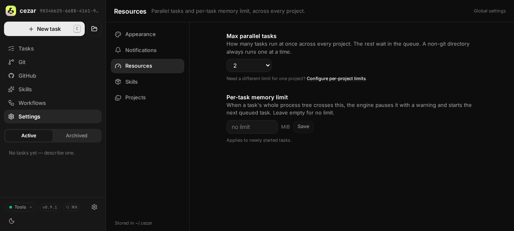
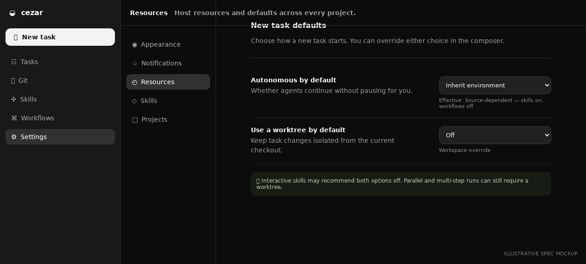

# Configurable composer run defaults

## TLDR

Make quick-task the cold New Task default, expose Worktree for every ordinary
run, and let Autonomous/Worktree defaults be seeded by environment
and overridden in workspace Settings. This is the no-ceremony composer policy
half of issue #657; per-skill `interactive: true` semantics are specified
separately in `2026-07-25-interactive-skill-composer-defaults.md`.

## Resolved assumptions (autonomous defaults)

| # | Question | Applied default | Why | Confirm? |
|---|---|---|---|---|
| Q1 | Where do configured defaults live? | Workspace config with nullable stored overrides that inherit environment values. | These are operator preferences shared across projects, and sandboxes need one seed with a per-sandbox override. | ok |
| Q2 | How much of #650 belongs here? | Only cold selection of quick-task and the truthful Worktree control. Broader source-picker/no-skill redesign stays in #650. | This delivers the issue’s explicit no-ceremony path without expanding into navigation work. | ok |
| Q3 | What replaces last-used toggle memory? | Stable workspace/env policy. Legacy `lastAutonomous`/`lastWorktree` keys remain parseable but new clients stop reading/writing them. | An unrelated previous run should not silently override an administrator’s or user’s declared default. | ok |
| Q4 | Which workflows can disable Worktree? | Skills and workflows may run in place; parallel variants remain isolated. | The repository-root lease safely serializes ordinary in-place workflows, while parallel variants require separate worktrees by definition. | ok |

## Problem Statement

Quick-task already provides a no-skill path, but the cold composer preselects a
skill and hides Worktree for workflows. Users can neither discover the simple
path reliably nor opt quick-task into the current checkout, despite the engine
supporting `worktree: false`.

Defaults also depend on source-specific code and last-used UI state. They cannot
be seeded for sandboxes or set deliberately across projects, so behavior drifts
based on whichever task ran last.

## Proposed Solution

1. Cold New Task selects built-in `quick-task` when no draft, deep link, or
   remembered explicit source exists.
2. Worktree appears for any ordinary git-backed skill/workflow. Parallel
   variants show it on and disabled with a reason.
3. `~/.cezar/config.json` gains optional workspace composer overrides.
4. `CEZ_AUTONOMOUS_DEFAULT` and `CEZ_WORKTREE_DEFAULT` seed absent overrides.
5. Global Resources Settings gains a **New task defaults** card with
   Inherit/On/Off choices.
6. A pure resolver combines run-shape constraints, explicit draft values,
   configured policy, and historical fallback. The companion interactive-skill
   spec inserts its hint into that same seam.

## Architecture

### Workspace state

Add a tolerant passthrough object in `src/workspace/config.ts`:

```ts
composerDefaults: z.object({
  autonomous: z.boolean().optional().catch(undefined),
  worktree: z.boolean().optional().catch(undefined),
}).passthrough().default(() => ({})).catch(() => ({}))
```

Effective helpers apply stored boolean → exact environment `0|1` → historical
fallback. Historical Autonomous remains source-dependent (skills on, workflows
off); Worktree remains on for eligible git runs.

The workspace API returns enough structure for Settings:

```ts
composerDefaults: {
  autonomous: boolean | null
  worktree: boolean | null
  inheritedAutonomous: boolean | 'source-dependent'
  inheritedWorktree: boolean
}
```

Thus Settings can truthfully render “Source-dependent — skills on, workflows
off” instead of inventing one effective Autonomous boolean.

### Composer resolver

```text
hard run-shape constraint
  > explicit draft choice
  > configured stored/env policy
  > historical source fallback
```

The companion interactive-skill spec adds its hint between explicit choice and
configured policy. Implement one helper with an optional skill recommendation
input so the two specs cannot create competing ternaries.

Eligibility requires git and variants ≤ 1. While sources load, retain the
existing readiness guard to prevent control flicker.

Legacy `lastAutonomous`/`lastWorktree` UI-state keys remain accepted by the
passthrough schema for backward compatibility but no longer participate in
resolution or new-client writes.

## Data Model

Additive optional workspace shape:

```json
{
  "composerDefaults": {
    "autonomous": false,
    "worktree": false
  }
}
```

Missing keys inherit; invalid values degrade per key to missing. Writes use
`mergeWriteWorkspaceConfig`, preserve unknown keys, and remain atomic `0600`.
No migration or required configuration is introduced.

Environment contract:

- `CEZ_AUTONOMOUS_DEFAULT=0|1`
- `CEZ_WORKTREE_DEFAULT=0|1`

Only exact values are recognized. Invalid/unset values use historical fallback
and never block boot. Stored values override environment seeds. Add both to
`.env.example` and the README env table in the same commit.

## API Contracts

`GET /api/workspace/config` gains `composerDefaults` with stored and inherited
values above.

`PUT /api/workspace/config` accepts a partial object:

```json
{ "composerDefaults": { "autonomous": false, "worktree": null } }
```

Boolean stores an override, `null` deletes it, and absence leaves it untouched.
Existing origin protection, zod `safeParse`, `{ error }`, and atomic merge-write
patterns apply.

`POST /api/runs` is unchanged; resolved booleans are submitted as today.

## UI/UX

### New Task

- Cold composer selects quick-task only when no explicit draft/deep-link/source
  preference exists.
- Worktree renders for ordinary workflows, including quick-task and multi-step
  workflows.
- Parallel variants render Worktree on and disabled with a concise reason.
- Explicit user changes survive source switching for the current draft.
- Starting/clearing creates a fresh draft resolved from current policy.

### Global Resources Settings

Add **New task defaults**:

- **Autonomous by default:** Inherit environment / On / Off. When inherited
  without an env seed, show “Source-dependent — skills on, workflows off.”
- **Use a worktree by default:** Inherit environment / On / Off, with inherited
  historical value “On.”

Copy explains that composer choices win, interactive skills may recommend both
off, and run-shape constraints can force a value. Reuse workspace-config
mutation/cache/revert, accessible labels, mobile layout, and theme primitives.

Visuals live under `assets/configurable-composer-run-defaults/`.

| Current Resources settings | Proposed New task defaults card |
|---|---|
|  |  |

## Edge Cases & Failure Scenarios

- Missing/corrupt/read-only workspace config degrades to env/historical defaults;
  failed Settings save reverts optimistically and boot continues.
- Invalid env values are ignored without repeated warnings.
- Older clients ignore additive API fields; newer clients handle absent fields.
- Deep link or saved draft source always beats cold quick-task selection.
- Source removed from catalog falls back through existing resolution.
- No git hides Worktree and runs in place.
- Raising variants after explicit Worktree off forces on; returning to one
  restores the draft’s explicit off.
- Multi-step workflows honor explicit and configured Worktree opt-outs.
- Workflow shape loading does not flicker controls.
- Direct incompatible API requests remain subject to server validation.

## Risks & Impact Review

- Cold source selection and removal of last-used toggle policy are intentional
  behavior changes; release notes must call them out.
- Worktree off exposes the current checkout to agent edits. Existing warning
  copy remains visible and policy can default it on.
- Workspace/config/API changes are additive, optional, passthrough, and
  reversible. Removing UI use restores historical behavior; stale keys are
  harmless.
- No secrets or PII are persisted. Raw env strings are never returned.

## Phasing

This policy can ship in two implementation checkpoints but is one composer
capability: every checkpoint uses the same resolver and Settings contract.

1. Workspace/env/API/Settings policy and resolver.
2. Quick-task cold selection plus truthful workflow Worktree eligibility.

## Implementation Plan

1. Add tolerant `composerDefaults` parsing and effective helpers to
   `src/workspace/config.ts`. Test stored/env/fallback precedence, exact `0|1`,
   invalid values, passthrough, and degradation.
2. Extend workspace GET/PUT schemas and response mapping. Test store, null
   deletion, partial merge, invalid bodies, unknown preservation, and no
   inherited-key materialization.
3. Extend web API types/fixtures and extract the shared composer resolver.
   Cover source-dependent Autonomous, Worktree fallback, explicit choices, and
   optional interactive recommendation.
4. Add Global Resources controls with On/Off/Inherit, accurate inherited copy,
   optimistic rollback, keyboard labels, and mobile tests.
5. Stop new-client reads/writes of legacy last-choice keys while preserving
   tolerant state parsing.
6. Make quick-task the cold default without overriding deep links, drafts, or
   explicit source memory. Add route tests.
7. Render Worktree for ordinary workflows, force it only for parallel variants,
   and verify submitted request bodies.
8. Document both env vars in `.env.example` and README and update any env drift
   guard.
9. Run the full validation gate and real-browser composer/Settings smoke flows
   on the implementation PR.
