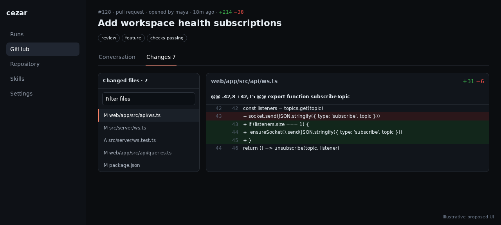

# GitHub PR changes review

## TLDR

Add a PR-only `Conversation | Changes` navigation inside Cezar’s GitHub detail pane so reviewers can inspect a pull request file-by-file without opening github.com. The read-only feature lazily fetches bounded, structured patches through the existing forge driver, reuses the cockpit’s diff components, and degrades honestly for binary, oversized, private-fork, offline, or unavailable content.

## Resolved assumptions (autonomous defaults)

| # | Question | Applied default | Why | Confirm? |
|---|---|---|---|---|
| Q1 | Should Changes review and PR merging be one specification? | Split them into linked specifications; this document owns only read-only changes review. | A fresh-context scope review confirmed that each capability works and ships independently. | ok |
| Q2 | Does v1 include inline comments, review decisions, and persistent “Viewed” state? | No; v1 provides navigation, readable patches, collapse state, and explicit completeness indicators. | Those mutations require separate review/thread contracts and are not necessary for manual inspection. | ok |

## Problem Statement

The GitHub tab already shows PR descriptions, comments, reviews, activity, aggregate `+/-`, and check rollups. It does not show the changed files or patches, so the user must leave the local cockpit at the decisive manual-review step. GitHub’s [review guidance](https://docs.github.com/en/pull-requests/collaborating-with-pull-requests/reviewing-changes-in-pull-requests/reviewing-proposed-changes-in-a-pull-request) recommends reviewing one file at a time, and its [file-filter guidance](https://docs.github.com/en/pull-requests/collaborating-with-pull-requests/reviewing-changes-in-pull-requests/filtering-files-in-a-pull-request) uses a file tree to navigate large changes. Cezar needs the useful read-only core of that workflow without becoming a second review-authoring client.

## Goals

- Deep-link to a PR’s complete-as-bounded Changes view inside Cezar.
- Navigate, filter, expand, and collapse per-file structured patches.
- Reuse the forge seam, project-scoped route pattern, TanStack Query, and diff facade.
- Make missing, binary, oversized, and truncated content unmistakable.
- Preserve zero-config and degrade-gracefully behavior.

## Non-goals

- Inline/file comments, suggestions, approve/request-changes, or persistent viewed progress.
- Commit-by-commit comparisons, rendered binary/notebook diffs, dependency review, or code-scanning annotations.
- Merging; that is specified separately in `2026-07-25-github-pr-merge.md`.
- A non-GitHub implementation in this delivery.

## Proposed Solution

For PR details only, add inner links below the title:

- `/p/:projectId/github/prs/:number` — Conversation;
- `/p/:projectId/github/prs/:number/changes` — Changes.

The legacy boot-project aliases retain route parity. Issues do not render the inner navigation.

The Changes view provides:

- changed-file count and aggregate additions/deletions;
- a filterable file tree with status and per-file `+/-`;
- collapsible patch cards using the existing safe structured-diff renderer;
- previous/next-file keyboard-accessible navigation and anchored selection;
- loading, empty, binary/no-patch, per-file truncation, response truncation, and failure states;
- an HTTP(S)-guarded `Open on GitHub` fallback targeting `/files`.

Collapse state is local to the mounted view. No local viewed-state persistence is introduced.



## Architecture

Extend `ForgeDriver` with one optional read capability:

```ts
prDiff?(number: number, opts?: { refresh?: boolean }): Promise<ForgePrDiffResult>
```

The GitHub driver calls the paginated pull-files endpoint via a fixed `gh api` argument array, never checks out an untrusted fork, and normalizes at the forge boundary. Add one route, mounted through the existing project-route manifest:

```text
GET /api/github/prs/:number/changes?refresh=1
```

The route validates a positive safe integer and exact refresh flag. Zod validates GitHub data and the response. `CEZ_DRY_RUN=1` supplies deterministic renamed, binary, truncated, and ordinary patches.

Normalize each file into the conceptual shape already consumed by the diff facade:

```ts
interface ForgePrChange {
  path: string
  previousPath?: string
  status: 'added' | 'modified' | 'removed' | 'renamed' | 'copied' | 'changed'
  additions: number
  deletions: number
  patch?: string
  patchUnavailableReason?: 'binary' | 'too-large' | 'not-provided'
  truncated?: boolean
}
```

Limits are part of the contract: at most 300 files, 512 KiB patch text per file, and 4 MiB normalized JSON. Cache for 60 seconds by `{repoRoot, PR number, head SHA}`; manual refresh bypasses the cache. A partial response always carries `truncated: true` and a readable reason.

The UI adds lazy client/query methods and adapts existing diff primitives rather than adding a second patch parser. React renders every path and patch as untrusted text; no raw HTML is introduced.

## API Contract

Success:

```json
{
  "available": true,
  "number": 128,
  "headSha": "0123456789abcdef0123456789abcdef01234567",
  "files": [],
  "additions": 214,
  "deletions": 38,
  "truncated": false
}
```

Absent `gh`, unsupported capability, offline GitHub, and read failure return HTTP 200 `{ "available": false, "reason": "..." }`. Unknown/deleted PR is 404; invalid input is 400. The pre-existing `/api/github`, comment/timeline, run diff, and repo diff contracts remain unchanged.

## UI/UX

Desktop retains the existing split list/detail layout. Inner tabs sit above content; at wide widths, a narrow file navigator sits beside patch cards. Mobile turns file navigation into a select/sheet above one column; code scrolls within its card so the page never overflows. Tabs and controls meet 44px targets, current-page state is accessible, status uses text plus color/icon, and loading updates announce politely.

The header displays the reviewed head SHA. A refresh that discovers a new SHA replaces the diff and announces that the reviewed revision changed. The view never claims completeness when any cap or upstream omission applies.

## Edge Cases & Failure Scenarios

- Missing/logged-out `gh`, offline/rate-limited GitHub: reason plus external fallback; boot and the rest of the tab continue.
- Private fork/deleted branch: use API data when available; never fetch fork code locally.
- Binary/generated/oversized patch: retain filename/stat and show the exact unavailable reason.
- Large PR: cap explicitly, retain navigation for returned files, and link to GitHub for the remainder.
- PR updated while open: refresh changes the head-keyed cache and resets local collapse/selection safely.
- Unsafe path/patch/link: text rendering and existing URL guard prevent injection.

## Risks & Impact Review

Patch size is the main performance risk; lazy loading, strict caps, head-keyed caching, and collapsible rendering bound it. API/schema drift is contained at the driver’s Zod boundary. All APIs are additive, there is no persistent state or migration, and rollback is simply removing the optional capability/route and inner tab.

## Phasing

### Phase 1 — server contract

Normalize and cap GitHub pull-file data behind the optional forge method and project-scoped route.

### Phase 2 — cockpit view

Ship routes, file navigation, structured patch rendering, responsive/accessibility states, and browser evidence.

## Implementation Plan

1. Add forge/Zod types and GitHub-driver fixtures for pagination, fork PRs, renamed/binary/missing patches, caps, schema drift, failure, and dry-run.
2. Implement head-SHA-keyed caching and `GET /github/prs/:number/changes`; add route-parity, project-isolation, validation, and degradation tests.
3. Adapt existing diff facade/components to normalized PR changes without altering protected run/repo diff endpoints; test unsafe text and every file status.
4. Add conversation/changes deep links, lazy query hooks, desktop/mobile file navigation, loading/error/empty/truncated states, and guarded fallback.
5. Extend unit and real-browser GitHub suites for deep links, keyboard behavior, responsive overflow, refresh to a new head, and visual regression.
6. Run the full validation gate and `npm run test:e2e`.

## Acceptance Criteria

- A reviewer can deep-link to and inspect every returned PR file without leaving Cezar.
- The view clearly distinguishes complete, truncated, binary, oversized, and unavailable patches.
- Another project can never receive this project’s cached diff.
- Existing GitHub conversation and protected diff/API surfaces remain compatible.
- Missing dependencies/services degrade without boot failure; light/dark/system, mobile, keyboard, unit, and browser coverage pass.

