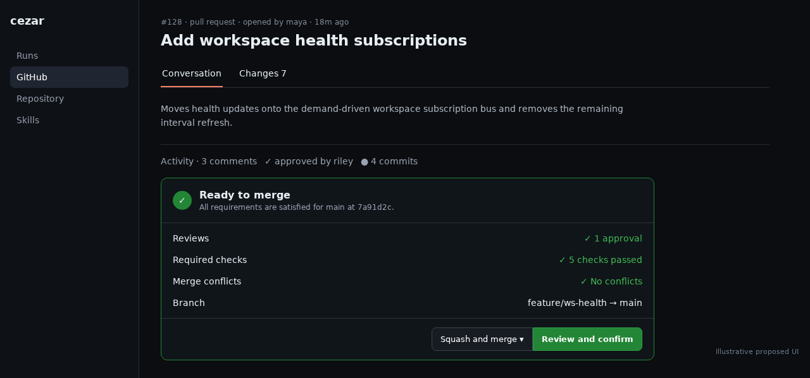
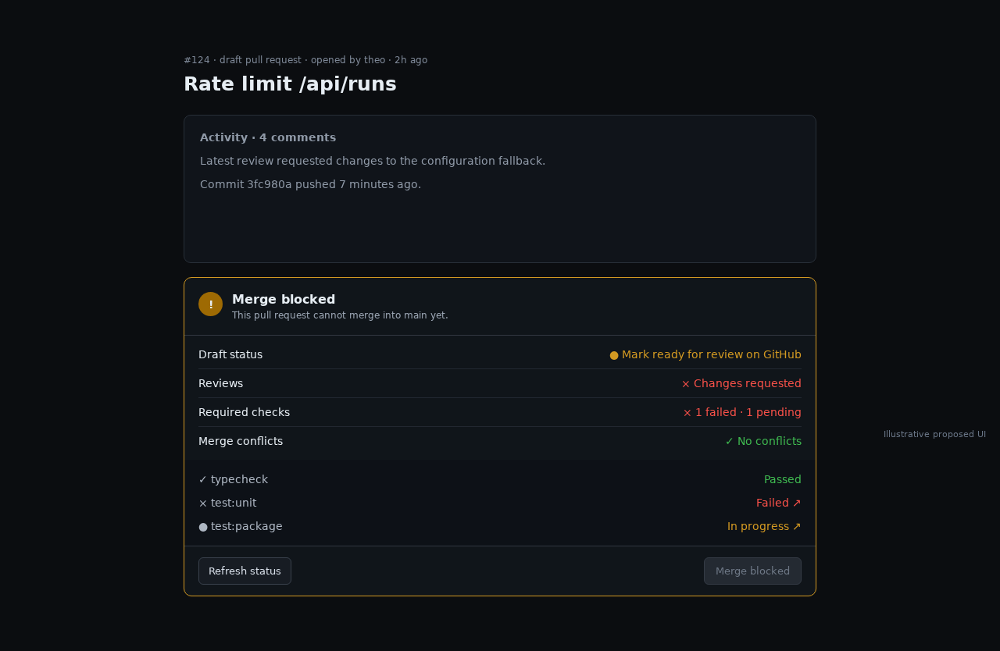

# GitHub PR merge box and guarded merge

## TLDR

Add a GitHub-shaped merge box to the PR Conversation view that shows reviews, individual checks, conflicts, draft/policy state, and repository-enabled merge methods, then allows an authorized user to merge with explicit confirmation. The server re-fetches authoritative GitHub state and compares the reviewed head SHA immediately before mutation, so stale or blocked PRs cannot be merged from cached UI.

## Resolved assumptions (autonomous defaults)

| # | Question | Applied default | Why | Confirm? |
|---|---|---|---|---|
| Q1 | Should the merge box depend on the new Changes tab? | No; link the specs, but let merge readiness/action ship independently on Conversation. | A fresh-context scope review found them independently deployable. | ok |
| Q2 | Does “mimics 1:1 GitHub” include auto-merge, merge queue, admin bypass, updating/deleting branches, and editable commit messages? | Match GitHub’s hierarchy, blocker/check disclosure, method picker, and confirmation; defer those additional mutations. | This preserves the requested merge workflow without exposing higher-risk or repository-specific operations. | ok |
| Q3 | Which method is initially selected? | Use GitHub’s repository default when exposed; otherwise squash, merge commit, then rebase among enabled methods. Persist no cross-PR preference. | Repository policy remains authoritative and no configuration is required. | ok |
| Q4 | May an incomplete local policy read enable merge? | No; unknown requiredness or stale state keeps the button disabled until a fresh authoritative preflight succeeds. | False readiness is unsafe for an upstream mutation. | ok |

## Problem Statement

Cezar shows only an aggregate checks badge. It cannot explain which check/review/rule blocks a PR, show the repository’s enabled merge methods, or merge after the user’s review. GitHub’s [PR model](https://docs.github.com/en/pull-requests/get-started/about-pull-requests) makes its merge box the consolidated view of checks and unmet requirements; its [merge documentation](https://docs.github.com/en/pull-requests/how-tos/merge-and-close-pull-requests/merging-a-pull-request) treats draft status, repository methods, branch rules, and checks as authoritative. Cezar needs that safe decision surface locally.

## Goals

- Show a GitHub-shaped, detailed and fresh mergeability summary.
- List individual checks with links and clear required/pending/failing states.
- Offer only repository-enabled merge methods.
- Require explicit confirmation and expected-head server preflight.
- Reconcile success, stale state, authorization failure, and external merges.
- Preserve zero-config discovery and graceful degradation.

## Non-goals

- Auto-merge, merge queue, admin bypass, branch update/conflict resolution, branch deletion, or editable merge messages.
- Approve/request-changes or inline review authoring.
- Changes/diff review, specified in `2026-07-25-github-pr-changes-review.md`.
- Locally recreating GitHub’s rules engine.

## Proposed Solution

Place the merge box after Activity and before `Hand to agent` in the PR Conversation view. It contains:

1. `Ready to merge`, `Merge blocked`, `Draft`, `Conflicts must be resolved`, `Merged`, or `Closed`;
2. one row per reviews, required checks, branch/head freshness, conflicts, and repository-rules group;
3. expandable check rows with name, state, requiredness, and HTTP(S)-guarded details link;
4. head → base branches and observed short head SHA;
5. when eligible, a method selector and primary action;
6. an inline confirmation naming method, PR/title, and base branch.





Unknown, pending, failed, unauthorized, draft, conflicted, or terminal state disables merge. A failure preserves the method selection and shows persistent inline text plus the existing toast.

## Architecture

Extend `ForgeDriver` with optional capabilities:

```ts
prMergeState?(number: number, opts?: { refresh?: boolean }): Promise<ForgePrMergeStateResult>
mergePR?(number: number, input: ForgeMergeInput): Promise<ForgeMergeResult>
```

Add project-scoped, route-parity-protected endpoints:

```text
GET  /api/github/prs/:number/merge-state?refresh=1
POST /api/github/prs/:number/merge
```

The driver fetches PR state, head/base refs and OIDs, mergeability, review decision, repository method policy, individual status checks, and readable branch/rules requirements in parallel. Zod normalization accepts optional/evolving GitHub fields and converts them into a stable eligibility enum plus blocker list. Requiredness is `true | false | null`; unreadable protection never becomes “ready.”

```ts
type ForgeMergeMethod = 'merge' | 'squash' | 'rebase'

interface ForgePrMergeState {
  number: number
  state: 'open' | 'closed' | 'merged'
  isDraft: boolean
  headRef: string
  baseRef: string
  headSha: string
  mergeable: 'mergeable' | 'conflicting' | 'unknown'
  reviewDecision: 'approved' | 'changes-requested' | 'review-required' | 'unknown'
  checks: ForgePrCheck[]
  methods: ForgeMergeMethod[]
  defaultMethod: ForgeMergeMethod | null
  eligibility: 'ready' | 'blocked' | 'pending' | 'unauthorized' | 'terminal' | 'unknown'
  blockers: Array<{ code: string; message: string }>
  canMerge: boolean
}
```

Cache reads for 15 seconds per `{repoRoot, PR}`. Manual refresh and mutation preflight bypass the cache. Concurrent mutations for the same project/PR share an in-process guard; GitHub remains authoritative across processes.

The POST accepts only:

```json
{
  "method": "squash",
  "expectedHeadSha": "0123456789abcdef0123456789abcdef01234567"
}
```

The server re-fetches state, rejects changed SHA/disabled method/ineligibility with 409, then calls GitHub’s merge API with the expected SHA. Fixed argument arrays prevent injection. No admin, delete-branch, or arbitrary-message option exists. Success evicts project-local GitHub list, merge state, timeline/comments, and workspace PR-status caches.

## API Contracts

`GET` returns `{ "available": true, "mergeState": { ... } }`, or HTTP 200 `{ "available": false, "reason": "..." }` for a missing capability/`gh`/read failure. Invalid input is 400 and unknown PR is 404.

`POST` success:

```json
{
  "merged": true,
  "number": 128,
  "url": "https://github.com/owner/repo/pull/128",
  "method": "squash",
  "mergeCommitSha": "..."
}
```

Errors use `{ error, code?, current? }`:

- 400 invalid number/body/method/SHA;
- 403 insufficient GitHub permission;
- 404 missing PR/repository;
- 409 stale head, draft, conflict, checks/reviews/rules blocked, disabled method, terminal/concurrent transition;
- 502 sanitized GitHub failure.

`current` may contain freshly normalized safe state. Raw stderr, tokens, and credential paths are never returned.

## UI/UX

Use the current card, button, dropdown, status tone, link, toast, and skeleton primitives in light/dark/system themes. The selector/button stack on mobile. Status is expressed with icon and text, not color alone. Loading changes announce politely. Confirmation moves focus to its heading, Escape cancels, cancel returns focus, and submission disables duplicate activation.

The merge button’s label reflects the method (`Squash and merge`, `Create a merge commit`, `Rebase and merge`). The confirmation repeats that wording and exact base. There is never a one-click mutation from the initial box.

## Security and Safety

- Existing same-origin API guard protects POST; all routes are project-scoped.
- Browser never supplies owner/repo/cwd and never invokes `gh`.
- Only positive PR number, enum method, and lowercase 40-hex SHA are accepted.
- GitHub authorization and fresh state—not local labels or UI—decide the mutation.
- Check titles/blocker messages are untrusted text; outbound links use the existing URL guard.
- The workspace WebSocket bus is not used because private PR details are unsafe for any local-origin page.

## Edge Cases & Failure Scenarios

- Mergeability computing/checks rerunning: pending, manual refresh, disabled action; no polling.
- Protection/rules unreadable: show observed checks, mark certainty unknown, disable mutation.
- No CI: “No checks configured” is neutral when GitHub otherwise reports eligible.
- Head changes after review: 409, invalidate related views, explain and require re-review.
- Method removed: 409, refresh allowed methods and select the new repository default.
- Merged elsewhere/response lost: refreshed terminal state wins; do not offer blind retry.
- Draft/conflict/review required: explicit blocker rows; no bypass.
- Offline/rate limit: preserve last read as visibly stale where available; fresh preflight is still required.

## Risks & Impact Review

Merging is an upstream, hard-to-reverse mutation. Explicit confirmation, expected-head compare-and-swap, fresh state, no bypass/delete options, and exact method display reduce risk. GitHub rules evolve, so the driver boundary is the only vendor-specific normalization point and unknown means disabled. APIs are additive, no local persistence/migration/config/env var is added, and rollback can remove the optional mutation while leaving the GitHub tab functional.

## Phasing

### Phase 1 — read-only merge box

Ship detailed authoritative merge state, checks, blockers, methods, and refresh with no merge mutation.

### Phase 2 — guarded merge

Add confirmation, expected-head preflight, concurrency protection, mutation, reconciliation, and cache invalidation.

## Implementation Plan

1. Add merge-state/check/method Zod schemas and forge types; cover draft, conflict, checks, reviews, unknown rules, authorization, terminal, rate-limit, schema-drift, and dry-run fixtures.
2. Implement optional `prMergeState`, 15-second project cache, and project-scoped GET route with refresh, parity, isolation, and validation tests.
3. Build the read-only merge box after Activity with individual checks, blockers, branches/SHA, methods, accessibility, responsive states, and guarded links.
4. Add strict merge request schema, fresh expected-head GitHub operation, sanitized result mapping, and same-PR in-flight guard; prove no forbidden flags/arguments reach the boundary.
5. Add POST route and tests for origin guard, every rejection, success, external merge, and cross-project cache eviction.
6. Add selector/confirmation/focus/mutation UI, stale reconciliation, duplicate-submit protection, and query invalidation.
7. Extend dry-run browser E2E through ready → confirm → merged, stale rejection, blocked state, and mobile; run the full validation gate and `npm run test:e2e`.

## Acceptance Criteria

- The merge box’s checks/blockers/methods match fresh GitHub state and unknown is never presented as ready.
- Only enabled methods appear and the exact choice/base are repeated before mutation.
- Stale head, draft, conflict, failed/pending/unknown requirement, insufficient permission, terminal PR, and disabled method cannot merge.
- Success or external merge updates every visible project-local PR surface without contaminating another project.
- Missing `gh`, offline GitHub, rate limits, and schema drift degrade without boot failure or credential leakage.
- Mutation origin protection, Zod boundaries, themes, mobile, keyboard/focus, unit, and browser coverage pass.

