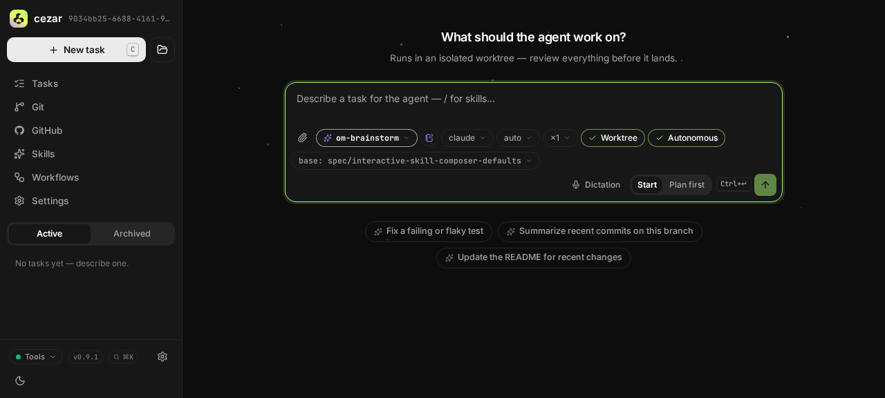
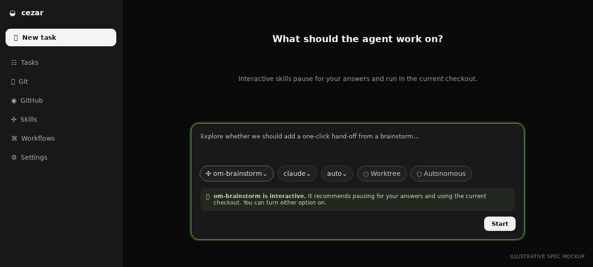

# Interactive skill composer defaults

## TLDR

Let a skill declare `interactive: true` in Markdown frontmatter. When that skill
is selected in New Task, the composer initially turns **Autonomous** and
**Worktree** off so a conversational skill can wait for answers without creating
an unused checkout. Both controls remain overridable; this is an advisory
per-skill default, not an execution constraint.

## Resolved assumptions (autonomous defaults)

This spec was produced by an autonomous `om-auto-write-spec` run. Reviewers may
override these defaults before implementation.

| # | Question | Applied default | Why | Confirm? |
|---|---|---|---|---|
| Q1 | Should issue #657 be one specification? | No. This document covers only interactive skill semantics. Workspace/env policy, quick-task selection, and generalized workflow controls are split into `2026-07-25-configurable-composer-run-defaults.md`. | Each half is independently deployable; splitting satisfies the repository’s one-capability-per-spec rule. | ok |
| Q2 | What precedence applies? | Plan-first/parallel constraints → explicit draft choice → `interactive: true` → existing composer fallback. | Engine safety remains authoritative, users can always override the hint, and the skill fixes only untouched fields. | ok |
| Q3 | Does `interactive: false` force both settings on? | No. Only parsed scalar `true` is meaningful; false, missing, malformed, and array values behave as absent. | The metadata is a narrow opt-out hint and every existing skill stays unchanged. | ok |
| Q4 | Does switching skills overwrite a touched toggle? | No. Source metadata applies only while that draft field is unset. A new/cleared draft resolves again. | Controls must not jump after the user makes an explicit choice. | ok |

## Problem Statement

Skills currently default Autonomous on. For a conversational skill, a deliberate
question/yield is therefore auto-continued and can become a monologue. Worktree
also defaults on, producing branch/worktree noise for skills whose output is a
conversation or brief rather than code.

The author can explain the intended mode in prose, but the composer cannot use
that information before starting the run. Users must remember two manual changes;
forgetting either produces no error, only subtly wrong behavior.

## Proposed Solution

Add one optional skill metadata field:

```yaml
---
name: om-brainstorm
description: Explore a problem interactively.
interactive: true
---
```

Discovery exposes `interactive?: true` through the existing skills catalog.
New Task resolves untouched Autonomous and Worktree fields to off for the
selected interactive skill. An explicit toggle choice wins and the controls stay
enabled whenever existing run-shape rules allow them.

Alternatives rejected:

- Hard-disable the controls: a skill cannot know every invocation, and the issue
  explicitly requires an override.
- Infer interactivity from the body/name: heuristics are unstable and invisible
  to skill authors.
- Change the runner/engine: this is preselection metadata; the submitted
  `autonomous`/`worktree` booleans already express execution behavior.

## Architecture

### Discovery

Extend `Skill` in `src/skills.ts` with `interactive?: true`.
`parseFrontmatter()` remains the purpose-built string/string-array parser.
`readMarkdownSkills()` sets the field only when
`frontmatter.interactive === 'true'`; quoted and unquoted `true` normalize to
the same scalar. `yes`, arrays, malformed blocks, false, and absence do not opt
in.

The existing skills API and `web/app/src/api/types.ts` gain the optional field.
This is additive: older clients ignore it and newer clients treat omission as
the historical behavior.

### Composer resolution

Extract a pure helper beside `new-task-draft.ts` so precedence is tested once:

```text
hard run-shape constraint
  > explicit draft boolean
  > interactive skill hint (false)
  > existing fallback
```

Hard constraints remain unchanged:

- Plan-first forces Autonomous off and disables it.
- Parallel variants force Worktree on.
- No-git execution runs in place.

An interactive hint applies independently to each unset field. If a user changes
one toggle, only that field becomes explicit. Switching sources preserves touched
values; starting or clearing the draft removes them.

### Data flow

```text
SKILL.md frontmatter
        │ discovery
        ▼
Skill.interactive ──> composer resolver <── explicit draft choices
                              │
                              ▼
                  POST /api/runs booleans
```

No `RunRecord`, workflow YAML, agent protocol, or run-creation request change is
required.

## Data Model

The only new data is the optional in-memory/API `Skill.interactive` boolean.
Skill Markdown remains valid without frontmatter. There is no migration or new
persistent cezar state.

## API Contracts

The existing skills-catalog entry gains:

```ts
interactive?: true
```

Omission means no recommendation. `POST /api/runs` is unchanged; the composer
continues sending ordinary resolved `autonomous` and `worktree` booleans.
Server-side validation remains authoritative.

## UI/UX

- Selecting an interactive skill with untouched controls shows Autonomous off
  and Worktree off.
- Helper copy says the skill recommends interactive, in-place execution and
  that either setting can be changed.
- The controls use existing checkbox/toggle primitives and retain keyboard,
  label, focus, mobile, and theme behavior.
- A touched value survives skill/source changes for the current draft.
- Plan-first and parallel constraints still render their existing disabled
  states and explanations.

Current and proposed composer visuals are stored under
`assets/interactive-skill-composer-defaults/`.

| Current composer | Proposed interactive-skill default |
|---|---|
|  |  |

## Edge Cases & Failure Scenarios

- Malformed/unknown metadata degrades to absence; discovery never fails.
- Older server/newer UI sees no field and uses historical behavior.
- Newer server/older UI ignores the additive field.
- Catalog refresh does not overwrite a touched field; an untouched field
  re-resolves from current metadata.
- Interactive skill plus plan-first keeps Autonomous forced off.
- Interactive skill plus parallel variants keeps Worktree forced on.
- No git keeps Worktree unavailable and execution in place.
- Direct API callers are unaffected because metadata is not an engine policy.

## Risks & Impact Review

- An interactive skill opts users out of isolation by default, so helper copy
  must clearly state that the current checkout is used. The user can restore
  isolation before starting.
- Skill format compatibility is additive and optional. Older versions ignore
  the key; existing files parse unchanged.
- Rollback is removal of composer use; the harmless unknown frontmatter field
  can remain.
- No credentials, PII, migrations, or breaking API changes are introduced.

## Phasing

This is one small, independently shippable capability: metadata discovery and
its composer interpretation land together. Partial delivery would expose a hint
with no effect or add UI logic with no reliable input.

## Implementation Plan

1. Extend `Skill` and `readMarkdownSkills()` with scalar
   `interactive: true` recognition. Test true, quoted true, false, arrays,
   malformed/missing frontmatter, CRLF, and unchanged body parsing.
2. Add the optional field to the skills response and mirrored web type. Extend
   API contract tests for presence and omission.
3. Extract the pure default resolver and test every precedence collision:
   explicit values, interactive hint, plan-first, variants, and no git.
4. Wire the selected skill into the resolver in `new-task.tsx`. Add route tests
   proving both toggles initially off, each remains overridable, touched values
   survive source switches, and forced states still win.
5. Add accessible explanatory copy and regression coverage for keyboard/mobile
   rendering.
6. Run the full validation gate and real-browser composer smoke flow on the
   implementation PR.
