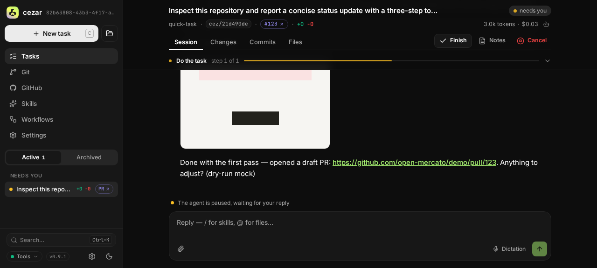
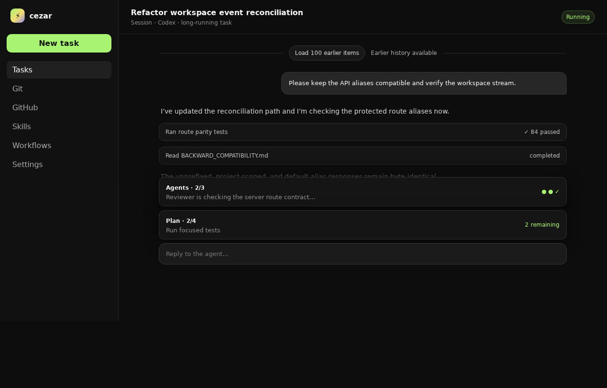
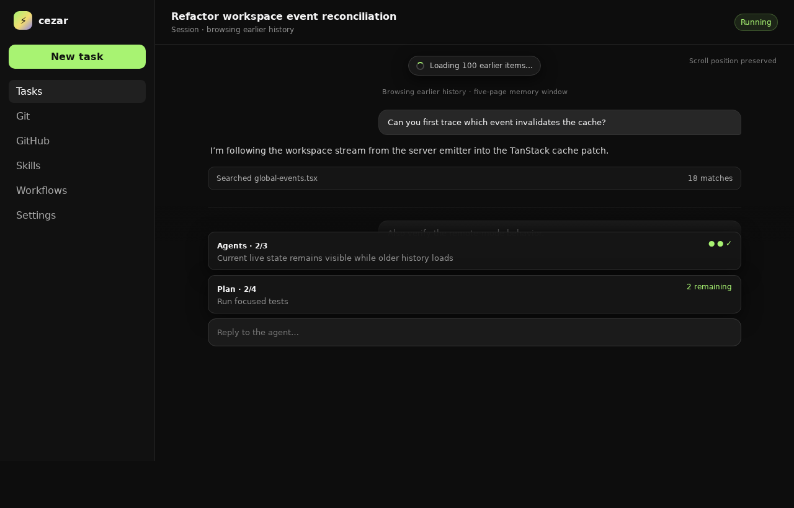

# Progressive long-session history loading

Tracking issue: [#717](https://github.com/open-mercato/cezar/issues/717)

## TLDR

Long task sessions currently block the cockpit while the server parses and streams the entire NDJSON transcript and the browser retains every raw event. Change the task thread to render the newest 100 session items first, then load older pages incrementally, while a compact bootstrap snapshot keeps the latest plan and current agent fan-out correct even when their source events predate the visible window. Existing full-replay SSE behavior remains available for backward compatibility.

## Resolved assumptions (autonomous defaults)

This spec was produced by an autonomous `om-auto-write-spec` run. The questions below were resolved with conservative, reversible defaults; reviewers can override them before implementation. None carries `⚠ NEEDS HUMAN CONFIRMATION`.

| # | Question | Applied default | Why |
|---|---|---|---|
| Q1 | What is the pagination unit? | **Protocol-level session items, exactly 100 per full page**, not 100 raw NDJSON lines. | One message/tool/reasoning item can span several lifecycle events, and v1/v2 twins can describe the same visible content. Counting raw lines would make the user-visible page size arbitrary and violate the brief's explicit “items” requirement. |
| Q2 | How should older pages load? | **Fetch the next older page only after explicit upward reader intent brings the history boundary near the viewport**, with an explicit “Load 100 earlier items” control as the keyboard/low-motion fallback. Initial layout, restoration, resize, or a previous prepend must never trigger a page by themselves, and the archive must never drain in the background. | Intent-gated loading removes the 20-second replay without turning a visible sentinel or one upward gesture into an eager cascade that recreates the original memory problem. |
| Q3 | How should off-window plan and agent state arrive? | **Fetch compact original source events from a parallel context route and reduce them through the existing client reducer.** | This lets the newest page paint without waiting for a cold full-file context scan, keeps `latestPlanEntries()` and `collectSubagents()` authoritative, and avoids a second server-side presentation model. |
| Q4 | How should live SSE avoid replaying the old prefix? | **Add an optional resume cursor plus `afterSeq` to the existing per-run SSE route and add SSE `id` fields. Calls without these query parameters keep today's full data replay semantics.** | It is additive, keeps the protected route/event names/data payloads, and supports both native `Last-Event-ID` reconnects and watchdog-created EventSource instances. |
| Q5 | Should page size be configurable? | **No: 100 items is a fixed implementation constant and API contract.** | A knob would make test coverage and memory behavior variable while violating the repository's zero-config rule. The number can change only through a reviewed contract change. |
| Q6 | Is this one capability or multiple specs? | **One cohesive capability, phased server-first and client-second.** | Pagination without bootstrap state breaks the plan/Agents docks; bootstrap without paginated transport does not solve latency or memory. Each phase can still leave the app working because the old full-replay path remains. |

## Problem Statement

`RunStore.readEvents()` reads and parses the complete `runs/<id>.ndjson` file into memory. The per-run SSE route then replays every persisted event, and `useRunEvents()` appends every frame to a React array before `reduceThread()` creates the rendered session. On very long runs this produces a long loading stream, delays useful recent content by many seconds, and keeps both the raw event history and reduced thread state resident in the browser.

The newest-window optimization cannot discard semantic state. `latestPlanEntries()` and `collectSubagents()` derive the plan dock and Agents dock from events that may be much older than the newest 100 visible items, including an early task spawn that is still running. Progressive history must therefore separate visible transcript pages from compact current-state bootstrap data.

## Proposed Solution

Add an additive cursor-based history route beside the existing SSE route:

1. `GET /api/runs/:id/history` reverse-reads complete turn projections from the NDJSON tail and returns source events sufficient to reduce the newest 100 session items, plus opaque older/newer cursors and a live-resume cursor.
2. In parallel, `GET /api/runs/:id/history-context` returns compact `contextEvents`: the latest plan snapshot and the exact turn structure/current agent fan-out needed by today's selectors, even when those source events are outside the visible page. The tail renders without waiting for a cold context rebuild.
3. `GET /api/runs/:id/events?cursor=…&afterSeq=…` starts replay after the history response's high-water point. Without either query parameter, it retains the current full-data replay behavior. Every data frame gains an SSE `id` so browser reconnects send `Last-Event-ID`.
4. A new `useRunHistory()` hook holds at most five 100-item pages, folds only retained source events into the transcript, folds compact context separately for the Plan and Agents docks, and merges live events by the existing `seq > maxSeq` rule.
5. After the reader explicitly scrolls upward, approaching the top loads and prepends exactly one older page while preserving the first visible row. The trigger disarms after that request and requires fresh upward intent before another automatic page; “Jump to latest” returns to a fresh tail page instead of forcing every intervening page into memory.

The design is additive and capability-detected. If the history route is unavailable or fails, the cockpit falls back to today's `useRunEvents()` full-replay path with a small non-blocking warning. A missing optimization never makes a session unreadable.

## Research and precedents

- TanStack Query's official infinite-query API supports `getPreviousPageParam`, `getNextPageParam`, and `maxPages`; its guide explicitly uses `maxPages` to bound stored/refetched pages. That is the right existing cockpit primitive for a bidirectional five-page window rather than a bespoke cache ([reference](https://tanstack.com/query/v5/docs/framework/react/reference/useInfiniteQuery), [guide](https://tanstack.com/query/latest/docs/framework/react/guides/infinite-queries)).
- The HTML Standard defines SSE `id` and browser `Last-Event-ID` reconnect behavior: once a server supplies an event id, the browser returns it on reconnection. Cezar should use that standard mechanism while retaining its payload-level `seq` guard for manual watchdog reopen and malformed frames ([WHATWG Server-sent events](https://html.spec.whatwg.org/multipage/server-sent-events.html)).
- Node's `fs.createReadStream()` supports byte-range reads with `start`/`end`, which makes opaque byte-offset cursors possible without loading the entire transcript into memory ([Node file-system API](https://nodejs.org/api/fs.html#fscreatereadstreampath-options)).
- Cezar's own strongest precedents are the lazy GitHub-check hydration contract in `BACKWARD_COMPATIBILITY.md` §2 and the demand-driven WebSocket subscription bus: ship the small view-critical slice first, do work only while a reader demands it, and preserve the existing route as the compatibility fallback.

What this intentionally skips: server-side transcript rendering, durable database/index infrastructure, background downloading of every historical page, and backend-specific logic. The append-only NDJSON file remains authoritative; cursor acceleration is a read strategy, not a new source of truth.

## Architecture

### 1. Session-item semantics

A page contains **100 session items**, but its `events` array may contain more than 100 source events because turn/session boundaries and paired v1 tool events are structural inputs to `reduceThread()`.

`packages/cezar/src/runs/event-history.ts` defines one pure classifier, `sessionItemKey(event, turnState)`, with these rules:

- v2 `item.started|updated|completed` events sharing `(stepId, item.id)` are one item. The page keeps the newest persisted full snapshot at or before its boundary; `item.delta` is not a persisted page item.
- `user-message`, `note`, `lifecycle`, `error`, `image`, `check-output`, `ask.requested`, and `provider-auth-required` each count as one standalone item because each produces a visible thread entry or bubble.
- A v1 `tool-call` plus its matching `tool-result` is one item. A v1 `text` event is one item only when it survives the existing mixed-file rule for that turn.
- `session.*`, `turn.*`, usage, token, cost, and engine bookkeeping events are structural: they do not consume the 100-item budget, but the scanner includes the minimal boundary events required to fold the selected items correctly.
- In a mixed v1/v2 turn, v2 item coverage suppresses v1 tool twins and text twins using the same evidence as `reduceThread()`. The implementation must continue scanning backward until **100 post-dedup item keys** are selected, not stop at 100 candidates.

The classifier is deliberately server-owned; the service cannot runtime-import the private `@open-mercato/cezar-api-client` workspace. Drift is prevented with shared golden inputs: server projection tests and web reducer tests consume the same mixed v1/v2 fixture pages and assert the resulting item identities/counts. This is a test-only cross-package reach, which repository rules allow.

### 2. Bounded reverse reader

`RunStore.readEvents()` remains unchanged for compatibility callers. Add async, memory-bounded helpers in `packages/cezar/src/runs/event-history.ts`:

```ts
const RUN_HISTORY_PAGE_ITEMS = 100

interface RunHistoryPageCursorV1 {
  v: 1
  kind: 'page'
  turnStartOffset: number // start of the containing canonical turn
  itemOrdinal: number     // exclusive canonical item position inside that turn
  direction: 'older' | 'newer'
}

interface RunHistoryLiveCursorV1 {
  v: 1
  kind: 'live'
  offset: number
  boundarySeq: number
}

interface RunHistoryPage {
  events: RunEvent[]             // chronological; visible page input
  itemCount: number              // 0..100
  olderCursor?: string
  newerCursor?: string
  liveCursor: string
  asOfSeq: number
  hasOlder: boolean
}

interface RunHistoryContext {
  contextEvents: RunEvent[]      // chronological; state-only reducer input
  asOfSeq: number
}
```

Both cursor variants are opaque base64url JSON, zod-validated, length-capped, and scoped implicitly by the route's run id. They contain no filesystem path or secret. Invalid syntax/ranges return `400 {error}`; a cursor beyond a now-shorter file returns `409 {error}` and tells the client to reload the newest page. Appends never invalidate existing byte offsets because NDJSON is append-only.

The reader opens the file once, snapshots its size, and walks backward in fixed-size byte chunks, carrying a partial UTF-8 line between reads. It skips malformed lines exactly like `readEvents()`. Projection happens in **complete turns**: the scanner locates a `turn.started`/`user-message` boundary, streams that turn through the mixed-vocabulary classifier, then selects a canonical ordinal slice from it. When a page splits one large turn, both adjacent pages may carry the same structural turn boundary, but `seq` dedup removes the overlap before reduction; their selected item ordinals never overlap. A page cursor identifies the turn boundary plus the exclusive canonical item ordinal, so no request has to guess v2 coverage or a v1 tool pair from a mid-turn byte offset. The implementation caches recently projected turns in memory, but the cache is disposable.

The scanner stops after 100 post-dedup items across one or more turn projections; it never parses the preceding archive into an array. Older/newer cursors walk canonical item positions in either direction so a five-page cache can evict the tail while someone browses ancient history and later walk forward again. Tests split pages inside a mixed v1/v2 turn, between a v1 tool call/result, and inside a turn larger than 100 items.

The reverse reader and context request run independently in the browser. Both server paths are streaming and bounded; no `readFileSync(...).split('\n')` is used on the optimized path, and the tail response never waits for a cold full-history context scan.

### 3. Compact plan and agent context

`deriveRunContextEvents()` makes one forward streaming pass and retains only source events needed by today's state selectors:

- the latest valid `plan.updated`, or the latest legacy TodoWrite/Task plan tool input when no v2 plan exists;
- the **most recent anchor turn** containing parent-less task tool items (`toolKind: 'task'`), then the same bounded carry-over walk `collectSubagents()` performs: skip intervening no-root steering turns, retain each earlier root-task turn while at least one of that turn's roots is unsettled, and stop at the first fully settled earlier fan-out (terminal runs carry none);
- the newest full snapshot for every root in the whole carried fan-out episode and each descendant attributed through `parentItemId`, from the earliest retained root turn through the end of the stream;
- every later turn boundary, even when it contains no task item, so a settled fan-out does not falsely look current merely because context compaction made its anchor appear to be the last turn;
- later task lifecycle and terminal/run-status inputs needed to distinguish running, completed, failed, declined, stalled, and the selector's “older but still unsettled” carry-over rule.

These events are returned unchanged except for lifecycle compaction (one newest full snapshot per item identity). They are **not** inserted into the visible transcript. The client calls `reduceThread(contextEvents)` and then the existing `latestPlanEntries()` / `collectSubagents()` selectors, preserving their semantics and the agent sheet's current child stream. Historical fan-outs before the selector's first fully settled boundary are not retained; only the selector-equivalent current episode and later structural turns are exempt from the five-page transcript window. Golden tests compare full-history selector output with compact-context selector output for: latest-turn settled agents; settled agents followed by a non-task turn (hidden); multiple overlapping unsettled root-task turns with steering turns between them; the first settled earlier fan-out bounding carry-over; terminal stalled agents; and nested child activity spanning later turns.

The context accumulator is cached in memory per `{runId, fileSize}` and incrementally updated from `RunStore`'s live `event` bus. After restart or for an old run, the context request rebuilds it from NDJSON with bounded memory while the independent tail request can already render. The cache is disposable acceleration—not a state file, migration, or boot requirement—and an unreadable/corrupt log degrades to whatever valid context events were recoverable.

### 4. HTTP and SSE contracts

Add a project-scoped route mounted through the existing route manifest:

```http
GET /api/runs/:id/history
GET /api/runs/:id/history?cursor=<opaque>
GET /api/p/:projectId/runs/:id/history
GET /api/runs/:id/history-context
GET /api/p/:projectId/runs/:id/history-context
```

The history route returns `RunHistoryPage`; the context route returns `RunHistoryContext`. Unknown run → `404 {error}`; invalid cursor → 400; cursor invalidated by a shorter/replaced file → 409. The unprefixed, boot-project, and `default` aliases must pass `route-parity.test.ts`. The runs family is not chained today, so this work does not invent lone `/api/v1` spellings or expand the task into converting the whole family.

Extend the existing protected SSE endpoint additively:

```http
GET /api/runs/:id/events                       # unchanged: full replay + live
GET /api/runs/:id/events?cursor=<liveCursor>&afterSeq=<maxSeq>
                                                # resume from page/client high-water + live
```

The listener still attaches before replay and buffers live events. A live cursor supplies a byte offset and `boundarySeq`; optional `afterSeq` is a validated non-negative integer carried by watchdog/page-show manual reopen. The route streams complete persisted events after the cursor offset, drops `seq <= max(boundarySeq, afterSeq, Last-Event-ID)`, drains buffered events with `seq > maxSeq`, then remains live. Each `run-event`/`ui-event` frame sets SSE `id` to its decimal `seq`. The client still enforces `seq > maxSeq` because:

- watchdog/page-show recovery creates a new EventSource and places its current `maxSeq` in `afterSeq` explicitly;
- ephemeral deltas consume sequence numbers but never appear in NDJSON, so gaps remain normal;
- one malformed or duplicated frame must never poison the stream.

No-query replay contents, event names, data JSON, ping cadence, run frames, and ordering remain unchanged. The raw SSE byte stream is intentionally additive—not byte-identical—because data frames gain an `id:` field; old EventSource clients ignore it while payload consumers see the same data. The implementation updates `BACKWARD_COMPATIBILITY.md` §2 with the new routes and optional cursor/`afterSeq`/`id` semantics; it must not remove the full replay path.

### 5. Shared API types and client hook

Add the Node-free DTOs (`RunHistoryPage`, `RunHistoryContext`, and opaque cursor aliases) to `packages/api-client/src/dto/types.ts`. The server keeps its runtime schemas locally and `api-types.test.ts` pins them to the DTO shapes without introducing a forbidden service runtime import.

Replace the task route's direct `useRunEvents()` consumption with `useRunHistory(runId)` in `packages/web/src/api/run-history.ts`:

- `useInfiniteQuery` fetches history pages in both directions and sets `maxPages: 5`.
- The cursorless page is the latest page. `fetchPreviousPage()` prepends older history; `fetchNextPage()` walks toward the tail after page eviction.
- A separate bounded live buffer subscribes with `liveCursor`. When live content reaches another 100 session items, it is compacted into the tail page/query cache rather than growing one React array forever.
- The history and context requests start concurrently. Source events from retained pages plus live events are deduped by `seq` and reduced for the visible transcript as soon as the tail answers. Context has a reserved, quiet loading state until `history-context` resolves. Its state reducer input is `contextEvents` plus every retained-page/live event with `seq > context.asOfSeq`, sorted/deduped by `seq`; this closes both snapshot orderings (`context.asOfSeq < history.asOfSeq` and the reverse) without inserting context into the visible transcript.
- `contextEvents` that later arrive through a visible page are not double-rendered because context never enters the visible source list.
- If the history request is 404 (older server), network-fails after retry, or returns an invalid contract, the hook closes any partial optimized stream and falls back to `useRunEvents()` full replay. If only context repeatedly fails, the same fallback restores exact Plan/Agents semantics rather than silently hiding current work. The thread stays usable and reports the fallback in a quiet status line; no server feature flag or user config is required.

The current `useRunEvents()` stays as the fallback and as coverage for the protected full-replay surface.

### 6. Scroll, virtualization, and page eviction

`packages/web/src/routes/task-thread/thread-scroller.tsx` remains the only scroll owner. When an older page is prepended it records the first visible row's stable source identity and pixel offset, then restores that anchor after reduction/render. Tests cover both flat and `virtua` modes; a prepend must not jump the reader to the top or tail.

Older-page auto-loading reuses the scroller's existing reader-intent model rather than treating sentinel visibility as demand. An upward wheel, upward navigation key, downward finger drag (which moves content toward older rows), or a scrollbar move that decreases `scrollTop` arms one older-page request. Mounting at the tail, restoring a cached position, ResizeObserver/virtualizer corrections, programmatic scrolls, and an IntersectionObserver's initial callback do not arm it. Starting a request consumes the arm; after prepend/anchor restoration settles, another automatic request requires a fresh upward gesture. The explicit **Load 100 earlier items** button may request one page without an arm. This makes one reader action produce at most one page and prevents a still-visible boundary from cascading through the archive.

The history transport supplies stable source sequences, but current turn render keys (`turn-1`, `turn-2`) can shift when earlier turns appear. Update row identity so a turn prefers its persisted `turn.started` or `user-message` sequence and items prefer `(stepId,item.id)`; ordinal keys remain only for malformed legacy content. This prevents page insertion from remounting every later row and preserves open-card state.

With five pages retained, browsing farther back evicts the page farthest in the fetch direction, as TanStack specifies. “Jump to latest” clears the historical window, refetches the cursorless tail, merges the live high-water mark, and restores follow-tail. It does not fetch every missing page. Open-card and scroll caches keep their current per-run, in-memory semantics.

## API Contracts

Example newest-page response (cursor values abbreviated and opaque to clients):

```json
{
  "events": [
    { "seq": 18791, "ts": "2026-07-28T12:00:00.000Z", "type": "turn.started", "turnId": "t-91" },
    { "seq": 18792, "ts": "2026-07-28T12:00:01.000Z", "type": "item.completed", "item": { "kind": "message", "id": "m-91", "role": "assistant", "text": "Running focused checks." } }
  ],
  "itemCount": 100,
  "olderCursor": "eyJ2IjoxLC4uLn0",
  "liveCursor": "eyJ2IjoxLC4uLn0",
  "asOfSeq": 18792,
  "hasOlder": true
}
```

Parallel context response:

```json
{
  "contextEvents": [
    { "seq": 940, "ts": "2026-07-28T08:00:00.000Z", "type": "item.started", "item": { "kind": "tool", "id": "agent-1", "toolKind": "task", "title": "Reviewer", "status": "running" } },
    { "seq": 18780, "ts": "2026-07-28T11:59:50.000Z", "type": "plan.updated", "entries": [{ "content": "Run focused checks", "status": "in_progress" }] }
  ],
  "asOfSeq": 18792
}
```

All page fields are required except `olderCursor`/`newerCursor`, which are absent at the corresponding boundary. Both event arrays are oldest-first. `itemCount` describes page `events` after mixed-vocabulary dedup. `asOfSeq` is the persisted high-water mark captured independently by each response and may have gaps because ephemeral events are not persisted; page/live events newer than the context high-water are always folded into context state.

## UI/UX

The first meaningful screen is the current task-thread chrome plus the newest 100 items. Header, composer, workflow step rail, run status, Plan dock, and Agents dock do not wait for older history. The history boundary appears above the oldest retained row:

- idle: **Load 100 earlier items** · “Earlier history available” when an older cursor exists;
- fetching: **Loading 100 earlier items…** in a polite `aria-live="polite"` status;
- failed: **Couldn’t load earlier items · Retry**; current rows remain;
- archive start: a dim **Start of session** divider.

An IntersectionObserver may trigger the same load action when the boundary approaches the viewport, but only while one explicit upward-intent arm is pending. Its initial observation, a short newest page that already exposes the boundary, viewport resize, cache restoration, and prepend layout work must issue zero requests. The request consumes the arm, so a boundary that remains visible cannot fetch a second page until the reader scrolls upward again. The button remains keyboard accessible and is the only trigger under reduced motion or when IntersectionObserver is unavailable. Loading never yanks focus or changes the reader's pixel anchor.

While browsing old pages, Plan and Agents continue showing **current** state from context/live events. Their copy does not imply they belong to the historical viewport. “Jump to latest” remains visible and returns directly to the tail.

Current cockpit screen touched by this work:



Illustrative proposed states (static mockups, not implementation code):





Accessibility requirements: the history button has a concrete item count; busy state uses `aria-busy`; new pages do not steal focus; status text does not announce each of 100 inserted rows; reduced-motion users get no spinner rotation; and the existing visible scrollbar/follow-tail behavior remains.

## Data Model

No authoritative state schema changes. `runs/<id>.ndjson` stays append-only and unchanged; `runs.json` gains no fields; no migration or user-authored config is introduced. Opaque cursors are request-scoped derivations of the NDJSON byte layout and are never persisted by the server.

The client Query cache retains at most five pages (nominally 500 session items), the current compact context, and a bounded live tail. The exact byte size varies with tool outputs/images already present in those items; large payload caps and image URLs retain current behavior.

## Edge Cases and Failure Scenarios

| Scenario | Required behavior |
|---|---|
| Empty run / no NDJSON file yet | `200` with empty arrays, `itemCount: 0`, `hasOlder: false`, and a live cursor at sequence 0; SSE stays live for the first event. |
| File appended between page and SSE connect | Cursor replay reads bytes after the captured offset before entering live mode; listener-before-replay buffering plus `seq > maxSeq` prevents loss/duplication. |
| Ephemeral delta occurs in the page→SSE gap | It cannot be replayed by design; the next persisted `item.updated|completed` full snapshot repairs the item. This matches today's ephemeral contract. |
| Malformed NDJSON line or unknown event type | Skip malformed JSON; carry unknown well-formed events structurally without counting them unless classified; never fail the whole page. |
| Cursor malformed, too long, negative, or beyond EOF | 400 for malformed input; 409 for a formerly valid but invalidated offset. The web resets to the newest page. |
| Run deleted while paging | 404; close the per-run stream and navigate through the existing missing-run state. |
| History request fails/offline | Retain the loaded window and show Retry. On initial optimized-load failure, fall back once to full replay rather than blanking the task. |
| Context rebuild is slow after restart | The independent newest-page response renders first. Context shows a reserved loading state, streams with bounded memory, then fills Plan/Agents; cache by file size makes subsequent opens fast. |
| Newest 100 items do not fill the viewport | Show the history boundary but issue no older-page request until the reader explicitly scrolls upward or activates the load button. Initial IntersectionObserver delivery is not demand. |
| Boundary remains visible after a prepend | Preserve the anchor and stop after that one page. A fresh upward gesture or explicit button activation is required for the next page, so requests never cascade. |
| Plan event lies before the newest page | `contextEvents` carries its latest full replacement; the dock becomes correct as soon as the parallel context response resolves without delaying tail render. An empty latest plan still clears the dock. |
| Active task spawn lies thousands of items back | Context carries the parent and current attributed child snapshots; Agents dock and sheet remain correct without loading unrelated history. |
| Reader pages past five pages | TanStack evicts the farthest page; cursors permit forward/back navigation. Jump to latest resets directly to the live tail. |
| Older v1-only recording | v1 item classifier and existing reducer fallback render it without migration; mixed-file tests prevent duplicate twins. |
| Old client against new server | It calls SSE without a cursor and receives the same replayed event names, data payloads, and order; additive SSE `id` fields are ignored. |
| New client against old server | History route 404 triggers the full-replay fallback. |

## Performance acceptance

Use deterministic generated NDJSON fixtures rather than timing a real agent:

- With 50,000 session items / at least 150,000 mixed lifecycle events, the newest-page response returns 100 visible items—not the full archive—while the parallel context response returns only the selector-equivalent current plan/fan-out episode.
- The optimized server path's retained heap grows with page + current context, not total file length. Tests assert bounded collection sizes; a benchmark records elapsed time/heap for regression visibility without making noisy wall-clock numbers the unit gate.
- In the real-browser E2E fixture, the first 100 items and composer become usable before any earlier page request; no more than five pages remain in the Query cache; the DOM remains bounded through existing virtualization.
- Network assertions prove zero older-page requests on mount—even when the initial 100 items are too short to fill the viewport—and exactly one request after each explicit upward gesture. Initial observer delivery, resize, cache restoration, anchor restoration, and a still-visible boundary after prepend must not trigger or cascade requests; the explicit load button requests exactly one page.
- Paging older preserves the first visible row within 2 px in both flat and virtual modes. Live frames arriving during an older-page fetch appear once at the tail and update Plan/Agents immediately.
- On the generated 50,000-item fixture, the newest-page request must not read before the oldest turn needed for its 100 canonical items; an instrumented reader assertion makes this deterministic. The separate context scan may be O(file bytes), but it cannot gate tail render and must retain bounded state.

## Risks and Impact Review

- **Risk: high, protected contracts.** The change touches the HTTP API, SSE replay, sequence dedup, and NDJSON consumption. Mitigation: the new history route is additive; the existing route with no query remains full replay; event names/data and persisted formats do not change; compatibility/parity suites pin every alias.
- **Reducer/projector drift.** Server item counting could disagree with client rendering, especially v1/v2 twins. Mitigation: one documented classifier, shared golden input fixtures, and cross-package contract tests that assert projected pages reduce to the expected identities and count.
- **Race at the history/live seam.** Mitigation: capture file size/high-water together, attach live listener before cursor replay, set SSE ids, and retain payload `seq > maxSeq` dedup.
- **Context grows with one enormous fan-out.** The exemption is intentional: correctness of the current Agents pane and sheet outranks a hard cap that silently hides active work. It still excludes every unrelated historical turn and compacts each item to its newest snapshot. A future summary-only agent-sheet mode would need its own UX design.
- **Cursor coupling to byte layout.** Cursors are opaque and short-lived; replacing/truncating a supposedly append-only file returns 409 and reloads the tail. They are not durable bookmarks or public identifiers.
- **Rollback.** Revert the web hook to `useRunEvents()` first; the additive history route and cursor support can remain inert. Reverting the server later restores the exact pre-change surface. No migration or cleanup is required.
- **Security.** Cursors contain only validated offsets/sequences, are scoped to an already-authorized same-origin run route, and never accept a path. Existing origin/project guards apply unchanged.

## Compatibility Notes

Implementation must update `BACKWARD_COMPATIBILITY.md` §2 to inventory `GET /api/runs/:id/history`, `GET /api/runs/:id/history-context`, and their project-scoped aliases, and to state that `GET /api/runs/:id/events` without cursor/`afterSeq` preserves full data replay while frames add transport `id` metadata. It must also retain §3's append-only NDJSON guarantees and §7's v1/v2 event vocabularies. No event type is added, removed, renamed, reordered on disk, or renumbered.

If implementation later chooses a durable index sidecar, that is a separate reviewed change: add it to `ensureDataGitignore`, delete/prune it with its run, make it optional/rebuildable, and never require migration or repair. This spec deliberately does not need one.

## Phasing

### Phase 1 — Additive server history contract

Ship reverse paging, compact context accumulation, cursor schemas, project-route parity, and SSE cursor/id support while the existing web client still calls full replay. The application remains behaviorally unchanged, and server/API tests prove the new path.

### Phase 2 — Progressive cockpit hydration

Add DTOs and `useRunHistory()`, move the task thread to the newest-page + parallel context + live model, add the complete five-page bidirectional/anchored browsing behavior, preserve plan/agent correctness, and retain automatic full-replay fallback. The application now gets the latency/memory benefit with no new UI beyond the accessible history boundary.

### Phase 3 — Real-browser performance proof

Add synthetic long-run fixtures, instrumented reader assertions, E2E performance/memory checks, and final visual QA against the mockups. Bounded bidirectional browsing already ships in Phase 2; this phase proves it under realistic volume rather than introducing another behavior seam.

## Implementation Plan

### Phase 1 — Server and contracts

1. Add `packages/cezar/src/runs/event-history.ts` with page/live cursor zod schemas/codecs, UTF-8-safe complete-turn projection, `sessionItemKey`, and streaming `deriveRunContextEvents`; cover empty/missing/corrupt files, multibyte chunk boundaries, exact 100-item pages, a page split inside mixed v1/v2 turns and v1 tool pairs, and an active task/plan thousands of events before the tail.
2. Add `RunHistoryPage` DTOs to `packages/api-client/src/dto/types.ts`, mirror the server zod response shape locally, and extend `packages/cezar/src/server/api-types.test.ts` plus fixture contract tests without adding a runtime service import of the private client package.
3. Register `GET /runs/:id/history` and `/runs/:id/history-context` once in `packages/cezar/src/server/server.ts` so legacy, boot-project, and `default` aliases share handlers. Add route-parity, 400/404/409, response-order, and “tail does not await context scan” tests; update `BACKWARD_COMPATIBILITY.md` §2.
4. Extend the existing SSE handler with optional live-cursor/`afterSeq` parsing, byte-offset replay, `Last-Event-ID`, and per-data-frame `id`; preserve listener-before-replay buffering, event names/data, ping/run frames, and the no-query full-data replay branch. Add race/reconnect/watchdog tests including ephemeral sequence gaps.

### Phase 2 — Client hydration and state correctness

5. Add `packages/web/src/api/run-history.ts` with concurrent tail/context fetches, bidirectional `useInfiniteQuery`, `maxPages: 5`, bounded live compaction, project scoping, and one-time fallback to `useRunEvents()`. Unit-test malformed pages/context, old-server 404, reconnect dedup, and live frames racing page fetches.
6. Adapt `packages/web/src/routes/task-thread/thread-state.ts` and row construction to stable source-derived identities, then feed retained page events to the visible reducer and `contextEvents + page/live events newer than context.asOfSeq` to a state-only reducer. Pin both independent-snapshot race orderings, latest-plan empty replacement, and full-vs-compact `collectSubagents()` equivalence for settled latest-turn, hidden historical, overlapping unsettled carry-over, settled-boundary, stalled terminal, and later-turn child cases.
7. Wire `task-thread.tsx`, `plan-dock.tsx`, `subagent-dock.ts`, and `subagent-sheet.tsx` to the new history state without changing their presentational contracts. Add the Load/Loading/Retry/Start-of-session boundary and accessible announcements; keep Plan/Agents current while historical pages are on screen.
8. Extend `thread-scroller.tsx`/`thread-scroll.ts` with explicit upward-intent arming, one-request-per-arm consumption, prepend anchor capture/restore for flat and `virtua` paths, page-eviction navigation, and direct Jump-to-latest reset. Test zero requests on mount/initial intersection/resize/restore, exactly one request per upward gesture or button activation, no post-prepend cascade, focus, open-card stability, reduced motion, 2 px anchor tolerance, and maximum retained pages.

### Phase 3 — Real-browser performance proof

9. Add deterministic long-session fixture generation to the server/web test helpers and instrument the page reader so tests prove a tail request never scans unrelated earlier turns and context retention stays bounded.
10. Add a `packages/web/e2e/` scenario proving first-page readiness independent of context completion, no historical request before upward reader intent, one-page-per-gesture top pagination with no observer cascade, current plan/agent docks, five-page query/DOM bounds, anchored prepends, live-tail updates, and old-history→latest navigation. Capture final implementation screenshots for the PR's QA evidence.
11. Run the full validation gate in repository order: `npm run typecheck`, `npm test`, `npm run test:unit`, `npm run build`, and `npm run test:package`, then `npm run test:e2e` for the real-browser flow. Confirm no runtime import from `packages/cezar` to the private API-client package and no new `CEZ_*` variable/config requirement.

## Out of Scope

- Rewriting, truncating, compacting, migrating, or renumbering existing NDJSON transcripts.
- Replacing SSE with WebSocket or adding a new per-feature socket; live run history stays on the established per-run SSE channel.
- Persisting a database, search index, summary sidecar, or user-authored pagination configuration.
- Changing agent event vocabularies, mapper parity, plan semantics, Agents dock grouping rules, or sub-agent control capabilities.
- Full-text search across unloaded history, durable deep links to an arbitrary item, or exporting partial history; each is independently deployable and can build on the cursor contract later.
- Automatically downloading every older page after first paint, which would restore the original memory problem under a different schedule.
