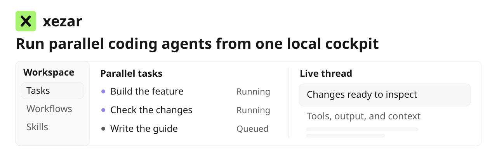
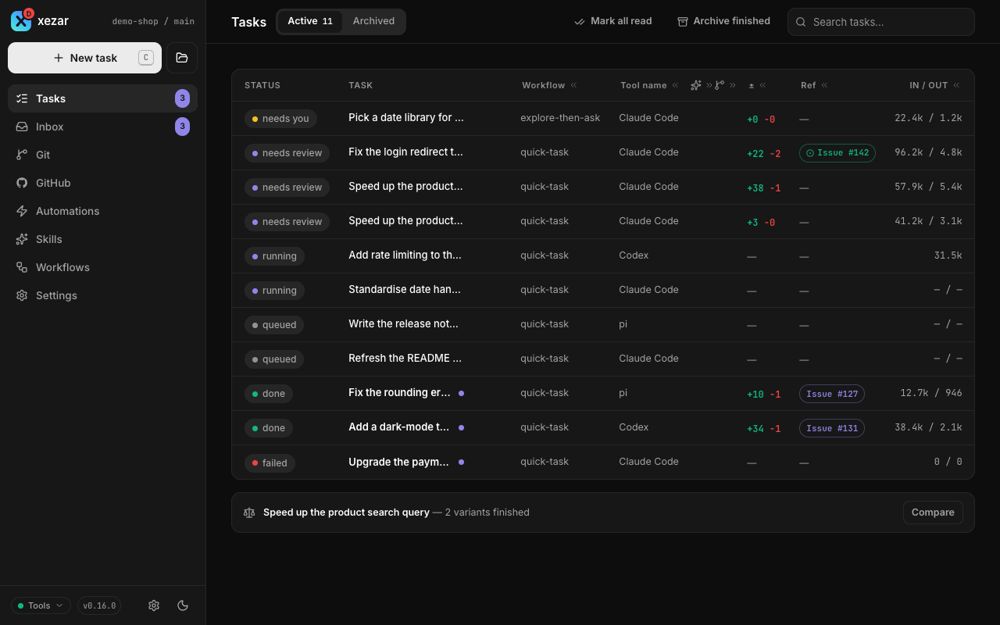
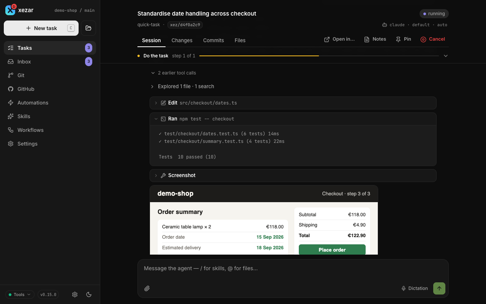
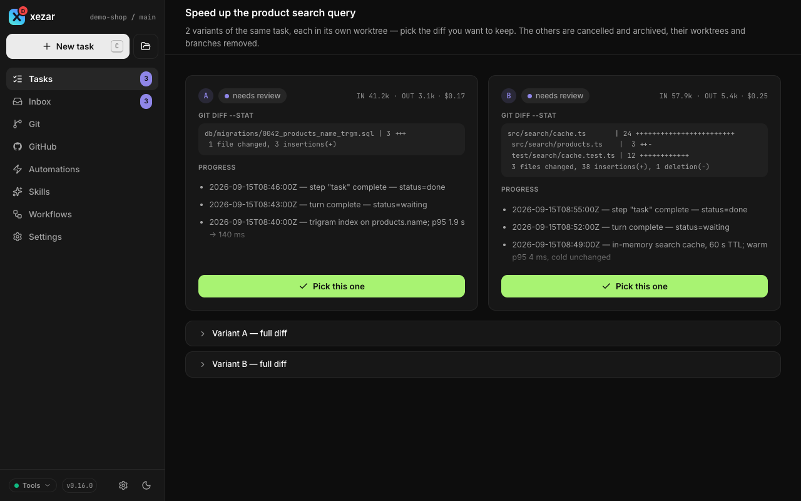
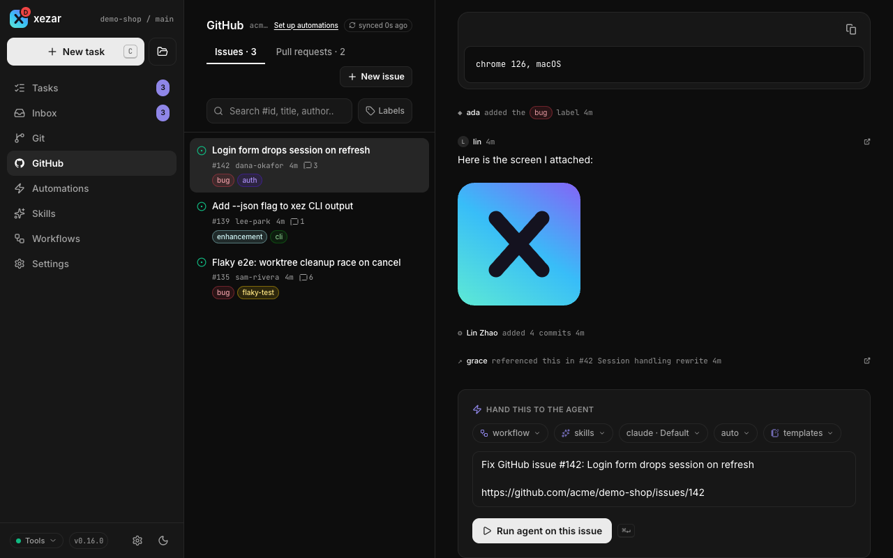
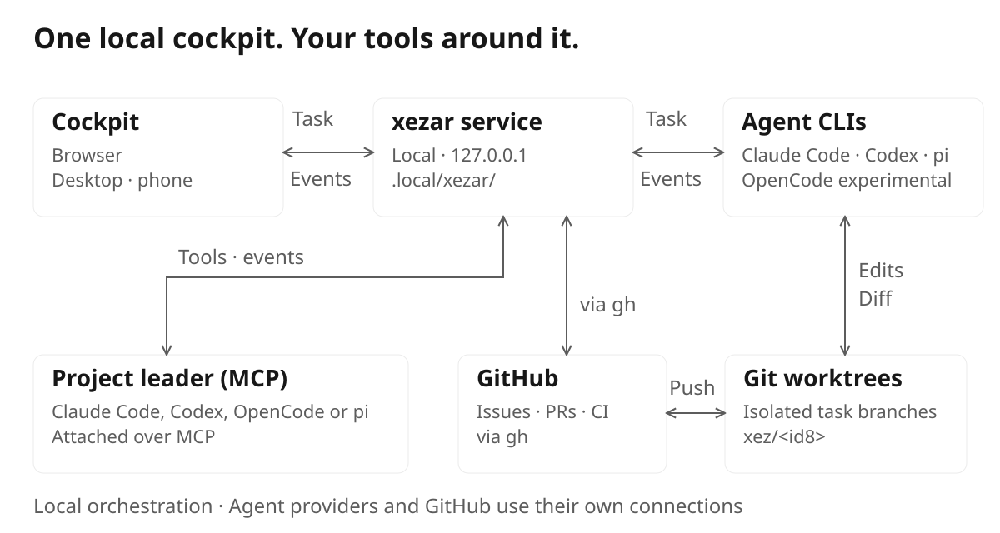

<div align="center">

<h1>xezar</h1>

<picture><source media="(prefers-color-scheme: dark)" srcset="docs/assets/readme/hero-dark.svg"></picture>

**Run parallel coding agents from one local cockpit.**

[](https://github.com/qodeca/xezar/actions/workflows/ci.yml)
[](https://www.npmjs.com/package/@qodeca/xezar)
[](LICENSE)


[Tour](#60-second-tour) · [Features](#features) · [How it works](#how-it-works) · [User guide](#user-guide) · [Backends](#agent-backends) · [Contributing](#contributing)

</div>

Type a task, pick a workflow and choose **Claude Code, Codex, OpenCode or pi**.
You can mix agents per step and watch them work live in a browser cockpit on your machine.
Git tasks get their own worktree by default. Overflow waits in a queue. Nothing merges without you.
xezar uses your CLI logins, your `gh` and your files. No xezar account, database or cloud service.

> **Project status: early.** xezar is 0.x and moves fast. This repository opened on 2026-09-07; the
> code is older and shipped before under the name Cezar. Expect rough edges, and expect breaking
> changes in minor releases – each one is called out in the [CHANGELOG](CHANGELOG.md).

```bash
npm install -g @qodeca/xezar
cd your-repo
xezar        # → cockpit at http://localhost:4321
```

That is the whole setup. If your `claude` CLI is logged in and `gh` is authenticated, there is nothing
else to configure. Runtime lives in `.local/xezar/` inside your repo – plain JSON, NDJSON and Markdown
you can `cat` and fix by hand.

## 60-second tour

<a href="docs/screenshots/0.16.0/tour.gif"></a>

<table>
<tr>
<td width="33%"><a href="docs/screenshots/0.16.0/task-thread-dark-1280.png"><picture><source media="(prefers-color-scheme: light)" srcset="docs/screenshots/0.16.0/task-thread-light-1280.png"></picture></a></td>
<td width="33%"><a href="docs/screenshots/0.16.0/compare-variants-dark-1280.png"><picture><source media="(prefers-color-scheme: light)" srcset="docs/screenshots/0.16.0/compare-variants-light-1280.png"></picture></a></td>
<td width="33%"><a href="docs/screenshots/0.16.0/github-issues-dark-1280.png"><picture><source media="(prefers-color-scheme: light)" srcset="docs/screenshots/0.16.0/github-issues-light-1280.png"></picture></a></td>
</tr>
<tr>
<td align="center"><b>Watch a run live</b><br>Every step, tool call and token as it happens.</td>
<td align="center"><b>Compare variants</b><br>Run a task ×2 or ×3, keep the best diff.</td>
<td align="center"><b>Work the tracker</b><br>Hand a GitHub issue to an agent in one click.</td>
</tr>
</table>

More → [Tasks and runs](docs/guide/02-tasks-and-runs.md)

## Features

-  **Parallel runs** – many agents at once, each followed live.
-  **Worktrees** – git tasks default to their own `xez/<id8>` branch.
-  **Four backends** – Claude Code, Codex, OpenCode, pi, mixed per step.
-  **Workflows** – short YAML chains of agent steps and shell checks.
-  **Skills** – Markdown playbooks, local or from a team repo.
-  **Review gate + draft PR** – optional; xezar never auto-merges.
-  **GitHub** – issues and PRs through your own `gh`.
-  **Local only** – no account, no database, no cloud service.
-  **Phone-friendly** – host it on a server, manage tasks from your phone.
-  **MCP leader** – an agent of yours drives the project through xezar's MCP tools.
-  **Queue + memory ceiling** – overflow waits; a run over its ceiling pauses.
-  **Themes and density** – dark, light or system, two accents, Roomy to Compact.

**Zero config.** No API keys, environment variables or configuration files are required.
xezar uses your existing agent logins and `gh`. Missing tools leave a smaller working cockpit.
**Autonomous** lets a run continue without stopping for answers.

## How it works

<picture><source media="(prefers-color-scheme: dark)" srcset="docs/assets/readme/architecture-dark.svg"></picture>

1. You describe a task; xezar runs it as a **workflow** – agent steps plus shell checks, with bounded `onFail` retries.
2. Each step shells out to an agent CLI you are logged into – **your subscription, no API key**.
3. Git tasks run in their own worktree by default; a non-git folder runs in place, one task at a time.
   Turn **Worktree** off to run in your checkout under the repository-root lease, which serializes tasks there.
4. Every event is written to `.local/xezar/` and streamed to the cockpit over SSE, replay included.
5. With the optional review gate on, a run with a diff waits in `review`; you merge, never xezar.

More → [Worktrees and git](docs/guide/03-worktrees-and-git.md)

## User guide

- [Getting started](docs/guide/01-getting-started.md) – install, first task and dry run.
- [Tasks and runs](docs/guide/02-tasks-and-runs.md) – composer, queue, variants and review.
- [Worktrees and git](docs/guide/03-worktrees-and-git.md) – branches, retention and diffs.

[Read the complete 17-part user guide](docs/guide/README.md) for backends, workflows, settings, configuration, hosting and troubleshooting.

## Quick start

**Prerequisites:** Node 20+ and at least one logged-in agent CLI – [`claude`](https://github.com/anthropics/claude-code),
[`codex`](https://github.com/openai/codex), [OpenCode](https://opencode.ai) or [pi](https://github.com/badlogic/pi-mono) –
plus, optionally, `git` and `gh`. The package installs both the `xezar` and `xez` commands.

```bash
npx @qodeca/xezar                                     # no install: fetched on demand
xezar run "add a --json flag to the export command"   # headless, CI-friendly
xezar init                                            # scaffold .xezar/
npm install -g @qodeca/xezar@latest                   # upgrade
```

The cockpit picks the next free port when 4321 is busy. **Try it offline:** `XEZ_DRY_RUN=1`
runs a bundled mock instead of a real agent, so the whole cockpit works offline with no login.

More → [Getting started](docs/guide/01-getting-started.md)

## Agent backends

| Backend | How xezar drives it | Tool access |
|---|---|---|
| **Claude Code** (default) | Headless `stream-json` mode | `allowedTools` (`bashAllowlist` scopes `Bash`); unapproved tools denied without prompting; the default list includes unrestricted `Bash` |
| **Codex** | `codex app-server`, JSON-RPC over stdio | Ignores `allowedTools`; `danger-full-access` with no approvals (`XEZ_CODEX_NETWORK=0` for the network-blocked sandbox) |
| **OpenCode** _(experimental)_ | `opencode serve`, HTTP + SSE | Ignores `allowedTools`; permission asks are answered fail-closed: a directory ask inside the run's own directories is allowed once, every other ask is denied |
| **pi** | `--mode rpc` over JSONL | `allowedTools` mapped onto pi's `--tools`; a `bashAllowlist` disables `Bash` |

Backends are detected locally, with Claude offered when none is found. Model choices come from
local discovery and configuration, with fallback choices when discovery is unavailable.
Choose a backend in config (`defaultRunner`), per task or per workflow step (`runner:`); the most specific wins.

## Configuration

Nothing is required. `.xezar/config.json` (per repo) and `~/.xezar/config.json` (per user) are optional,
and the cockpit's Settings write them for you. Every user-facing `XEZ_*` variable is listed below.
xezar never loads a `.env` file; export variables in your shell.

To let a repository carry its own xezar setup, start `xezar --single-project` once in it: settings,
agent accounts and limits then live in the project's `.xezar/` folder, `~/.xezar` is not opened, and a
clone runs the same way with no setup step. The first run offers a one-time copy of your global
setup. See [single-project mode](docs/guide/09-projects.md#to-keep-a-projects-xezar-setup-inside-the-project--single-project-mode).

<details>
<summary>Environment variables</summary>

| Env var | Effect |
|---|---|
| `XEZ_DRY_RUN=1` | Use bundled mock agents; the cockpit works offline without a login. |
| `XEZ_AGENT_MODELS_LOCKED=1` | Lock models to native agent settings. Exact `1` also delegates provider checks to agents. Restart required. Stored `modelsLocked: true` locks models only. |
| `XEZ_APPROVAL_GATE=1` | Opt into Claude's interactive approval UI; by default, unapproved tools are denied without interrupting the run. |
| `XEZ_FOLLOWUPS=1` | Enable the follow-up Inbox (default off). Settings → Resources overrides this without restart; task Notes work either way. |
| `XEZ_AUTOMATIONS=1` | Enable scheduled GitHub automations (default off, exact `1`). Read live, no restart: turning it on starts the poller and opens the routes, turning it off stops the poller and closes them, each observed the next time xezar consults the flag. Definitions survive disabling it. |
| `XEZ_AUTOSAVE=1` | Enable periodic 90-second worktree commits (default off). Turn-end and pre-PR flushes always run. |
| `XEZ_CLAUDE_BIN=/path/to/claude` | Override which `claude` binary is used. |
| `XEZ_CODEX_BIN=/path/to/codex` | Override which `codex` binary is used. |
| `XEZ_CODEX_REASONING=concise` | Codex reasoning summary: `auto` (default), `concise`, `detailed` or `none`; unknown values use `auto`. |
| `XEZ_OPENCODE_BIN=/path/to/opencode` | Override which `opencode` binary is used. |
| `XEZ_PI_BIN=/path/to/pi` | Override which `pi` binary is used. |
| `CLAUDE_CONFIG_DIR`, `CODEX_HOME`, `PI_CODING_AGENT_DIR` | Move the agent’s default account, including credentials (`CODEX_HOME` for Codex, `PI_CODING_AGENT_DIR` for pi). Add second logins in Settings → Agent accounts. |
| `OPENCODE_CONFIG_DIR` | Move OpenCode configuration; credentials remain in `~/.local/share/opencode`. Defaults to `$XDG_CONFIG_HOME/opencode` or `~/.config/opencode`. |
| `XEZ_BROWSE_ROOT=~/` | Default root for **Add project → Open local folder…**. The picker cannot navigate above it; a saved workspace value overrides the environment default and must name an existing folder. |
| `XEZ_PROJECTS_DIR=~/xezar/projects` | Default destination for **Clone from GitHub**. Saved workspace settings override it, and missing directories are created recursively. |
| `XEZ_SKILLS_AUTO_UPDATE=0` | Disable automatic application of tracked team-skill updates (default on). Saved global Skills settings override it; read-only detection continues. |
| `XEZ_AUTONOMOUS_DEFAULT=0` | Seed the New Task Autonomous default (`0` or `1`). Without a seed, skills default on and workflows off; a saved global Resources setting overrides it. |
| `XEZ_WORKTREE_DEFAULT=1` | Seed the New Task Worktree default (`0` or `1`). Without a seed, eligible runs default on; a saved global Resources setting overrides it. |
| `XEZ_DISABLE_REPO_LOCK=1` | Bypass the repository-root lease (default off, exact `1`). Concurrent agents may overwrite files or Git state. Isolated worktrees are unaffected. |
| `XEZ_SINGLE_PROJECT=1` | Show only the launch project and refuse project management (default off, exact `1`). Restart required; registry rows are retained. State stays in `~/.xezar`; not deprecated by `--single-project`, which also moves the state into the project. |
| `XEZ_GLOBAL_LAYOUT=1` | Ask for the global layout on this launch even in a folder that carries `.xezar/workspace.json` (default off, exact `1`; the flag is `--global-layout`). It outranks the marker, and it is how a script or test harness gets the global layout from a clone that commits the marker without moving the project's own state. `XEZ_HOME` still only relocates the global state root and neither turns the layout on nor off. |
| `XEZ_HIDE_TOKEN_USAGE=1` | Hide token counts, keeping cost visible (default off, exact `1`, restart required). API data is unchanged. |
| `XEZ_HIDE_COST=1` | Hide cost, keeping token counts visible (default off, exact `1`, restart required). API data is unchanged. |
| `XEZ_HIDE_TOKEN_METRICS=1` | Legacy switch hiding both counts and cost; overrides the two flags above (default off, exact `1`, restart required). |
| `GITHUB_TOKEN` | Fallback for GitHub reads/PRs when `gh` isn't authenticated. |
| `XEZ_ENV_PASSTHROUGH=A,B` | Forward extra host variables to agents. Settings → Resources overrides this without restart; the default environment is restricted. |
| `XEZ_AGENT_ENV_FULL=1` | Give agents the full host environment, including host secrets (default off). |
| `XEZ_AGENT_TMPDIR=0` | Disable per-task temp directories and their write check; use host `TMPDIR` instead. Default: isolated, checked directories cleaned at run end. |
| `XEZ_REDACT_SECRETS=0` | Disable best-effort credential scrubbing in saved state (default on). Scrubbing cannot guarantee every secret is caught. |
| `XEZ_TITLE_UPDATES=0` | Turn off the live task-title refresh (namer re-runs on each turn end). The Settings → Agents toggle overrides this default. |
| `XEZ_AUTONAME=0` | Disable all LLM task naming, keeping heuristic titles. Naming is off in dry runs unless forced with `1`. |
| `XEZ_REVIEW_GATE=1` | Enable review for successful non-autonomous runs with changes (default off, exact `1`). Settings → Agents overrides it. |
| `XEZ_NO_BANNER=1` | Hide the team-skills banner at `xezar serve` startup. |
| `XEZ_PORT=4321` | The port `xezar serve` starts from, then the next free one. `-p/--port` beats it, and so does a port pinned for the project (`xezar projects port <id> <port>`), so one export in a shell profile cannot pull every project to the same start port. A value that is not a whole number from 0 to 65535 refuses the start. |
| `XEZ_OUTPUT=auto` | How `xezar serve` shows what is happening: `auto` (default — a live table on a wide terminal, one line per event elsewhere), `lines` (never a table; the screen-reader and log-file answer), `rich`. A saved `cli.output` overrides it; `--output` overrides both. |
| `XEZ_COLOR=auto` | Colour: `auto` (default), `always`, `never`. Colour only ever reinforces a word that is already there, so turning it off loses nothing. In `serve`, pipes, CI and `TERM=dumb` suppress colour even with `always`. |
| `NO_COLOR=1` | Any non-empty value turns colour off. It outranks `XEZ_COLOR` and a saved `cli.color`; an explicit `--color` beats it. |
| `XEZ_LOG_LEVEL=info` | How much `xezar serve` says: `debug`, `info` (default), `warn`, `error`. A saved `cli.logLevel` overrides it; `--log-level` overrides both. |
| `XEZ_QUIET=1` | Warnings and errors only (exact `1`; `--quiet` is the flag). The cockpit URL, each task's final status and every bind or exposure failure are still printed — quiet can never hide a failure. It raises the threshold but never lowers one you set higher. |
| `XEZ_INSTANCE=workspace` | Which projects one xezar process serves: `workspace` (default — this cockpit opens every project you have registered) or `project` (this cockpit serves the project it started in, and your other projects appear as links to their own cockpit; they stay listed and you can still add and remove them). A saved `cli.instance` overrides it; `--instance` overrides both. `XEZ_SINGLE_PROJECT` and a folder that owns its xezar state already serve one project and win over it. |
| `VITE_XEZ_API_BASE=http://localhost:4321` | Build-time API origin for a separately hosted cockpit; default is same-origin. A served `xez-api-base` meta tag overrides it. |
| `XEZ_REMOTE=1` | Hide conveniences that open files or applications on the host machine. Off by default. |
| `XEZ_CODEX_NETWORK=0` | Use Codex's network-blocked workspace-write sandbox; default is full access. |
| `XEZ_HOME=/path/to/state` | Move global state and the project registry from `~/.xezar`; empty uses the default. |

Defaults and internal test variables: [`.env.example`](.env.example).

</details>

## Project leader (MCP)

A project leader works through the xezar MCP tools only – not the cockpit UI and not the HTTP API.
Start the bridge from your agent with `npx -y @qodeca/xezar mcp`.
xezar pushes project events to the attached leader.

Nothing is pushed until a leader is attached, and xezar gains no setting and no
environment variable for it. The leader attaches itself with `leader_events` action
`attach`: xezar takes the client from the leader's own MCP session (Claude Code, Codex or
pi), so it names nothing, and `leader_events` action `status` says whether it is attached
and can receive pushes. Each pushed event names the cursor to acknowledge, so no read is
needed. An attachment ends when xezar restarts; the leader checks `status` and attaches
again.

**After a context compaction the leader reads, it does not wait.** A compaction drops
whatever pushed messages were still in the leader's context, and xezar re-pushes nothing
on a timer. So the leader's own instructions should say: after context compaction, call
`leader_events` with action `read` and no cursor before relying on prior pushes. It
replays the retained events after the last explicit acknowledgement, including events
that were pushed but never acknowledged. Read every page with `nextCursor` while
`hasMore` is true, deduplicate by `eventId`, reconcile the current task state, then
acknowledge only the events accounted for – a transport receipt is not an
acknowledgement. Already acknowledged events are not replayed; a retained earlier cursor
rewinds the read on purpose and never moves the acknowledgement. If the journal reports a
gap, reconcile the returned current state before acknowledging `resumeCursor`. Do not
poll while idle. xezar ships that same text in the tool description and in the MCP
`initialize` instructions, so a leader reads it at runtime.

Delivery is **at-least-once within retained durable state** – not exactly-once, and not a
promise about runtime state you deleted. The journal keeps at least the newest 10 000
events per project and evicts none younger than 14 days; one page carries at most 100
events or 40 000 bytes. Anything older comes back as an explicit gap, never as silence.
Only `ack` moves the position – reading an event or receiving it does not – and `ack` is
cumulative, monotonic and idempotent, so an older or repeated cursor is a successful
no-op.

A person can still attach a leader with **Attach leader** under
**Settings → MCP connection → Connection status**, and an OpenCode leader is attached
only that way.
An unattached leader reads events with `leader_events`. Use `gh` for GitHub facts. During project
setup, keep four results separate: a project snippet is only **files prepared**; a real MCP tool
result proves **connected**; `leader_events` attach/status proves **attached**; and a real pushed
event or an attached-session `read` proves **delivery verified**. After xezar restarts, the
attachment is gone even though journal cursors remain: call a tool, check status, attach with a new
operation ID and read retained events again. The canonical end-to-end setup, launch, verification and
recovery instructions for Claude Code, Codex, pi and OpenCode are in the
[project-leader guide](docs/guide/13-mcp-leader.md).

<details>
<summary>Waking a Claude Code leader: requirements and recovery</summary>

Launch with `claude --dangerously-load-development-channels server:xezar` to let xezar wake this leader. The flag lets a custom server push messages into your session because custom servers are not on the channel allowlist. Claude Code shows a confirmation screen on every launch: choose "I am using this for local development" if you accept it. Then let the leader call `leader_events` action `attach`, or use **Attach leader** under **Settings → MCP connection → Connection status**, the same control that attaches Codex, OpenCode and pi. Until it is attached, the leader reads events with `leader_events`. The feature-flag service must be reachable and enable Channels. A Team or Enterprise admin must enable Channels. Channels need a claude.ai or Anthropic Console API-key login, do not work on Bedrock, Vertex or Foundry, and are off while CLAUDE_CODE_DISABLE_NONESSENTIAL_TRAFFIC is set.

- **`claude-code-not-owner`** – The MCP session that owns this project is not a Claude Code session, so there is no Claude Code leader to push events to. Events are kept in the journal. fix: Start Claude Code in this project with --dangerously-load-development-channels server:xezar, let it call a xezar tool once, then attach it again.
- **`claude-code-bridge-too-old`** – This Claude Code session is connected through an older xezar MCP bridge that cannot push events. Events are kept in the journal. fix: Restart Claude Code so it starts the current xezar bridge (npx -y @qodeca/xezar mcp), then attach it again.
- **`claude-code-channel-not-advertised`** — This Claude Code session connected while xezar could not push to it, so its xezar MCP server did not register the channel and a pushed event would never reach the model. Events are kept in the journal. fix: Reconnect the xezar MCP server in Claude Code (/mcp, then reconnect xezar) or restart Claude Code while the cockpit runs, then attach it again (from Claude Code: leader_events with action attach). Until then, read events with leader_events.
- **`claude-code-push-unconfirmed`** – xezar pushed events to the attached Claude Code session, and they are not acknowledged yet. Claude Code does not confirm delivery, so xezar cannot tell a leader that is still working from one that never received them. Nothing is lost: the events stay in the journal. fix: If the leader is working, nothing is needed. Otherwise check the launch flag and the Channels requirements above. Until then, read events with leader_events.

</details>

More → [Run each supported client as the project leader](docs/guide/13-mcp-leader.md)

## Remote access

xezar binds to `127.0.0.1` by default (this machine only). To reach it from a phone or another machine, `xezar server-install` puts an
authenticated front before it – see the [Remote access overview](docs/server-install/README.md).

## Upgrading to 0.16.0

### Audit trail file

The audit trail is now `.local/xezar/audit.ndjson`, with a new record shape (#306). The old
`mcp-audit.ndjson` is read-only: xezar reads it only while the new file does not exist, prints one
deprecation line when it does, and never changes it. Keep it if you want the old history. xezar 0.15.0,
after a downgrade, reads its old file but cannot read records written by 0.16.0. The old name stops
being read no earlier than 0.18.0. The trail now records cockpit, automation and command-line changes
too, not only MCP; on a hosted server behind a custom reverse proxy, set `X-Xezar-User` to the
authenticated user (the bundled nginx site already does). Details: [`BACKWARD_COMPATIBILITY.md`](BACKWARD_COMPATIBILITY.md).

### Claude Code, pi and OpenCode runs and your own MCP servers

A task run started with Claude Code, pi or OpenCode no longer loads your own `xezar` MCP entry (#342) –
the same rule Codex runs have had since #324. This closes a real bug: xezar's bridge took your
project's one leader slot the moment it connected, so a task running in the project folder itself
(Worktree off) could hold that slot for its whole lifetime and refuse your own leader session with
"project occupied". Every other MCP server your project declares still loads, for every backend; your
config files are never edited. Two narrowings follow: a Claude Code task now sees only the MCP
servers your project's own `.mcp.json` declares, not the ones in `~/.claude.json`; and for pi and
OpenCode a server literally named `xezar` is switched off in tasks even when it belongs to you, so
rename an unrelated server of that name. Details: [`BACKWARD_COMPATIBILITY.md`](BACKWARD_COMPATIBILITY.md).
Migration: [Run each supported client as the project leader](docs/guide/13-mcp-leader.md) § "To keep your leader while tasks run in the same folder".

### The sidebar is navigation-only now

The sidebar's task list, the Active/Archived toggle and the "Search… ⌘K" box are gone (#546); the
sidebar shows navigation only. Active/Archived and search now live on the Tasks pages – the
per-project Tasks page and the workspace-wide All tasks page – alongside pin/unpin, unread state
and diff stats, which already lived there; ⌘K still opens the command palette from anywhere, with
no sidebar click target needed. Details: [`BACKWARD_COMPATIBILITY.md`](BACKWARD_COMPATIBILITY.md).

### Single-project mode

A repository can now carry its own xezar setup so every clone runs the same way with no host setup
step: start `xezar --single-project` once in the project folder – its first run there also offers a
one-time import of your existing global `~/.xezar` setup. See
[Projects § single-project mode](docs/guide/09-projects.md#to-keep-a-projects-xezar-setup-inside-the-project--single-project-mode).

### Hosted WebSocket migration

Hosted mode (`XEZ_REMOTE=1` or a non-loopback bind) now refuses all WebSocket upgrades, including
native clients without an Origin. Use the authenticated HTTP API and SSE event endpoints through
your reverse proxy; the cockpit already uses these transports remotely. Local-mode WebSocket
clients and the Vite development proxy are unchanged.

### MCP door for every registered project

Every project registered in the cockpit now gets its own MCP door, opened at boot and when the
project is registered (#557) – not only the one the cockpit started in. A leader started in a
second project can attach without restarting the cockpit inside that project's folder; nothing to
configure, and the starting project's connection, socket location and connection file are
unchanged. See
[Run a leader in each client](docs/guide/13-mcp-leader.md#to-run-a-leader-in-each-client).

### A few more things to expect

- A pi task in its own isolated working copy (Git worktree) can no longer use its file tools to
  write or edit the repository's primary working copy, and a shell command that names that copy is
  refused (best effort, not containment). A pi task that needs the primary working copy on purpose
  must be created with Worktree off.
- A run xezar itself ends for the memory limit now finishes `failed`, not `done` – expect `failed`
  instead of a done run with no deliverable.
- In an autonomous run, the automatic re-prompt after a Continue on a workflow step still waiting
  for `XEZ:DONE` is capped at 3 attempts; once that step says `XEZ:DONE`, the remaining steps keep
  their usual budget. No flag restores the old 40-retry loop.
- The stdout line `recovered N run(s) from the previous session` is gone; a script that read it
  should instead read stderr's plain output and select `event=task.recovered`.

Details for all four: [`BACKWARD_COMPATIBILITY.md`](BACKWARD_COMPATIBILITY.md).

## Upgrading to 0.15.0

### Codex runs and MCP servers

A Codex run no longer loads the MCP servers, plugins or apps from your own Codex config (#324). To give
Codex runs a server, declare it in the project's own `.codex/config.toml`, trust the project in Codex,
keep `~/.codex/config.toml` from adding keys to it, and do not name it `xezar` (reserved for xezar's
leader bridge). A Codex CLI that cannot answer `config/read` fails the run – update it with
`npm i -g @openai/codex`. Details: [`BACKWARD_COMPATIBILITY.md`](BACKWARD_COMPATIBILITY.md).

### Team skills repository

The default team skills repository moved from `open-mercato/skills` (`om-*`) to `qodeca/xezar-skills`
(`xez-*`). A curated selection naming `om-*` keeps working. Move an `npx skills` install by hand:

```sh
npx skills remove om-fix om-code-review … -p   # every om-* name in skills-lock.json; -g for a global install
npx skills add qodeca/xezar-skills --skill '*'
rm -rf ~/.cache/xez/skills/open-mercato__skills .claude/skills/om-*   # optional: orphaned clone cache and copies
```

To keep the old collection, set `"skillsRepos": [{ "repo": "open-mercato/skills" }]` in `.xezar/config.json`
(loaded and enabled, no longer auto-updated).

### Agent config symlinks

Settings → Agent config no longer follows an individual config-file symlink: reads and writes answer
409 and the file is listed read-only (#363). Replace the link with a regular file; relocating a whole
agent home still works.

## Contributing

Bug reports, ideas and pull requests are welcome – [CONTRIBUTING.md](CONTRIBUTING.md) is the path from a
change to a merged pull request, including local development. Report security problems privately, as
described in [SECURITY.md](SECURITY.md).

## License

**MIT** © Qodeca – full text in [LICENSE](LICENSE).
Xezar is based on work done in [open-mercato/cezar](https://github.com/open-mercato/cezar).
