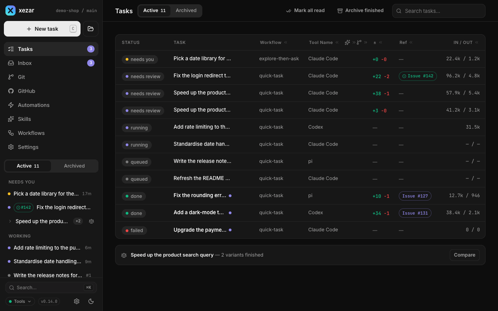

<div align="center">

<a href="docs/assets/readme/hero-light.svg"><picture>
  <source media="(prefers-color-scheme: dark)" srcset="docs/assets/readme/hero-dark.svg">
  
</picture></a>

**Run a team of coding agents in parallel – from one local cockpit.**

[](https://github.com/qodeca/xezar/actions/workflows/ci.yml)
[](https://www.npmjs.com/package/@qodeca/xezar)
[](LICENSE)


[Tour](#60-second-tour) · [Features](#features) · [How it works](#how-it-works) · [User guide](#user-guide) · [Backends](#agent-backends) · [Contributing](#contributing)

</div>

Type a task, pick a workflow and an agent – **Claude Code, Codex, OpenCode or pi**, or a mix per
step – and watch it work live in a browser cockpit that runs on your machine. Each task gets its own
git worktree, the overflow waits in a queue, and nothing merges without you. Your CLI logins, your
`gh`, your files. No accounts, no database, no cloud.

> **Project status: early.** xezar is 0.x and moves fast. This repository opened on 2026-09-07; the
> code is older and shipped before under the name Cezar. Expect rough edges, and expect breaking
> changes in minor releases – each one is called out in the [CHANGELOG](CHANGELOG.md).

```bash
npm install -g @qodeca/xezar
cd your-repo
xezar        # → cockpit at http://localhost:4321
```

That is the whole setup. If your `claude` CLI is logged in and `gh` is authenticated, there is nothing
else to configure. Runtime lives in `.local/xezar/` inside your repo – plain JSON, NDJSON and Markdown
you can `cat` and fix by hand.

## 60-second tour

<a href="docs/screenshots/0.15.0/tour.gif"></a>

<table>
<tr>
<td width="33%"><a href="docs/screenshots/0.15.0/task-thread-dark-1280.png"><picture><source media="(prefers-color-scheme: light)" srcset="docs/screenshots/0.15.0/task-thread-light-1280.png"></picture></a></td>
<td width="33%"><a href="docs/screenshots/0.15.0/compare-variants-dark-1280.png"><picture><source media="(prefers-color-scheme: light)" srcset="docs/screenshots/0.15.0/compare-variants-light-1280.png"></picture></a></td>
<td width="33%"><a href="docs/screenshots/0.15.0/github-issues-dark-1280.png"><picture><source media="(prefers-color-scheme: light)" srcset="docs/screenshots/0.15.0/github-issues-light-1280.png"></picture></a></td>
</tr>
<tr>
<td align="center"><b>Watch a run live</b><br>Every step, tool call and token as it happens.</td>
<td align="center"><b>Compare variants</b><br>Run a task ×2 or ×3, keep the best diff.</td>
<td align="center"><b>Work the tracker</b><br>Hand a GitHub issue to an agent in one click.</td>
</tr>
</table>

More → [Tasks and runs](docs/guide/02-tasks-and-runs.md)

## Features

| | | |
|:--|:--|:--|
| <br>**Parallel runs** – many agents at once, each followed live. | <br>**Worktrees** – every git task on its own `xez/<id8>` branch. | <br>**Four backends** – Claude Code, Codex, OpenCode, pi, mixed per step. |
| <br>**Workflows** – short YAML chains of agent steps and shell checks. | <br>**Skills** – Markdown playbooks, local or from a team repo. | <br>**Review gate + draft PR** – optional; xezar never auto-merges. |
| <br>**GitHub** – issues and PRs through your own `gh`. | <br>**Local only** – no account, no database, no cloud service. | <br>**Phone-friendly** – host it on a server, steer it from your pocket. |
| <br>**MCP leader** – an agent of yours drives the project through xezar's MCP tools. | <br>**Queue + memory ceiling** – overflow waits; a run over its ceiling pauses. | <br>**Themes and density** – dark, light or system, two accents, Roomy to Compact for real. |

**Zero config.** No wizard, no API keys, no env vars, no schema. xezar rides the `claude` / `codex` /
`opencode` / `pi` logins and the `gh` you already have, and every missing piece degrades to a smaller
working cockpit instead of blocking you. Flip **Autonomous** and a run never stops to ask – queue a
stack of tasks and walk away.

## How it works

<a href="docs/assets/readme/architecture-light.svg"><picture>
  <source media="(prefers-color-scheme: dark)" srcset="docs/assets/readme/architecture-dark.svg">
  
</picture></a>

1. You describe a task; xezar runs it as a **workflow** – agent steps plus shell checks, with bounded `onFail` retries.
2. Each step shells out to an agent CLI you are logged into – **your subscription, no API key**.
3. In a git repo the task runs in its own worktree; a non-git folder runs in place, one task at a time.
4. Every event is written to `.local/xezar/` and streamed to the cockpit over SSE, replay included.
5. With the optional review gate on, a run with a diff waits in `review`; you merge, never xezar.

More → [Worktrees and git](docs/guide/03-worktrees-and-git.md) · [Workflows](docs/guide/05-workflows.md) · [Skills](docs/guide/06-skills.md)

## User guide

**[Read the user guide →](docs/guide/README.md)** – every screen, setting and command, one part per topic.

| Part | | Part | |
|---|---|---|---|
| [01 Getting started](docs/guide/01-getting-started.md) | install, first task, dry run | [09 Projects](docs/guide/09-projects.md) | many repos, tags, All tasks |
| [02 Tasks and runs](docs/guide/02-tasks-and-runs.md) | composer, queue, variants, review | [10 Settings](docs/guide/10-settings-reference.md) | every settings section |
| [03 Worktrees and git](docs/guide/03-worktrees-and-git.md) | branches, retention, diff base | [11 Configuration](docs/guide/11-configuration-reference.md) | config keys and env vars |
| [04 Agent backends](docs/guide/04-agent-backends.md) | models, accounts, tool access | [12 CLI](docs/guide/12-cli-reference.md) | every command and flag |
| [05 Workflows](docs/guide/05-workflows.md) | YAML, checks, retries, timeouts | [13 MCP leader](docs/guide/13-mcp-leader.md) | tools, attach, events |
| [06 Skills](docs/guide/06-skills.md) | discovery, team repo, updates | [14 Remote access](docs/guide/14-remote-access.md) | hosting on a server |
| [07 GitHub and automations](docs/guide/07-github-and-automations.md) | issues, PRs, watches | [15 Project kit](docs/guide/15-project-kit.md) | the `.xezar/` directory |
| [08 Inbox, notifications, templates](docs/guide/08-inbox-notifications-templates.md) | follow-ups, alerts | [16 Troubleshooting](docs/guide/16-troubleshooting-faq.md) | common failures, FAQ |

## Quick start

**Prerequisites:** Node 20+ and at least one logged-in agent CLI – [`claude`](https://github.com/anthropics/claude-code),
[`codex`](https://github.com/openai/codex), [OpenCode](https://opencode.ai) or [pi](https://github.com/badlogic/pi-mono) –
plus, optionally, `git` and `gh`. The package installs both the `xezar` and `xez` commands.

```bash
npx @qodeca/xezar                                     # no install: fetched on demand
xezar run "add a --json flag to the export command"   # headless, CI-friendly
xezar init                                            # scaffold .xezar/
npm install -g @qodeca/xezar@latest                   # upgrade
```

The cockpit picks the next free port when 4321 is busy. **Just kicking the tires?** `XEZ_DRY_RUN=1`
runs a bundled mock instead of a real agent, so the whole cockpit works offline with no login.

More → [Getting started](docs/guide/01-getting-started.md) · [CLI reference](docs/guide/12-cli-reference.md)

## Agent backends

| Backend | How xezar drives it | Tool access |
|---|---|---|
| **Claude Code** (default) | Headless `stream-json` mode | `allowedTools` (`bashAllowlist` scopes `Bash`); unapproved tools denied without prompting; the default list includes unrestricted `Bash` |
| **Codex** | `codex app-server`, JSON-RPC over stdio | Ignores `allowedTools`; `danger-full-access` with no approvals (`XEZ_CODEX_NETWORK=0` for the network-blocked sandbox) |
| **OpenCode** _(experimental)_ | `opencode serve`, HTTP + SSE | Ignores `allowedTools`; every permission auto-approved |
| **pi** _(experimental)_ | `--mode rpc` over JSONL | `allowedTools` mapped onto pi's `--tools`; a `bashAllowlist` disables `Bash` |

xezar offers only the backends it finds installed. Pick one as the config default (`defaultRunner`), per
task in the composer, or per workflow step (`runner:`) – the most specific wins. Models come from what
each CLI on your machine reports, never from a list shipped with xezar.

More → [Agent backends](docs/guide/04-agent-backends.md)

## Configuration

Nothing is required. `.xezar/config.json` (per repo) and `~/.xezar/config.json` (per user) are optional,
and the cockpit's Settings write them for you. The most used switches:

| Env var | Effect |
|---|---|
| `XEZ_DRY_RUN=1` | Bundled mock agents – the cockpit works offline with no login. |
| `XEZ_REVIEW_GATE=1` | Park finished, non-autonomous runs with a diff at `review`. Settings → Agents wins when set. |
| `XEZ_FOLLOWUPS=1` | Turn on the follow-up Inbox. Settings → Resources wins when set. |
| `XEZ_AUTOMATIONS=1` | Turn on scheduled GitHub automations. Read at boot. |
| `XEZ_APPROVAL_GATE=1` | Claude Code's interactive approval UI instead of silent denial. |
| `XEZ_ENV_PASSTHROUGH=A,B` | Forward extra host env vars to agents. Settings → Resources wins when set. |
| `XEZ_CLAUDE_BIN`, `XEZ_CODEX_BIN`, `XEZ_OPENCODE_BIN`, `XEZ_PI_BIN` | Use a specific agent binary. |
| `GITHUB_TOKEN` | Fallback for GitHub reads and PRs when `gh` is not authenticated. |

Every variable, with its default, is in [`.env.example`](.env.example) – the env contract. xezar never
loads a `.env` file.

More → [Configuration reference](docs/guide/11-configuration-reference.md) · [Settings](docs/guide/10-settings-reference.md)

## Project leader (MCP)

A project leader works through the xezar MCP tools only – not the cockpit UI and not the HTTP API.
Start the bridge from your agent (`npx -y @qodeca/xezar mcp`) and attach the leader with **Attach
leader** under **Settings → MCP connection → Connection status**; xezar then pushes project events to
it, and `leader_events` is the fallback for a leader that is not attached. GitHub facts come from `gh`.

<details>
<summary>Waking a Claude Code leader: requirements and recovery</summary>

Launch with `claude --dangerously-load-development-channels server:xezar` to let xezar wake this leader. The flag lets a custom server push messages into your session because custom servers are not on the channel allowlist. Claude Code shows a confirmation screen on every launch: choose "I am using this for local development" if you accept it. The feature-flag service must be reachable and enable Channels. A Team or Enterprise admin must enable Channels. Channels need a claude.ai or Anthropic Console API-key login, do not work on Bedrock, Vertex or Foundry, and are off while CLAUDE_CODE_DISABLE_NONESSENTIAL_TRAFFIC is set.

- **`claude-code-not-owner`** — The MCP session that owns this project is not a Claude Code session, so there is no Claude Code leader to push events to. Events are kept in the journal. fix: Start Claude Code in this project with --dangerously-load-development-channels server:xezar, let it call a xezar tool once, then attach it again.
- **`claude-code-bridge-too-old`** — This Claude Code session is connected through an older xezar MCP bridge that cannot push events. Events are kept in the journal. fix: Restart Claude Code so it starts the current xezar bridge (npx -y @qodeca/xezar mcp), then attach it again.
- **`claude-code-push-unconfirmed`** — xezar pushed events to the attached Claude Code session, and they are not acknowledged yet. Claude Code does not confirm delivery, so xezar cannot tell a leader that is still working from one that never received them. Nothing is lost: the events stay in the journal. fix: If the leader is working, nothing is needed. Otherwise check the launch flag and the Channels requirements above. Until then, read events with leader_events.

</details>

More → [MCP leader](docs/guide/13-mcp-leader.md) · [MCP tool reference](docs/features/mcp-server/mcp-api.md)

## Remote access

xezar binds to `localhost`. To reach it from a phone or another machine, `xezar server-install` puts an
authenticated front before it – see the [Remote access overview](docs/server-install/README.md).

More → [Remote access](docs/guide/14-remote-access.md)

## Upgrading to 0.15.0

### Codex runs and MCP servers

A Codex run no longer loads the MCP servers, plugins or apps from your own Codex config (#324). To give
Codex runs a server, declare it in the project's own `.codex/config.toml`, trust the project in Codex,
keep `~/.codex/config.toml` from adding keys to it, and do not name it `xezar` (reserved for xezar's
leader bridge). A Codex CLI that cannot answer `config/read` fails the run – update it with
`npm i -g @openai/codex`. Details: [`BACKWARD_COMPATIBILITY.md`](BACKWARD_COMPATIBILITY.md).

### Team skills repository

The default team skills repository moved from `open-mercato/skills` (`om-*`) to `qodeca/xezar-skills`
(`xez-*`). A curated selection naming `om-*` keeps working. Move an `npx skills` install by hand:

```sh
npx skills remove om-fix om-code-review … -p   # every om-* name in skills-lock.json; -g for a global install
npx skills add qodeca/xezar-skills --skill '*'
rm -rf ~/.cache/xez/skills/open-mercato__skills .claude/skills/om-*   # optional: orphaned clone cache and copies
```

To keep the old collection, set `"skillsRepos": [{ "repo": "open-mercato/skills" }]` in `.xezar/config.json`
(loaded and enabled, no longer auto-updated).

### Agent config symlinks

Settings → Agent config no longer follows an individual config-file symlink: reads and writes answer
409 and the file is listed read-only (#363). Replace the link with a regular file; relocating a whole
agent home still works.

## Contributing

Bug reports, ideas and pull requests are welcome – [CONTRIBUTING.md](CONTRIBUTING.md) is the path from a
change to a merged pull request, including local development. Report security problems privately, as
described in [SECURITY.md](SECURITY.md).

## License

**MIT** © Patryk Lewczuk – full text in [LICENSE](LICENSE).
