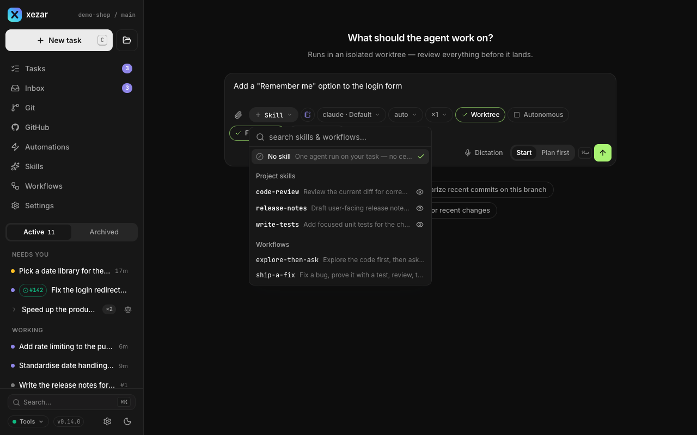

# Getting started

Use xezar to give coding tasks to an agent and follow its work in a browser. This page takes you from installing the command to opening your first task, with a mock-agent option for trying the cockpit before connecting an account.

## To check prerequisites

Have Node.js 20 or newer and npm available. Install Git to use isolated task branches and the Git views. For real agent work, install and sign in to a supported agent CLI: Claude Code, Codex, OpenCode or pi. GitHub features also need `gh`; `GITHUB_TOKEN` is the authentication fallback when `gh` is not signed in. You can start a local task without it.

## To install xezar

For a command you can reuse from any project:

```sh
npm install -g @qodeca/xezar
xezar --version
```

Or run it without a global installation:

```sh
npx @qodeca/xezar
```

The installed command also has the short name `xez`.

## To start the cockpit and choose a port

Open a terminal in your project folder and run:

```sh
xezar
```

This starts the server and opens the browser. The server binds to `127.0.0.1` by default and tries port `4321` first. If that port is occupied, it tries higher ports; use the URL printed in the terminal. You can choose a project and port explicitly, or stop the automatic browser opening:

```sh
xezar --repo /path/to/project --port 4322 --no-open
```

`xezar serve` is the explicit spelling of the same command. No `.xezar/config.json` is required, and xezar does not automatically load a `.env` file.

## To log in to an agent CLI

Run the login command for the CLI you installed in your own terminal, and complete its prompts:

| Agent | Login command |
| --- | --- |
| Claude Code | `claude auth login` |
| Codex | `codex login` |
| OpenCode | `opencode auth login` |
| pi | `pi /login` |

In the cockpit, open the project's **Settings → Agents** to check provider availability. Select the available agent in the new-task composer.

## To let an agent set up this project (optional)

Setup is optional. You can create ordinary tasks without ever running it.

On a fresh project's Tasks page, xezar offers a guided setup: "New to this project? An agent can look at it and prepare the files it needs, and it shows you every change before anything is written." **Settings → Project setup** offers the same setup under **Guided setup**. Choose **Set up this project** to start it. Without an available agent backend the button stays disabled and xezar shows the reason: "Setup unavailable — no agent backend was found. Install Claude Code, Codex, OpenCode or pi, sign in, then open this page again."

The button creates an ordinary task from the built-in `project-setup` workflow. It appears in the task list, and you can open or cancel it like any other task. Nothing starts it except your click or a project leader's request.

**What it inspects.** The task first reads what is already in the project: existing guidance, conventions and decisions, the agent clients available, Git metadata when there is a repository, and any checks the project already defines. It adapts to that material and never replaces a policy the project already states.

**What it asks.** It asks only what it cannot tell from the project itself:

1. Your domain: software, a campaign or marketing work, research, or something else.
2. The outputs you want.
3. Whether you work independently or with a project leader.
4. Which agent client to configure, only when that is ambiguous.
5. A base branch, only in a Git project where the intent is ambiguous.
6. Which team-skills source to use: the default, a custom one, or none.

Each question offers two options, the recommended one first, and you can always type your own answer. A required question you leave unanswered blocks the writes that depend on it.

**The preview.** Before it writes anything, the task shows a per-file preview of every change. It writes only what you accept, and it keeps your own content and unrelated lines as they are. If a file changes after the preview, that preview is refused and a new one is needed.

**The apply step.** Like any task, a setup task in a Git project works in its own isolated working copy (Git worktree) by default, so your checkout stays untouched until you integrate the result — see [Worktrees and Git](03-worktrees-and-git.md). In a folder without Git it works in place and keeps the originals under `.local/` so you can recover them. It writes only project files:

- `.xezar/config.json`, with real supported settings only (see [Project kit](15-project-kit.md#to-add-optional-project-configuration)).
- `.xezar/pipeline/config.json`, only if you opt in (see [Project kit](15-project-kit.md#to-add-an-optional-agent-pipeline)).
- One agent instruction file for the project, such as `AGENTS.md` or `CLAUDE.md`.
- In a Git project, a `.local/` entry in the root `.gitignore`.
- If you work with a project leader, that client's project MCP file: `.mcp.json` for Claude Code, `.codex/config.toml` for Codex, or `.pi/mcp.json` for pi.

It never changes your home-folder settings, trusts a project, signs you in, installs an adapter or attaches a leader for you.

**The report.** The task ends with a report: which files changed, which checks passed, failed, were unavailable or were not run, what it did not do and why, and a numbered list of what is left for you. That list can include integrating the change, signing in to a client, starting it and attaching a project leader. Running a leader is covered in [MCP project leader](13-mcp-leader.md). A prepared file alone does not prove a leader is connected.

## To re-check after an update

When xezar or its bundled setup templates change after this project was checked, xezar offers a re-check. It never starts one on its own. The offer is a notice at the top of the cockpit, on every page of the project, and the same state stays on **Settings → Project setup**.

- **Re-check** on the notice (or **Re-check now** on **Settings → Project setup**) starts an ordinary task that compares this project's files with the current defaults and previews the differences. Nothing is applied until you accept a preview.
- **Later** hides the notice for this version. The re-check stays available from **Settings → Project setup**.

**Settings → Project setup** shows one state: Not set up yet, Set up, Changed since the last check, Re-checking, or Provenance unknown. It also shows **Last observed** (the xezar version and templates running now), **Last offered** and **Last successfully checked**. Only a check that finishes moves **Last successfully checked**. A cancelled or failed check leaves it where it was.

This history lives in `<project>/.local/xezar/onboarding-state.json`. It is disposable local data, not configuration: deleting it only forgets past offers and checks. A missing file reads as Not set up yet. An empty or invalid file reads as Provenance unknown, and a re-check then will not replace a file on its own. Neither case blocks ordinary tasks.

A project leader sees the same state through the MCP and can start the same setup or re-check task; see [MCP project leader](13-mcp-leader.md).

## To start your first task

1. Open **New task** in the project you want to work on.
2. Describe a small, concrete result, for example: “Explain how this project's tests run. Do not change files.”
3. Choose an available agent and model. Leave the skill/workflow selection empty for one plain agent step, or choose an existing workflow.
4. In a Git repository, keep **Worktree** on for an isolated checkout. Leave **Autonomous** off if you want the agent to pause for your answers.
5. Choose **Start** and send the task. Open its thread to follow the response.



See [Tasks and runs](02-tasks-and-runs.md) for replies, review and task controls, and [Worktrees and Git](03-worktrees-and-git.md) for where changes go.

## To try without a login

In a POSIX shell, start the cockpit with the bundled mock agent:

```sh
XEZ_DRY_RUN=1 npx @qodeca/xezar
```

Create a task to see the mock event stream without invoking a real agent CLI. This exercises the cockpit, not a real model's ability to complete your task. Restart without `XEZ_DRY_RUN=1` when you want real agent work.

## To upgrade

Stop the running cockpit before starting the new version. For a global installation:

```sh
npm install -g @qodeca/xezar@latest
xezar --version
xezar
```

For an `npx` launch:

```sh
npx @qodeca/xezar@latest
```

## To find data or reset local state

| Location | What it holds |
| --- | --- |
| `<project>/.local/xezar/` | Task history, transcripts, handoff notes and task worktrees |
| `~/.xezar/` | Workspace settings, the project registry and agent-account records |
| `<project>/.xezar/` | Maintained project configuration, workflows and skills |

Before resetting, stop the cockpit and preserve any work you need from task worktrees. Removing a project's `.local/xezar/` discards its local task history and worktree directories. Use the [worktree cleanup controls](03-worktrees-and-git.md#to-set-retention-and-reclaim-now) first when you only need disk space.

For a workspace reset, remove the whole `~/.xezar/` directory, or the directory selected by `XEZ_HOME`. Removing only `config.json` can restore the registry from `config.json.bak`. xezar rebuilds runtime infrastructure on the next launch. Keep the project's `.xezar/` kit: it is maintained source, not disposable history.

## Related settings / env / config

- **Settings → Agents**: provider availability and project agent defaults.
- **Settings → Project setup**: guided-setup state, identities and the setup or re-check action.
- `--repo`, `--port`, `--no-open`: where and how the cockpit starts.
- `XEZ_DRY_RUN=1`: use the mock agent.
- `XEZ_HOME`: choose a different workspace-state directory.
- `.xezar/config.json`: optional project configuration. See the [environment contract](../../.env.example) for environment defaults.
- `<project>/.local/xezar/onboarding-state.json`: disposable record of past guided-setup checks.

Next: [Tasks and runs](02-tasks-and-runs.md)

Describes xezar 0.16.0.
