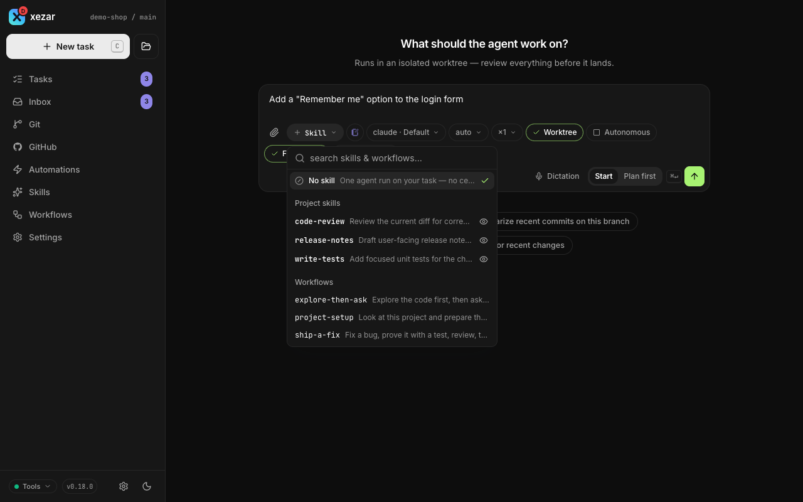

# Getting started

By the end of this page you will have a task running: you describe what you want in a browser on your own machine, an agent does it, and you watch every step as it happens. It takes installing the command, starting it in your project, and signing in to one agent CLI — there is nothing to configure first.

If you would rather look before you sign anything in, [try it without a login](#to-try-without-a-login) — a bundled mock agent drives the whole cockpit offline.

## To check prerequisites

Have Node.js 22 or newer and npm available. Install Git to use isolated task branches and the Git views. For real agent work, install and sign in to a supported agent CLI: Claude Code, Codex, OpenCode or pi. GitHub features also need `gh`; `GITHUB_TOKEN` is the authentication fallback when `gh` is not signed in. You can start a local task without it.

**By system.** macOS and Linux need nothing beyond the above. Native Windows support is still in progress; under WSL, xezar works as it does on Linux. On Windows itself, install Git for Windows for the Git features and follow each agent CLI's own Windows instructions; the MCP leader bridge (`xezar mcp`) is not available there yet. `xezar serve` warns at start-up when long file paths are off; turn on the Windows setting LongPathsEnabled (needs an administrator) and run `git config --global core.longpaths true`.

## To install xezar

For a command you can reuse from any project:

```sh
npm install -g @qodeca/xezar
xezar --version
```

Or run it without a global installation:

```sh
npx @qodeca/xezar
```

The installed command also has the short name `xez`.

## To start the cockpit and choose a port

Open a terminal in your project folder and run:

```sh
xezar
```

This starts the server and opens the browser. The server binds to `127.0.0.1` by default and tries port `4321` first. If that port is occupied, it tries higher ports; use the URL printed in the terminal. You can choose a project and port explicitly, or stop the automatic browser opening:

```sh
xezar --repo /path/to/project --port 4322 --no-open
```

`xezar serve` is the explicit spelling of the same command. No `.xezar/config.json` is required, and xezar does not automatically load a `.env` file.

## To log in to an agent CLI

xezar uses the logins you already have; it never asks for an API key of its own. Run the login command for the CLI you installed, in your own terminal, and complete its prompts:

| Agent | Login command |
| --- | --- |
| Claude Code | `claude auth login` |
| Codex | `codex login` |
| OpenCode | `opencode auth login` |
| pi | `pi /login` |

`xezar providers connect <claude|codex|opencode|pi>` does the same thing without you having to remember which command it is: it opens a terminal running that tool's own login on the machine that runs xezar. Add `--account <id>` for a second login. See the [CLI reference](12-cli-reference.md#to-sign-an-agent-tool-in-providers-connect).

In the cockpit, open the project's **Settings → Agents** to check provider availability. Select the available agent in the new-task composer.

## To start your first task

1. Open **New task** in the project you want to work on.
2. Describe a small, concrete result, for example: “Explain how this project's tests run. Do not change files.”
3. Choose an available agent and model. Leave the skill/workflow selection empty for one plain agent step, or choose an existing workflow.
4. In a Git repository, keep **Worktree** on for an isolated checkout. Leave **Autonomous** off if you want the agent to pause for your answers.
5. Choose **Start** and send the task. Open its thread to follow the response.



See [Tasks and runs](02-tasks-and-runs.md) for replies, review and task controls, and [Worktrees and Git](03-worktrees-and-git.md) for where changes go.

## To try without a login

In a POSIX shell, start the cockpit with the bundled mock agent:

```sh
XEZ_DRY_RUN=1 npx @qodeca/xezar
```

Create a task to see the mock event stream without invoking a real agent CLI. This exercises the cockpit, not a real model's ability to complete your task. Restart without `XEZ_DRY_RUN=1` when you want real agent work.

## To let an agent set up this project (optional)

Setup is optional. You can create ordinary tasks without ever running it, and everything above works with no setup at all. It exists for the case where you would rather have an agent read the project and prepare the files it needs than write them yourself.

On a fresh project's Tasks page, xezar offers a guided setup: "New to this project? An agent can look at it and prepare the files it needs, and it shows you every change before anything is written." **Settings → Project setup** offers the same setup under **Guided setup**. Choose **Set up this project** to start it. Without an available agent backend the button stays disabled and xezar shows the reason: "Setup unavailable — no agent backend was found. Install Claude Code, Codex, OpenCode or pi, sign in, then open this page again."

The button creates an ordinary task from the built-in `project-setup` workflow. It appears in the task list, and you can open or cancel it like any other task. Nothing starts it except your click or a project leader's request.

**What it runs.** The task runs the `xez-onboard-opinionated` skill from xezar-skills 3.0.3, the default team-skills source. That skill sets up the whole project around xezar: a Claude Code project leader, workflows and role skills, gates, labels and branch protection. The same skill also runs from the kit's [one-prompt bootstrap](https://github.com/qodeca/xezar-skills/blob/main/docs/bootstrap-prompt.md).

**Its limits.** Before it touches anything, it checks three limits: Claude Code only, GitHub only, and clean projects only – it never merges into a setup the project already has. A project outside them gets a stop that writes nothing and names the alternative.

**What it asks.** It first reads the repository: the branching model, the checks the build files declare, and the agent tools, accounts and models on this machine. It then shows what it found as proposals for you to confirm or correct, never as decisions already taken, and asks about routing: which tool and model does which kind of work. Your answers are saved as you give them, so an interrupted setup resumes where it stopped.

**The preview.** Before it writes anything, it shows every file it will create, delete or leave alone. You approve the whole set or nothing. If a file changes after the preview, that preview is refused and a new one is needed.

**The apply step.** It commits the approved files on a setup branch and opens one pull request. It merges that pull request only when you say so, and only when its checks are green. After the merge it protects the base branch, runs a small smoke test to prove a task can run, and changes engine settings for this project only. It writes nothing under `~/.xezar/`.

**The report.** The task ends with a report: what changed, which checks passed, failed or were not run, what it did not do and why, and what is left for you. Running the leader is covered in [MCP project leader](13-mcp-leader.md). A prepared file alone does not prove a leader is connected.

**Without the skill.** When the skill cannot be loaded – offline, or with no team-skills source – the task runs xezar's own built-in setup prompt instead. That prompt only inspects the project, asks what it cannot tell, shows a per-file preview, writes what you accept and reports the result.

## To re-check after an update

When xezar or its bundled setup templates change after this project was checked, xezar offers a re-check. It never starts one on its own. The offer is a notice at the top of the cockpit, on every page of the project, and the same state stays on **Settings → Project setup**.

- **Re-check** on the notice (or **Re-check now** on **Settings → Project setup**) starts an ordinary task that compares this project's files with the current defaults and previews the differences. Nothing is applied until you accept a preview.
- **Later** hides the notice for this version. The re-check stays available from **Settings → Project setup**.

**Settings → Project setup** shows one state: Not set up yet, Set up, Changed since the last check, Re-checking, or Provenance unknown. It also shows **Last observed** (the xezar version and templates running now), **Last offered** and **Last successfully checked**. Only a check that finishes moves **Last successfully checked**. A cancelled or failed check leaves it where it was.

This history lives in `<project>/.local/xezar/onboarding-state.json`. It is disposable local data, not configuration: deleting it only forgets past offers and checks. A missing file reads as Not set up yet. An empty or invalid file reads as Provenance unknown, and a re-check then will not replace a file on its own. Neither case blocks ordinary tasks.

A project leader sees the same state through the MCP and can start the same setup or re-check task; see [MCP project leader](13-mcp-leader.md).

In a project that xezar-skills onboards, `.xezar/routing.json` (schema `.xezar/routing.schema.json`) holds model
and lane routing. Its leader uses `node .xezar/checks/route.mjs --check` to validate it, `--rows` for
classification rows without lane data, `node .xezar/checks/route.mjs <row id>` for that row's lane
order, and `--table` for a human
view; `--file <path>` is onboarding-only before the first merge and marks output `source=unmerged`.
The kit's account-limits table records each runner/login budget as `ok`, `unknown`, or `out` with its
reset time; the kit's routing guide tells the leader to read it. Xezar reports that same status
natively – see [Settings reference](10-settings-reference.md#to-read-and-refresh-plan-limits).

xezar supports projects onboarded with xezar-skills 3.0.3, which needs xezar 0.19.0 or later. A project
still on kit 2.x moves to 3.0.3 first; the kit's
[upgrade notes](https://github.com/qodeca/xezar-skills/blob/main/UPGRADE_NOTES.md) list the steps.

## To upgrade

Stop the running cockpit before starting the new version. For a global installation:

```sh
npm install -g @qodeca/xezar@latest
xezar --version
xezar
```

For an `npx` launch:

```sh
npx @qodeca/xezar@latest
```

## To find data or reset local state

| Location | What it holds |
| --- | --- |
| `<project>/.local/xezar/` | Task history, transcripts, handoff notes and task worktrees |
| `~/.xezar/` | Workspace settings, the project registry and agent-account records |
| `<project>/.xezar/` | Maintained project configuration, workflows and skills |

Before resetting, stop the cockpit and preserve any work you need from task worktrees. Removing a project's `.local/xezar/` discards its local task history and worktree directories. Use the [worktree cleanup controls](03-worktrees-and-git.md#to-set-retention-and-reclaim-now) first when you only need disk space.

For a workspace reset, remove the whole `~/.xezar/` directory, or the directory selected by `XEZ_HOME`. Removing only `config.json` can restore the registry from `config.json.bak`. xezar rebuilds runtime infrastructure on the next launch. Keep the project's `.xezar/` kit: it is maintained source, not disposable history.

## Related settings / env / config

- **Settings → Agents**: provider availability and project agent defaults.
- **Settings → Project setup**: guided-setup state, identities and the setup or re-check action.
- `--repo`, `--port`, `--no-open`: where and how the cockpit starts.
- `XEZ_DRY_RUN=1`: use the mock agent.
- `XEZ_HOME`: choose a different workspace-state directory.
- `.xezar/config.json`: optional project configuration. See the [environment contract](../../.env.example) for environment defaults.
- `<project>/.local/xezar/onboarding-state.json`: disposable record of past guided-setup checks.

Next: [Tasks and runs](02-tasks-and-runs.md)

Describes xezar 0.18.0.
