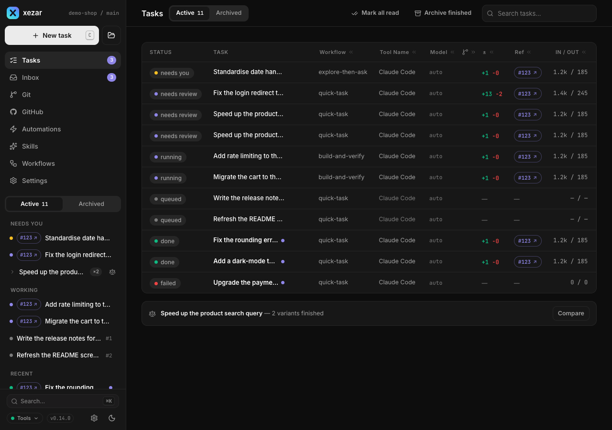
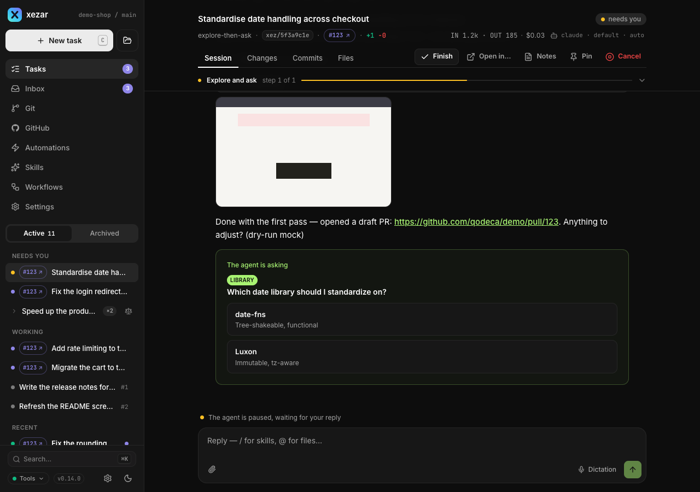
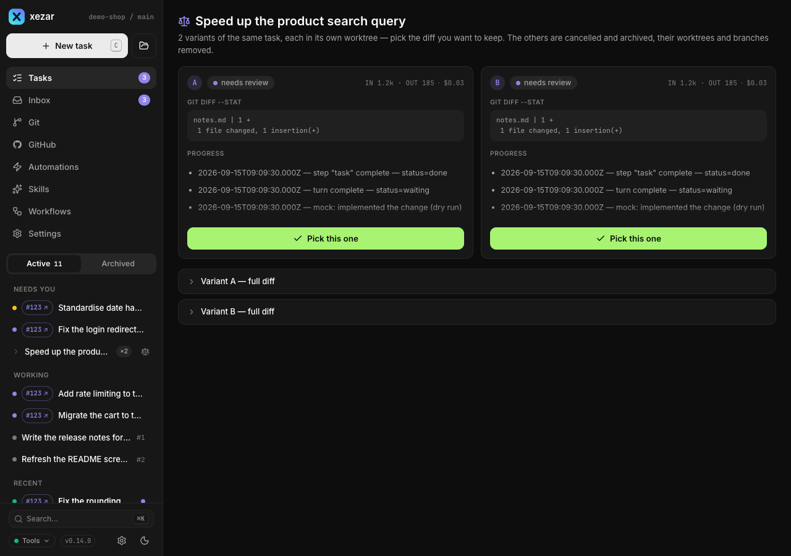
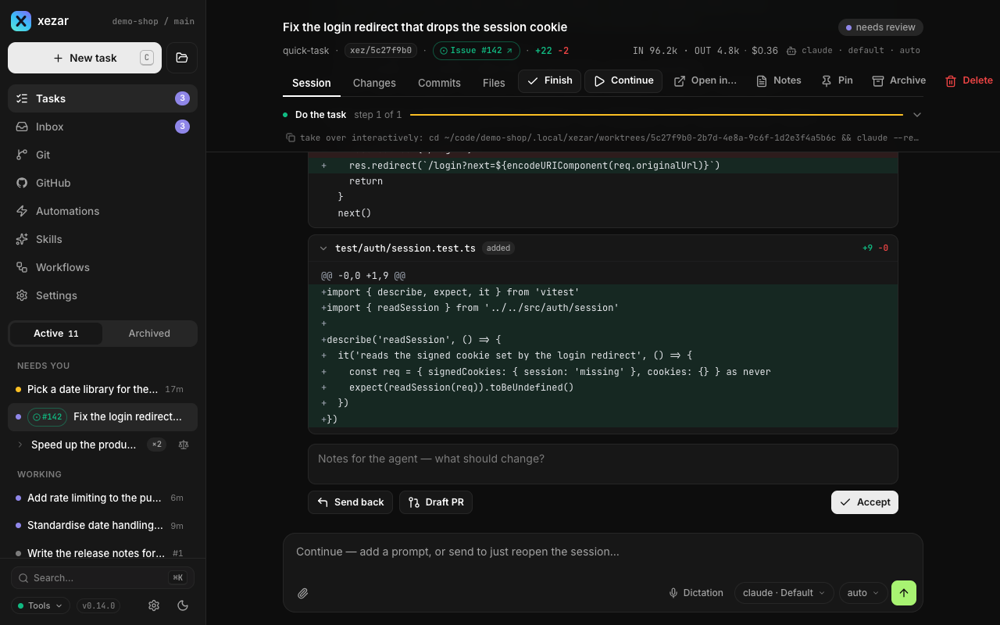

# Tasks and runs

Use the task views to start work, follow an agent, answer questions and inspect the result. A run is an execution of your task through the selected workflow; the cockpit keeps its conversation, steps and Git views together so you can return to it later.

## To use the composer

Open **New task** in the project you want and describe the result. The project picker appears only when more than one project is available. Choose a skill or workflow and a model; the agent picker appears only when there is more than one usable agent or an account choice. With no skill or workflow selected, the task runs as one plain agent step. The composer also offers attachments, parallel variants, **Worktree**, **Autonomous** and **Plan first**.

## To read statuses and follow the lifecycle

Open **Tasks** for the current project. Select a row to open its thread. **All tasks** brings together tasks across projects.

| Status or label | What to do |
| --- | --- |
| Queued | Wait for capacity, or edit the prompt before execution starts. |
| Running | Follow the conversation and tool activity; send more context if needed. |
| Monitoring | The run is still running and watching downstream work. It is not asking for your answer. |
| Needs you (`waiting`) | Read the last message and reply, or finish the session. |
| Needs review (`review`) | Inspect the diff, send feedback, draft a PR or accept. |
| Done | Inspect the result; this status does not mean it has merged or passed your project's checks. |
| Failed | Read the error and transcript before continuing. |
| Cancelled | Execution was stopped; inspect any work already produced. |
| Scheduled | An automatic resume is pending, for example after a usage limit. Read the resume hint. |

A task normally moves from queued to running, then waits for you, reaches review, finishes or fails. Monitoring is an activity within running; scheduled is a display label for a pending automatic resume.

## To attach supporting files

Use the paperclip, paste files or drop them into the composer. Images, PDF and plain-text files such as TXT and Markdown are supported. A message accepts up to four attachments, each up to 5 MB. Check the attachment chips before sending; rejected files produce an explanation. Attachments can accompany the initial task or a later message.

## To talk to a running agent

Open the thread, type in the composer and choose the send (arrow) button. Use it to add a constraint, answer a question or point out a problem. When the agent presents answer options, select an option or type your own answer. Read its next response to confirm how it used the message.

## To manage the queue and edit a queued prompt

A queued task's thread shows its queue position. Use the pencil button (**Edit the prompt**) on the initial prompt while it is still queued. You can also add messages, which are folded into the prompt before the run starts, and edit or remove those queued messages. These controls stop being queued-prompt edits once execution begins.

Open global **Settings → Resources** to inspect the workspace parallel limit. Project limits can narrow workspace capacity, so a queued task does not necessarily mean an agent is broken.

## To use Autonomous

Turn on **Autonomous** in the composer when the agent should keep working without pausing for your answers. xezar prompts it to continue when it would otherwise wait, up to 40 automatic continuation nudges per run. **Plan first** forces Autonomous off and disables its toggle. Autonomous runs skip the optional review gate. This does not make xezar merge the result; inspect the finished task and its checks before integrating it.

## To use Plan first

Select **Plan first**, describe the task and submit it to request a proposed chain of steps. Review the plan before starting: move steps up or down, drag them into order, or remove steps you do not need. Choose **Start** to run the reviewed chain. You can also save the steps as a reusable workflow. If planning is unavailable, the review sheet identifies its single-step fallback.

## To run variants and Compare them

Choose **×2 variants** or **×3 variants** before starting. Variants require Git and always use separate worktrees. Open **Compare** for the group to inspect each variant's status, usage, progress excerpt and full diff.

Wait until all variants have stopped before choosing **Pick this one**. Read the confirmation carefully: the other variants are archived, and their worktrees and branches are removed with no undo. If the review gate is on and the chosen variant is not autonomous and has changes, it moves to review; otherwise a done variant stays done.

## To inspect the thread and Changes / Files / Commits tabs

Use the thread for agent text, tool calls and results. Expand the tool activity you need to inspect. The task header provides Git tabs:

- **Changes**: inspect the task's diff by file.
- **Files**: browse the task's files and preview a selected file.
- **Commits**: inspect the task's commit list and open an individual commit's diff. Agent commits and autosave commits appear here when present.

These views describe the task's working location. The sidebar's **Git** view describes the project's main working tree; see [Worktrees and Git](03-worktrees-and-git.md).

## To use the review gate

Enable the review gate in the project's **Settings → Agents** if you want successful, non-autonomous runs with a worktree diff to stop for inspection. It is off by default.

At **Needs review**, read the diff. Enter corrections and choose **Send back** to continue with that feedback. Choose **Accept** to mark the task done without a PR, or **Draft PR** to publish it for review. Accepting does not merge the branch.

## To create a draft PR

Use **Draft PR** in the review panel after inspecting the changes. The operation needs a task worktree, an `origin` remote and GitHub access through `gh`; it pushes the task branch and opens a draft pull request. Successful creation marks the task done. If the task already has a PR, the panel links to it instead. When automatic PR creation is unavailable, read the error and any manual command offered before taking the next step. Merging remains a separate action.

## To continue, cancel, archive or open in a terminal

- **Continue**: reopen a stopped task with a recorded agent session. Add a follow-up prompt, or submit without text to reopen it. Resolve any provider-availability message first.
- **Cancel**: stop a running, waiting or queued task.
- **Finish**: close a waiting session, or accept a task at review.
- **Archive**: put an inactive task aside; **Unarchive** brings it back. Archiving is separate from deleting the task.
- **Open in…** (desktop only): a task with a worktree offers available local applications and agent CLIs. A task without a worktree offers only **Terminal (resume session)**, when its session can be resumed. On phones, the action menu has a plain **Terminal** item when available. The same backend can resume a stopped task's recorded session; a different backend starts fresh. A running task's CLI launch also starts fresh rather than attaching another CLI to the active session.

Local terminal handoff depends on local-machine capability; it is unavailable in hosted mode.

## To read Notes (handoff)

Choose **Notes** in the task header or action menu. It renders the task's handoff Markdown, including progress and resume notes when the agent writes them. An unstarted task may show “No notes yet”. Read these notes alongside the transcript when resuming work.

## Related settings / env / config

- Project **Settings → Agents**: agent defaults and review gate (`reviewGate` in `.xezar/config.json`).
- Global **Settings → Resources**: parallel capacity, idle sessions and automatic usage-limit resume.
- `XEZ_REVIEW_GATE=1`: enable review when no stored project `reviewGate` overrides it; autonomous runs still skip it.
- `XEZ_AUTONOMOUS_DEFAULT` and `XEZ_WORKTREE_DEFAULT`: inherited composer defaults; stored workspace choices take precedence.
- `XEZ_AUTOSAVE`: periodic worktree commits. See the [environment contract](../../.env.example) for its default.

Next: [Worktrees and Git](03-worktrees-and-git.md)

Describes xezar 0.15.0.
