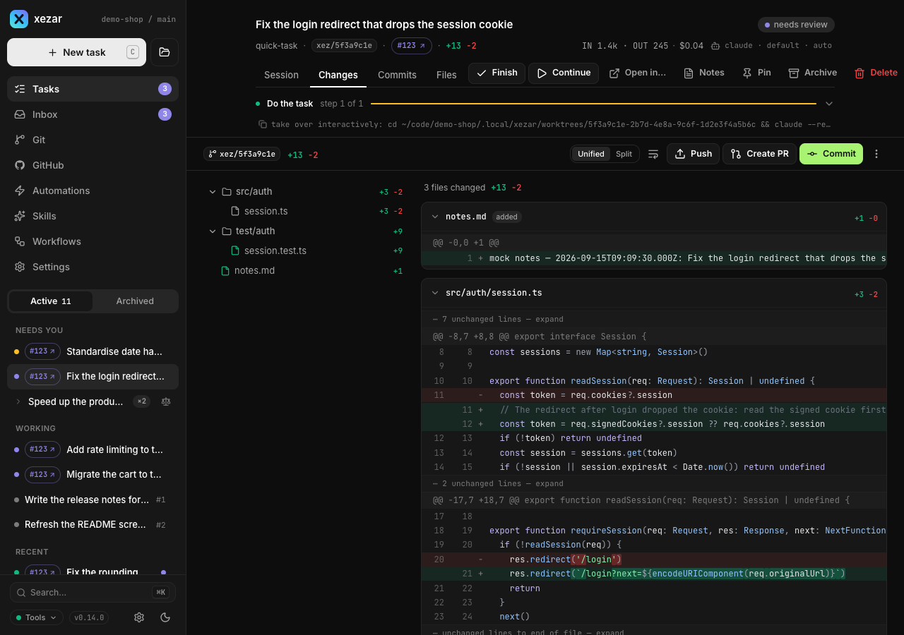
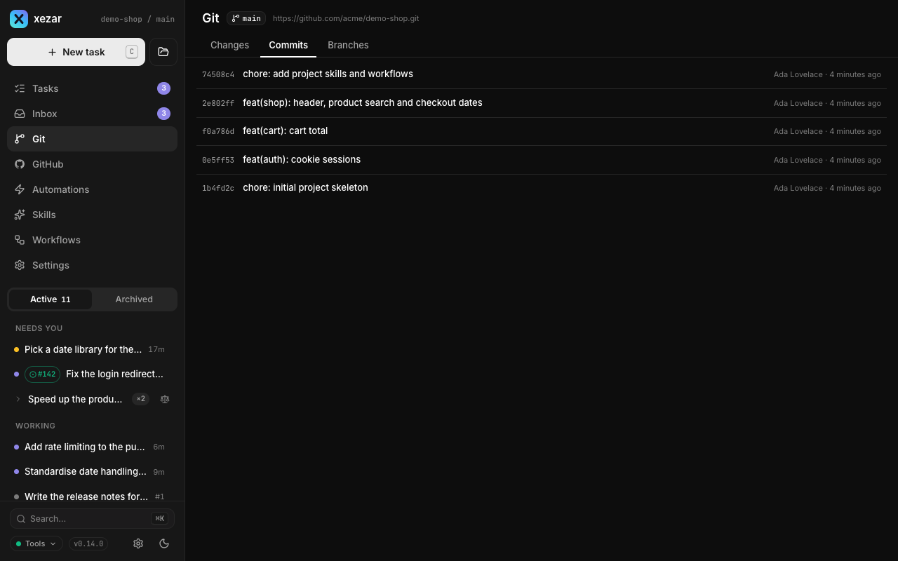

# Worktrees and Git

Use worktrees to keep a task's files separate from your everyday checkout, then use the task and repository Git views to inspect the result. This page explains where a run works, what its diff measures and how to reclaim disk space without confusing cleanup with integration.

## To use the default worktree and task branch

In a Git repository, leave **Worktree** on when starting a task. xezar creates a checkout at `.local/xezar/worktrees/<runId>` on a branch named `xez/<id8>`, where `id8` is the first eight characters of the run ID. The workflow steps execute in that checkout.

If the requested worktree cannot be created, the task fails before workflow execution. Read the error in the thread and fix the Git or filesystem problem before trying again. xezar does not silently run that task in your everyday checkout.

## To turn Worktree off and use the repository-root lease

Turn **Worktree** off in the composer when the task should work directly in the project's working tree. xezar does not create a task branch in this mode. Changes affect the files you already have open there.

By default, the repository-root lease coordinates in-place runs inside this cockpit: one run holds the lease for its whole lifetime, including idle waits between turns, while another waits to acquire it. The lease belongs to one project’s run manager process; a separate headless `xezar run` process does not share it. It does not lock edits you make in an external editor. Parallel variants always use worktrees, so their Worktree control cannot be turned off.

## To work in a non-Git folder

Start xezar in the folder and create a task normally. Runs execute in place, one at a time under the same lease. There is no Git worktree or task branch, variants are unavailable, and the Git view explains that the folder is not a repository.

## To set retention and Reclaim now

Open the project's **Settings → Worktrees**. Set how many finished worktrees to keep and save the value. `0` means unlimited. The workspace default is ten; global **Settings → Resources** changes the default for projects without their own setting.

Retention considers done, failed and cancelled tasks. It keeps the most recently finished worktrees up to the limit and reclaims older directories. Tasks at review are excluded because the review panel still needs their worktrees.

Choose **Reclaim now** to apply that keep-limit immediately. It removes eligible directories and keeps their branches. Committed work remains on those branches; preserve needed uncommitted files before cleanup. Continuing a reclaimed task attempts to recreate its worktree from the retained branch.

The per-row **Delete** action is different: its confirmation removes both the worktree directory and branch. Preserve work you want before confirming it.

## To understand how the diff base is chosen

Open a task's **Changes** tab to see what its working tree changes relative to its task baseline.

For an ordinary isolated task, xezar uses the common ancestor of the base branch and the task's current commit. It checks the available local and `origin` base references so a stale local base does not add already-upstream work to the task's diff. This uses locally available Git references; it is not an automatic pull of your checkout.

If the agent switches to another branch, xezar also checks that branch's recorded state at the run's start. It compares that baseline with the common-ancestor baseline and uses the one attributing fewer changed lines to the task. If the historical branch state is unavailable, or the checkout is detached, this path falls back to uncommitted changes against `HEAD`.

For a task started with **Worktree** off, xezar records the starting commit as the baseline while reading the shared working copy. Work done there by another editor can therefore appear in the task's view too.

## To use the Git view

Choose **Git** in the project sidebar to inspect the project's main working tree:

- **Changes** shows its working-copy changes against `HEAD`.
- **Commits** shows recent commits; select one to inspect its diff.
- **Branches** lists branches and offers **Switch** and **Create** actions.

Check which working tree you intend to inspect: task tabs show the task's location, while this sidebar view shows the project's checkout. Read any Git refusal before retrying a branch change.

## To choose the base branch

Open **Git → Branches** and use **Agents’ base branch**. This saves `baseBranch` in `.xezar/config.json` for new task worktrees and their eventual PR target. A blank choice uses the branch checked out when the run starts, after it leaves the queue.

For a configured branch, xezar can use its local or `origin` reference, preferring the remote reference when the local one is not up to date with it. If the configured name cannot be resolved, the thread records a note and the task uses the currently checked-out branch. An existing task retains its recorded fork point when the project setting changes.

Inspect and integrate the result separately; xezar does not automatically merge a finished task. See [Tasks and runs](02-tasks-and-runs.md#to-use-the-review-gate) for review and draft PR controls.

## Related settings / env / config

- Project **Settings → Worktrees**: `worktreeRetention` in `.xezar/config.json`.
- Global **Settings → Resources**: `resources.worktreeRetentionDefault` in `~/.xezar/config.json`.
- **Git → Branches → Agents’ base branch**: project `baseBranch`.
- `XEZ_WORKTREE_DEFAULT`: inherited composer setting; an explicit stored workspace choice wins.
- `XEZ_DISABLE_REPO_LOCK=1`: explicitly bypasses the in-place lease and allows overlap in the shared checkout. Leave it unset for serialization.
- See the [environment contract](../../.env.example) for environment defaults.

Describes xezar 0.15.0.
