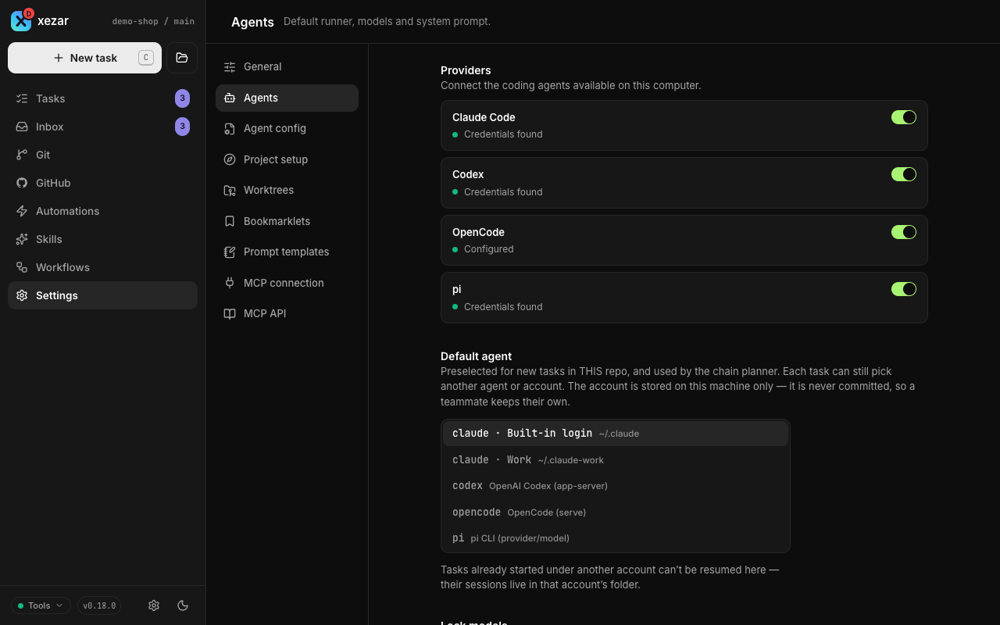
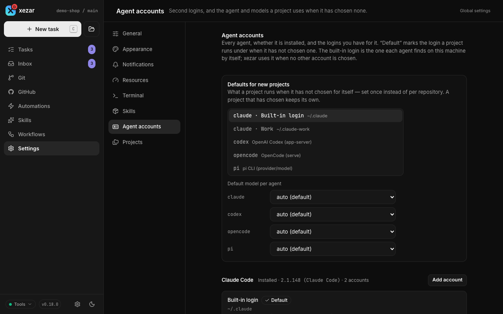

# Agent backends

Use this page to choose the coding agent that runs your tasks, select its account and model, and understand which tools and environment it receives. A backend is the connection between xezar and an installed agent CLI; each backend feeds the same task thread in the cockpit.

## To choose one of the four backends

| Backend | How xezar drives it |
| --- | --- |
| Claude Code (`claude`, the default) | A persistent CLI process exchanges streamed JSON through standard input and output. |
| Codex (`codex`) | `codex app-server` exchanges JSON-RPC messages through standard input and output. |
| OpenCode (`opencode`, experimental) | A local `opencode serve` process receives HTTP requests and streams events over SSE. |
| pi (`pi`) | `pi --mode rpc` exchanges JSON messages through standard input and output. |

Choose an agent in the new-task composer. A workflow can also choose a different `runner` for each agent step; see [Workflows](05-workflows.md).

## To check detection and binary paths

xezar probes agent binaries with `--version` for its health check. The composer offers enabled backends whose account probes report that they are signed in; installing a CLI alone is not enough. Dry-run mode supplies a mock backend without a login. Open the chosen CLI once to log in or configure its provider before starting a task.

If the executable is outside the server's `PATH`, export the matching variable before starting xezar: `XEZ_CLAUDE_BIN`, `XEZ_CODEX_BIN`, `XEZ_OPENCODE_BIN` or `XEZ_PI_BIN`. Use the executable's path as the value. A missing optional backend does not prevent the cockpit from starting.

## To choose models and defaults

Open project **Settings → Agents** to select the default agent and per-agent model presets. You can override the choice for a task, or set `runner` and `model` in a workflow step. A step's model takes precedence over the task's model. Leaving a model on **auto (default)** lets the backend choose; OpenCode model IDs use `provider/model`.

To lock models to native agent settings, set `XEZ_AGENT_MODELS_LOCKED=1` or `"modelsLocked": true` in global `~/.xezar/config.json` or project `.xezar/config.json`. Project **Settings → Agents → Lock models** turns the project key on and off (off deletes it); the locked model then shows read-only. The switch cannot lift a lock set by the environment variable or the global key, and says so. While locked, requests that set a model override are refused with HTTP 409. The Agents section also has a shared system prompt and the planner and namer model controls. Those two background-model controls apply to Claude; their defaults are `sonnet` and `haiku` respectively. For Claude only, `ANTHROPIC_MODEL` supplies the native default when no cockpit preset is saved and the task model is left on **auto (default)**. A saved cockpit preset is layered over that default and the selected model is passed as `--model`.



## To use another agent account

Global **Settings → Agent accounts** shows all four agents at once, one group per agent rather than one tab at a time, so "is Codex installed, and which login does it use" is answerable without clicking. Each group opens with a one-line fact — installed or not, the version when there is one, and how many logins it holds — followed by that agent's logins.

1. Open global **Settings → Agent accounts** and find the agent's group.
2. Use **Add account** for Claude Code, Codex or pi. Give the account a separate configuration directory and use **Connect** to sign in. The directory may be one that does not exist yet: **Connect** runs the agent's own login, and the agent creates it.
3. Pick the account as a machine default under **Defaults for new projects**, in project **Settings → Agents**, or for a single task. A project choice takes precedence over the machine default.

What each row tells you:

- The login each agent finds on this machine by itself is called **Built-in login**. xezar does not save it, so it carries no rename or remove.
- The login your tasks actually run under is marked in words — **In use** when the project keeps its own setup, **Default** for the machine-wide choice. The server decides which one, the same way a run does, so the marker cannot disagree with what runs.
- **Show details** reveals who the account is signed in as, its own config files, and **Rename** and **Remove**. Nothing about the identity is fetched until you ask for it, and an account name that looks like an e-mail address reads **Name hidden** until then.
- **Remove** only forgets the account: nothing in its directory is deleted — not the login, not the sessions — and projects that used it fall back to the built-in login. Existing sessions belong to the account that created them, so changing the default does not move those sessions.

**A saved choice that names an account you no longer have is reported, not silent.** The top of the pane says how many such choices there are, with a link to each affected agent, and each one names what tasks do instead — they run on the built-in login — and how to fix it, including a one-click **Use the built-in login** that makes the saved choice say what already happens. Tasks keep running throughout.

OpenCode cannot hold a second account here: its credentials live outside its configuration directory, so a second directory would change its settings without changing the login. Its group still appears, because "is OpenCode set up?" is a question this page should answer.

Account registrations and selections live in a file of their own, never in xezar's settings file:

| Layout | File |
| --- | --- |
| Global (the default) | `~/.xezar/agent-accounts.json` |
| A project that keeps its own setup (`xezar --single-project`) | `<project>/.xezar/agent-accounts.json` |

The second one can be committed, so a clone starts with the same account names and directories; the sign-ins themselves stay on each machine. In that layout the pane also says whether the accounts of your personal machine-wide setup were copied into this project and how many could still be — a count, never their names — with a **Copy _n_ accounts** button. That button is the only thing on the page that copies; nothing happens on load, and `xezar accounts import-global` runs the same merge from a terminal. An account whose directory does not exist on this machine reads **Unavailable** there, and a task that asks for it is refused before the agent starts rather than quietly run under another login.



## To pin an account's model and effort

Claude Code reads its model and its reasoning effort from its own `settings.json` in the account's configuration directory. When a task leaves the model on **auto (default)**, no cockpit preset is saved and `ANTHROPIC_MODEL` is unset, xezar passes no model flag and the account's saved `model` decides. xezar passes no effort flag at all, so a saved effort applies to that account's tasks.

```json
{
  "model": "opus[1m]",
  "modelSettings": { "claude-opus-5": { "effortLevel": "medium" } }
}
```

An explicit choice always outranks saved settings: `CLAUDE_CODE_EFFORT_LEVEL` in the environment, the CLI's `--effort` flag, or an in-session `/effort` change. To save an effort instead, set the top-level `effortLevel` for every model or one entry under `modelSettings` for a single model. The per-model key takes the model's canonical name even when `model` selects an alias such as `opus[1m]`. Both keys accept `low`, `medium`, `high` and `xhigh`; with nothing saved the CLI's own per-model default applies.

xezar forwards Claude Code's own variables to that backend, so a `CLAUDE_CODE_EFFORT_LEVEL` exported before xezar starts reaches every Claude Code task and outranks whatever each account saved. Keep efforts in the account homes to vary them per account, and reserve the variable for a deliberate machine-wide override.

## To keep a task account's initial context small

Every skill, plugin and instruction file Claude Code loads at startup occupies part of the context each task begins with. Keep that set small for an account that runs xezar tasks.

Adding the account is already half of it: an added Claude Code account has its own configuration directory, and its settings, session history, instruction file, skills and plugins live there too. Nothing is inherited from your default home: not its instruction file, not the skills it synced, not the plugins it enabled. Only settings your organization installs through managed policy apply to every home and cannot be excluded from any.

Then trim what the account home itself loads by adding keys to its `settings.json`:

| Key | Effect |
| --- | --- |
| `syncClaudeAiPlugins: false` | Stops syncing the hosted account's plugins and skills into this home; already-synced entries move to a trash folder on the next launch. |
| `disableBundledSkills: true` | Removes the skills and workflows that ship with the CLI. Skills you authored are unaffected. |
| `enabledPlugins` | Set `"<name>@<source>"` to `false` to disable one plugin; the identifier pairs the plugin name with where it came from. |
| `skillOverrides` | Set a visible skill's name to `"off"` to drop it from context. It does not reach a skill that comes from a plugin; disable that one with `enabledPlugins`. |

These keys do not affect xezar's own skills: xezar hands a skill body to the agent inside the task instructions and never depends on the CLI discovering it. Open the CLI once with `CLAUDE_CONFIG_DIR` pointed at the account's directory to let the changes land: entries that were already synced are moved aside during that launch, so the following launch starts with the smaller set. Check the CLI's status output to confirm its plugin and skill lists are what you expect.

## To control tool access per backend

Workflow agent steps accept `allowedTools` and `bashAllowlist`. Without overrides, the tools are `Read`, `Edit`, `Write`, `Grep`, `Glob` and unrestricted `Bash`. Treat that default as full shell access.

| Backend | Effect of these controls |
| --- | --- |
| Claude Code | Passes `allowedTools` to the CLI. A non-empty `bashAllowlist` replaces unrestricted Bash with allowed command prefixes. Tools requiring approval are denied by default; `XEZ_APPROVAL_GATE=1` selects Claude's `acceptEdits` approval mode. |
| Codex | Honours one signal from the tool list: a step that allows neither `Edit` nor `Write` runs confined – it may change files only in its own working copy and the run's own evidence, handoff and temporary folders, and the network stays on so it can still fetch and post. The working copy stays writable and `bashAllowlist` is ignored. Every other step uses full access with approvals disabled. `XEZ_CODEX_NETWORK=0` turns the network off for both. |
| OpenCode | Ignores the per-tool allowlist. Permission requests are answered automatically and fail closed. A request to reach a directory is allowed once when the directory is inside the run's own directories (its worktree, its run and temporary files). Every other request is denied – a directory outside them, a web fetch, a shell command, a repeated-call warning – and the denial is shown in the transcript. If the agent keeps asking for the same denied thing three times in a row, or collects 20 denials in one session, the run stops with a named error. |
| pi | Maps supported tool names to its `--tools` list. A non-empty `bashAllowlist` keeps Bash but allows only commands that start with an allowed prefix, the same rule as Claude Code. Every part of a combined command (`a; b`, `a && b`, `a \| b`) must be allowed on its own, and writing a command's output to a file with `>` or `>>` is refused. |

## To make a project MCP server available to Codex

Declare it in the project's trusted `.codex/config.toml`. Before starting or resuming a thread, xezar asks Codex for its effective configuration. It leaves MCP servers whose reported origins are entirely project configuration as configured, and disables other servers. A home configuration that adds a key to the same server makes that server ineligible.

xezar also disables plugins, apps and its own leader bridge for task runs. Do not name an unrelated server `xezar`: that name is reserved and disabled too. These are per-thread overrides; xezar does not rewrite your Codex configuration. If the app-server cannot answer `config/read`, the run fails instead of starting with unexamined tools. This isolation applies to Codex, not the other backends.

## To handle usage limits and auto-resume

Check the task's failure message and any scheduled resume time. Global **Settings → Resources** controls `autoResumeOnUsageLimit`, which is on by default. Eligible tasks stopped by a provider usage limit can resume after the reported reset; this is conditional, not a retry of every failed task. Turn the setting off if you want to resume such work yourself.

## To pass environment variables and protect stored secrets

Agents receive a filtered environment: basic shell and toolchain variables, the chosen backend's authentication variables, `GITHUB_TOKEN`, xezar variables and task-specific values. Arbitrary host variables are dropped.

Use global **Settings → Resources → Extra variables agents receive** to pass additional names. Values come from the server's environment. The saved `agentEnvPassthrough` list overrides `XEZ_ENV_PASSTHROUGH`, including an empty list; the control can return to following the environment default. `XEZ_AGENT_ENV_FULL=1` passes the entire host environment, including its secrets.

Secret redaction is enabled by default for persisted transcripts and free-text run fields. It scrubs credential values and known token shapes before writing, but is best-effort protection. It does not remove the agent's access to credentials it was given.

## To troubleshoot a shell that returns nothing

Check the task's tool result and error messages before assuming the command succeeded. One known cause is a broken temporary directory: Claude Code's shell output can be lost even when a command's side effects have already happened. xezar normally creates and write-tests a private temporary directory for each task, then points `TMPDIR`, `TEMP` and `TMP` there.

If a task fails before the agent starts with a temporary-directory error, fix the named path's permissions or storage problem. If you deliberately set `XEZ_AGENT_TMPDIR=0`, restore the default and start a new task; that opt-out bypasses both the private directory and its preflight. Also check whether the selected backend actually permits the shell command using the tool-access table above.

## Related settings / env / config

- Project **Agents**: `defaultRunner`, `defaultModels`, `systemPrompt`, `plannerModel`, `namerModel` in `.xezar/config.json`.
- Model lock: `XEZ_AGENT_MODELS_LOCKED=1` or `modelsLocked: true` in global or project configuration; the project key has a **Lock models** switch in **Agents**.
- Global **Agent accounts** and **Resources**: account selections, usage-limit auto-resume and environment passthrough.
- Claude Code account homes: `model`, `effortLevel` and `modelSettings`, plus the context-trimming keys above, live in each account's own `settings.json`.
- `CLAUDE_CODE_EFFORT_LEVEL` is forwarded to Claude Code and outranks the effort an account saved; use it as a machine-wide override, not a default.
- Binary, approval, sandbox, environment and redaction switches: [environment contract](../../.env.example).
- [Workflows](05-workflows.md) explains per-step overrides; [Skills](06-skills.md) explains reusable instructions.

Next: [Workflows](05-workflows.md)

Describes xezar 0.18.0.
