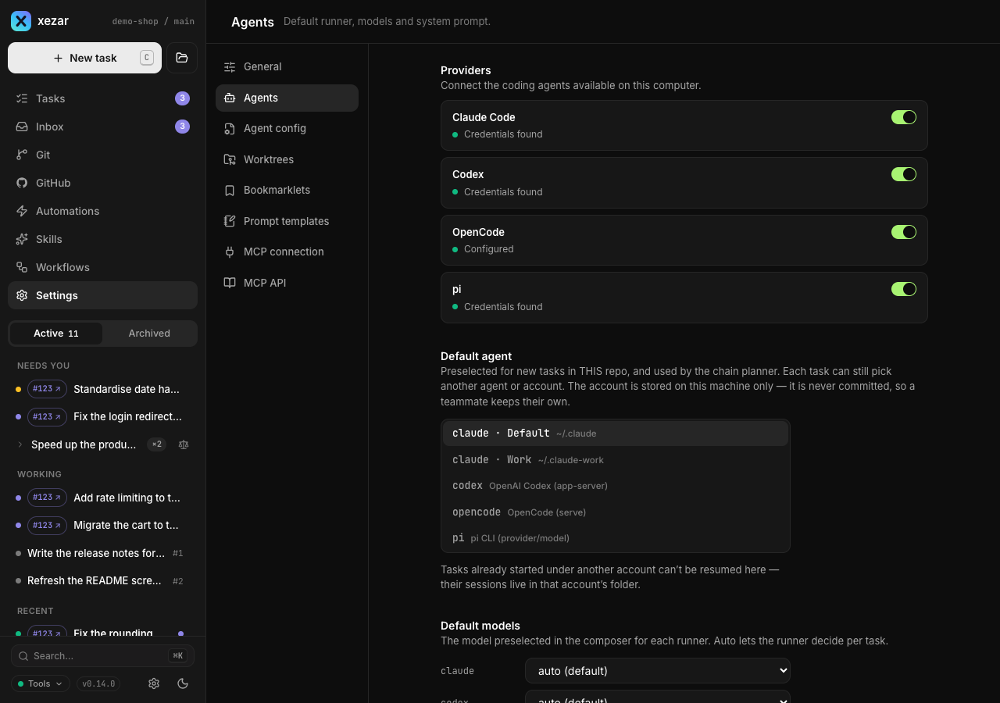
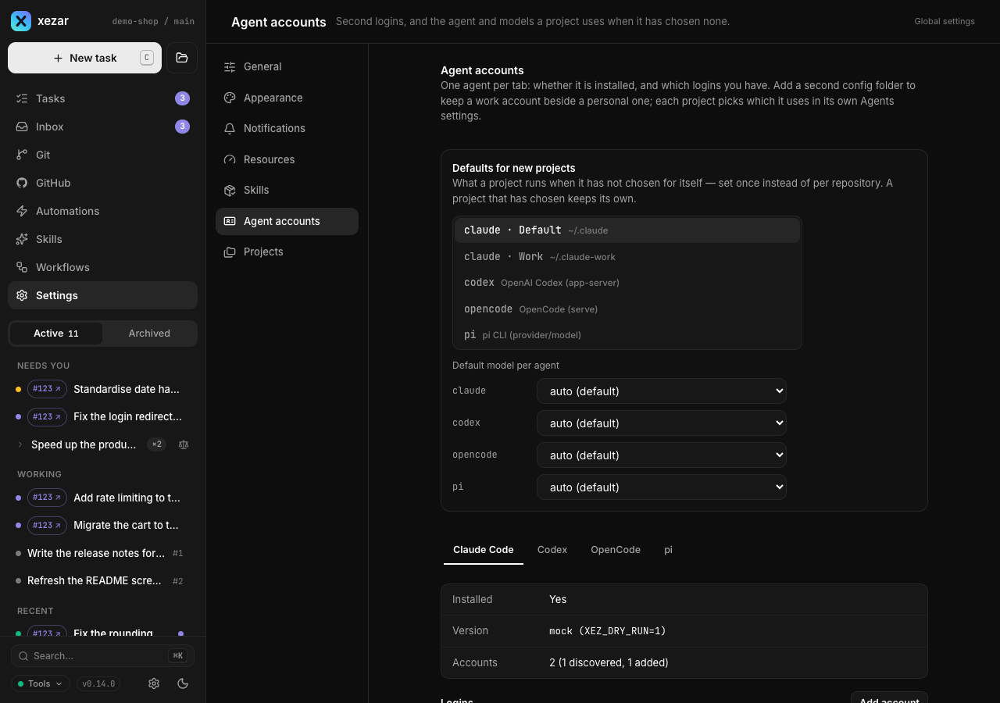

# Agent backends

Use this page to choose the coding agent that runs your tasks, select its account and model, and understand which tools and environment it receives. A backend is the connection between xezar and an installed agent CLI; each backend feeds the same task thread in the cockpit.

## To choose one of the four backends

| Backend | How xezar drives it |
| --- | --- |
| Claude Code (`claude`, the default) | A persistent CLI process exchanges streamed JSON through standard input and output. |
| Codex (`codex`) | `codex app-server` exchanges JSON-RPC messages through standard input and output. |
| OpenCode (`opencode`, experimental) | A local `opencode serve` process receives HTTP requests and streams events over SSE. |
| pi (`pi`) | `pi --mode rpc` exchanges JSON messages through standard input and output. |

Choose an agent in the new-task composer. A workflow can also choose a different `runner` for each agent step; see [Workflows](05-workflows.md).

## To check detection and binary paths

xezar probes agent binaries with `--version` for its health check. The composer offers enabled backends whose account probes report that they are signed in; installing a CLI alone is not enough. Dry-run mode supplies a mock backend without a login. Open the chosen CLI once to log in or configure its provider before starting a task.

If the executable is outside the server's `PATH`, export the matching variable before starting xezar: `XEZ_CLAUDE_BIN`, `XEZ_CODEX_BIN`, `XEZ_OPENCODE_BIN` or `XEZ_PI_BIN`. Use the executable's path as the value. A missing optional backend does not prevent the cockpit from starting.

## To choose models and defaults

Open project **Settings → Agents** to select the default agent and per-agent model presets. You can override the choice for a task, or set `runner` and `model` in a workflow step. A step's model takes precedence over the task's model. Leaving a model on **auto (default)** lets the backend choose; OpenCode model IDs use `provider/model`.

To lock models to native agent settings, set `XEZ_AGENT_MODELS_LOCKED=1` or `"modelsLocked": true` in global `~/.xezar/config.json` or project `.xezar/config.json`. Project **Settings → Agents** shows the locked model as read-only; it has no lock switch. While locked, requests that set a model override are refused with HTTP 409. The Agents section also has a shared system prompt and the planner and namer model controls. Those two background-model controls apply to Claude; their defaults are `sonnet` and `haiku` respectively. For Claude only, `ANTHROPIC_MODEL` supplies the native default when no cockpit preset is saved and the task model is left on **auto (default)**. A saved cockpit preset is layered over that default and the selected model is passed as `--model`.

## To use another agent account

1. Open global **Settings → Agent accounts** and choose the agent's tab.
2. Use **Add account** for Claude Code, Codex or pi. Give the account a separate configuration directory and use **Connect** to sign in. The directory may be new.
3. Pick the account as a machine default, in project **Settings → Agents**, or for a task. A project choice takes precedence over the machine default.

OpenCode does not support extra accounts through this feature: its configuration directory does not also move its credentials. Account registrations and selections live in `~/.xezar/agent-accounts.json`. **Remove** unregisters an added account; it does not delete its directory or sessions. Existing sessions belong to the account that created them, so changing the default does not move those sessions.

## To control tool access per backend

Workflow agent steps accept `allowedTools` and `bashAllowlist`. Without overrides, the tools are `Read`, `Edit`, `Write`, `Grep`, `Glob` and unrestricted `Bash`. Treat that default as full shell access.

| Backend | Effect of these controls |
| --- | --- |
| Claude Code | Passes `allowedTools` to the CLI. A non-empty `bashAllowlist` replaces unrestricted Bash with allowed command prefixes. Tools requiring approval are denied by default; `XEZ_APPROVAL_GATE=1` selects Claude's `acceptEdits` approval mode. |
| Codex | Ignores the per-tool allowlist. Uses full access with approvals disabled by default. `XEZ_CODEX_NETWORK=0` selects a network-blocked, workspace-write sandbox. |
| OpenCode | Ignores the per-tool allowlist. Permission requests are answered automatically and fail closed. A request to reach a directory is allowed once when the directory is inside the run's own directories (its worktree, its run and temporary files). Every other request is denied – a directory outside them, a web fetch, a shell command, a repeated-call warning – and the denial is shown in the transcript. If the agent keeps asking for the same denied thing three times in a row, or collects 20 denials in one session, the run stops with a named error. |
| pi | Maps supported tool names to its `--tools` list. A non-empty `bashAllowlist` disables Bash entirely because pi cannot enforce command-prefix restrictions. |

## To make a project MCP server available to Codex

Declare it in the project's trusted `.codex/config.toml`. Before starting or resuming a thread, xezar asks Codex for its effective configuration. It leaves MCP servers whose reported origins are entirely project configuration as configured, and disables other servers. A home configuration that adds a key to the same server makes that server ineligible.

xezar also disables plugins, apps and its own leader bridge for task runs. Do not name an unrelated server `xezar`: that name is reserved and disabled too. These are per-thread overrides; xezar does not rewrite your Codex configuration. If the app-server cannot answer `config/read`, the run fails instead of starting with unexamined tools. This isolation applies to Codex, not the other backends.

## To handle usage limits and auto-resume

Check the task's failure message and any scheduled resume time. Global **Settings → Resources** controls `autoResumeOnUsageLimit`, which is on by default. Eligible tasks stopped by a provider usage limit can resume after the reported reset; this is conditional, not a retry of every failed task. Turn the setting off if you want to resume such work yourself.

## To pass environment variables and protect stored secrets

Agents receive a filtered environment: basic shell and toolchain variables, the chosen backend's authentication variables, `GITHUB_TOKEN`, xezar variables and task-specific values. Arbitrary host variables are dropped.

Use global **Settings → Resources → Extra variables agents receive** to pass additional names. Values come from the server's environment. The saved `agentEnvPassthrough` list overrides `XEZ_ENV_PASSTHROUGH`, including an empty list; the control can return to following the environment default. `XEZ_AGENT_ENV_FULL=1` passes the entire host environment, including its secrets.

Secret redaction is enabled by default for persisted transcripts and free-text run fields. It scrubs credential values and known token shapes before writing, but is best-effort protection. It does not remove the agent's access to credentials it was given.

## To troubleshoot a shell that returns nothing

Check the task's tool result and error messages before assuming the command succeeded. One known cause is a broken temporary directory: Claude Code's shell output can be lost even when a command's side effects have already happened. xezar normally creates and write-tests a private temporary directory for each task, then points `TMPDIR`, `TEMP` and `TMP` there.

If a task fails before the agent starts with a temporary-directory error, fix the named path's permissions or storage problem. If you deliberately set `XEZ_AGENT_TMPDIR=0`, restore the default and start a new task; that opt-out bypasses both the private directory and its preflight. Also check whether the selected backend actually permits the shell command using the tool-access table above.

## Related settings / env / config

- Project **Agents**: `defaultRunner`, `defaultModels`, `systemPrompt`, `plannerModel`, `namerModel` in `.xezar/config.json`.
- Model lock: `XEZ_AGENT_MODELS_LOCKED=1` or `modelsLocked: true` in global or project configuration; shown read-only in **Agents**.
- Global **Agent accounts** and **Resources**: account selections, usage-limit auto-resume and environment passthrough.
- Binary, approval, sandbox, environment and redaction switches: [environment contract](../../.env.example).
- [Workflows](05-workflows.md) explains per-step overrides; [Skills](06-skills.md) explains reusable instructions.

Next: [Workflows](05-workflows.md)

Describes xezar 0.15.0.
