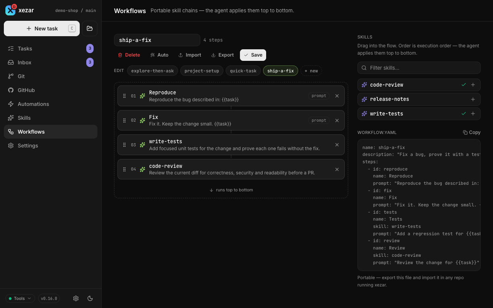

# Workflows

Use a workflow to repeat an ordered sequence of agent work and shell checks for each task. Each agent step can use its own prompt, skill, backend and model; check steps give the sequence a concrete pass-or-fail result.

## To start with built-in quick-task

Choose **quick-task** for one agent step that works on your prompt. It is available without a workflow file. For a reusable sequence, add a `.yaml` or `.yml` file directly under `.xezar/workflows/`. File workflows take precedence over built-ins with the same name. Invalid files are skipped without preventing other workflows from loading. Look for skipped-file messages in `xezar run` output or the `issues` field of `GET /api/v1/workflows`; a skipped file does not appear in the cockpit workflow list.

## To write the YAML format

A workflow has a `name`, an optional `description`, and either `steps` or the shorter `skills` list. Use unique step IDs. This example assumes your project has an `npm test` script:

```yaml
name: implement-and-check
description: Make a change and run the project tests.
steps:
  - id: implement
    name: Implement the task
    prompt: |
      Implement {{task}} and verify the affected behavior.
      End with XEZ:DONE only when this step is complete.
    timeout: 2h
  - id: verify
    name: Run tests
    command: npm test
    onFail:
      retry: implement
      max: 2
```

`{{task}}` expands to the task text entered by the user. Include it in a custom prompt to pass that text to the agent; a custom prompt without it omits the task text. If `prompt` is omitted, the default prompt supplies the task text. For a sequence consisting only of skills, use:

```yaml
name: review-docs
skills:
  - review-docs
  - summarize-findings
```

Those skill names are examples: create or choose matching [skills](06-skills.md) in your catalog. Each name becomes an agent step applying that skill to `{{task}}`. Do not put both `skills` and `steps` in one file.

## To choose agent versus check steps

An **agent step** has `prompt`, `skill`, or both. It can also set `runner` (`claude`, `codex`, `opencode` or `pi`), `model`, `allowedTools` and `bashAllowlist`. Tool restrictions differ between [backends](04-agent-backends.md#to-control-tool-access-per-backend).

A **check step** has `command`. Exit code zero passes; a non-zero exit fails or enters its configured repair loop. Do not combine `command` with `prompt` or `skill` in the same step. Checks execute shell commands, so use commands suitable for the project and machine running xezar.

## To retry a failed check with onFail.retry

Set `onFail.retry` to an earlier step's ID and `max` to a positive integer. In the example, a failed `verify` returns to `implement` at most twice, running the intervening sequence again. The failing command output is added to the retried agent's prompt. Omitting `max` defaults it to two retries.

A retry target must exist and precede the check. Without a retry rule, or after its allowance is exhausted, the failed check fails the run. This is a check-failure repair loop; it does not automatically retry a failed agent step. Put `onFail` on checks: it is accepted on agent steps but ignored there.

## To set an agent timeout

Set `timeout` on an agent step to a positive whole-number duration such as `45s`, `90m` or `2h`. Use `none` for no wall-clock cap. Zero durations and values beyond the supported timer range (about 24 days) are rejected.

If omitted, earlier agent steps inherit a 30-minute timeout. An agent step at the very end of the workflow stays open for follow-ups without that wall-clock cap; idle-session limits still apply. An explicit `timeout` overrides this default. An agent followed by a check is an earlier step even if it is the only agent in the workflow. `timeout` is rejected on check steps; put any command-specific deadline in the check command itself.

## To finish earlier steps with XEZ:DONE

Every agent step that is not the workflow's final step must finish its last turn with `XEZ:DONE`. Include that instruction in its prompt or skill. Exiting successfully without the marker is not enough: xezar fails the step instead of advancing while the agent may be waiting for an answer. `XEZ:MONITORING` is not a substitute for completion.

An agent at the very end can remain open for conversation; `XEZ:DONE` signals that its goal is complete. In a multi-agent-step chain, each step must do its own assigned work. A predecessor's completion report does not complete a later step.

## To build a workflow in the cockpit

Open **Workflows**, create a new workflow or select an existing one, and add skills from the palette to the canvas. Drag cards to reorder them; with the keyboard, focus a drag grip, press Space, move with arrow keys, then press Space again. The builder allows up to eight steps.

Name the workflow and review the YAML preview before choosing **Save**. Saving asks for overwrite confirmation when the generated `<slug>.yaml` file already exists; different names can produce the same filename. Creating a file that shadows built-in `quick-task` needs no overwrite confirmation unless that file already exists. Choose **Auto** to propose a sequence from a brief, then review and edit it before saving. A planner fallback is shown as a one-step proposal.



## To import or export a workflow

Use **Import** to paste YAML into the builder. Parsing happens on the server; fix any reported validation errors before saving. **Export** downloads a YAML file and **Copy** puts YAML on the clipboard. A plain skill stack uses the compact `skills` form; checks, prompt-only steps, custom prompts other than `{{task}}`, per-step runners or models, tools, retries, timeouts, or a step name that differs from its skill require full `steps` form.

## Related settings / env / config

- Workflow files: `.xezar/workflows/*.{yaml,yml}`; no file is needed for built-in `quick-task`.
- Project **Settings → Agents** supplies backend and model defaults; global **Settings → Resources** controls idle-session limits.
- [Agent backends](04-agent-backends.md) and [Skills](06-skills.md) explain the choices within agent steps.

Next: [Skills](06-skills.md)

Describes xezar 0.16.0.
