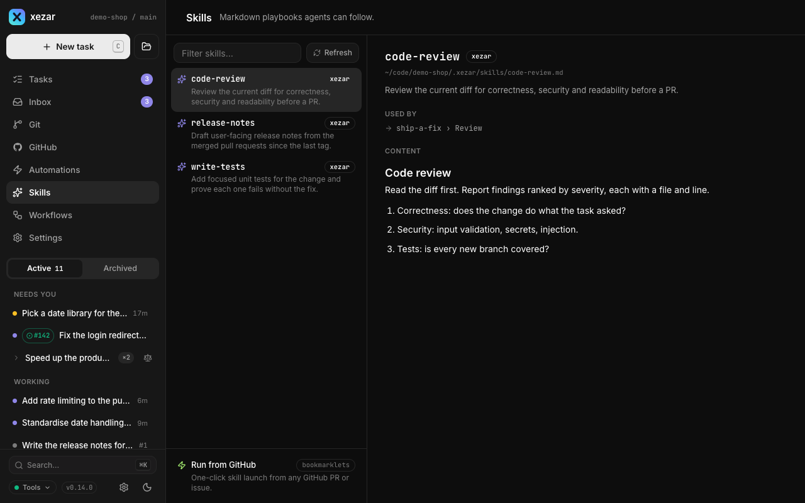

# Skills

Use skills to give an agent reusable instructions for a recurring job, such as reviewing documentation or investigating a bug. A skill is a Markdown playbook selected for a task or named by a workflow step; the Skills view lets you inspect the instructions before using them.

## To write a skill file

Create `.xezar/skills/review-docs.md` with an optional frontmatter block and a Markdown body:

```markdown
---
name: review-docs
description: Review documentation against the current source.
---

Read the changed documentation and the source it describes.
Check examples, links and stated defaults. Report inaccuracies with file paths.
End with XEZ:DONE only when this step's review is complete.
```

`name` and `description` supply catalog labels. Without a name, xezar uses the filename. You can instead use `.xezar/skills/review-docs/SKILL.md`; its fallback name is the containing directory. Supporting files such as `references/checklist.md` can live alongside that entry point without becoming separate skills. Frontmatter supports simple values and lists, not every YAML feature.

To use the skill in a workflow, set `skill: review-docs`; see [Workflows](05-workflows.md). In particular, keep the completion instruction for skills used in earlier steps.

## To understand discovery order

When two skills have the same name, the first source below wins:

1. Project `.xezar/skills/`.
2. Project `.ai/skills/`.
3. Project `.agents/skills/`.
4. Project agent mirrors, in order: `.claude/skills/`, `.codex/skills/`, `.cursor/skills/`, `.opencode/skills/`.
5. Global `~/.agents/skills/`, then `~/.claude/skills/`.
6. Configured team repositories.

Missing directories are fine. Account selection does not switch the global skill library: skills are shared instructions, not account identity. A local skill with the same name can hide a newer team definition; check its source when an update seems to have no effect.

## To use team skills and control automatic updates

The default team source is `qodeca/xezar-skills` at `main`. xezar reads it through a shared bare Git cache under `~/.cache/xez/skills/`; initial catalog loading runs in the background. Without network access, it can list the cached copy or an empty team catalog. **Refresh** requests a new catalog fetch.

Installed-skill updates are separate. The updater checks tracked `qodeca/xezar-skills` installations in project and global scopes and applies available updates automatically by default when xezar starts listening and when a project is added. Checks use a six-hour cache window. Opening update status in the cockpit checks only; it does not apply updates. There is no timer that applies new updates: use **Update now** when available, or let a later server start check and apply them. Only names authorized by the installation lock file are eligible; other repositories and manually maintained folders are left alone. A missing lock file is treated as current with the reason "installation is not tracked"; the Manage panel can therefore say "Installed xezar-skills are up to date" even when nothing is tracked. Check **Settings → Skills** for "No tracked xezar-skills installation found." Unavailable `npx` prevents update checks.

To disable automatic application, turn off **Update xezar-skills automatically** in global **Settings → Skills**, or export `XEZ_SKILLS_AUTO_UPDATE=0` when no saved override is set. Background detection remains read-only when automatic application is off.

To keep the default catalog and personal selection, leave `skillsRepos` out of project `.xezar/config.json`. For a different team catalog, set it explicitly; replace this example repository with your own:

```json
{
  "skillsRepos": [
    { "repo": "your-org/team-skills", "ref": "main" }
  ]
}
```

An explicit `skillsRepos` list defines the project's sources; an empty list disables team sources. Setting any `skillsRepos` value, even a list naming the default repository, ignores your personal selection and hides **Manage skills**, including its update buttons.

## To browse Skills and use the Manage panel

Open **Skills**, search the catalog and select a row to preview its body and source. Use **Refresh** to reload the catalog. When default team skills are available, **Manage skills** opens their selection panel.

All default team skills are initially enabled. Uncheck names you do not want offered. That selection follows you across projects through `~/.xezar/ui-state.json`; it filters the default team catalog, not local skill files. Clearing all checkboxes is a real empty selection.

The Manage panel also shows installed-skill update status. Its action changes with status: **Check again** when current, **Update now** when an update is available, **Retry** after a failed apply, or **Retry check** when status is unavailable. After files update, the panel may suggest `/xez-apply-upgrade-notes` for descriptor migrations in configured repositories. Updating skill files and applying repository upgrade notes are separate actions.



## To use the issue-filing skill

Use an issue-filing skill when you have a problem or proposal that does not yet have an issue. It drafts and, after the required approval, can create one new issue; issue triage instead reads an existing issue and returns a verdict without changing it. The issue-filing procedure comes from the shared skills collection at a pinned revision, so a project receives a reviewed common procedure rather than a moving copy. A project can add a local wrapper with its own tracker, templates, label policy, and evidence requirements; that nearer wrapper takes precedence over the shared skill.

## To change Settings → Skills

Open global **Settings → Skills** to inspect tracked installation status and the automatic-update switch. A saved `skillsAutoUpdate` value in `~/.xezar/config.json` overrides the environment default. Choose **Use default** to clear the saved override and follow the environment again when you want `XEZ_SKILLS_AUTO_UPDATE` to decide. For manual check and apply actions, return to **Skills → Manage skills**.

## To migrate from the old repository

If you explicitly configured the retired `open-mercato/skills` source, remove the `skillsRepos` key and refresh the catalog to restore the default `qodeca/xezar-skills` source with **Manage skills** and personal selection intact. Keeping an explicit key, even with the new default repository, hides that panel and bypasses the selection. Inspect local installations too: the current updater recognizes only the new repository, so it will not upgrade an old-source installation for you.

Review workflow references using the old `om-` names and choose the matching current `xez-` names from the catalog. The compatibility mapping applies when reading the personal `importedSkills` selection: an old `om-` selection also admits the matching `xez-` skill without rewriting the saved list. It is not a general rewrite of workflow files or local skill copies. Preserve local edits when replacing an old installation.

## Related settings / env / config

- Project `.xezar/config.json`: `skillsRepos`; `.xezar/skills/`: maintained local playbooks.
- Global **Settings → Skills**: `skillsAutoUpdate`; **Skills → Manage skills**: catalog selection and manual updates.
- `XEZ_SKILLS_AUTO_UPDATE` and `XEZ_NO_BANNER`: [environment contract](../../.env.example). Hiding the banner does not disable the catalog.
- [Workflows](05-workflows.md) explains skill chains; [Agent backends](04-agent-backends.md) explains the tools an agent receives.

Next: [GitHub and automations](07-github-and-automations.md)

Describes xezar 0.15.0.
