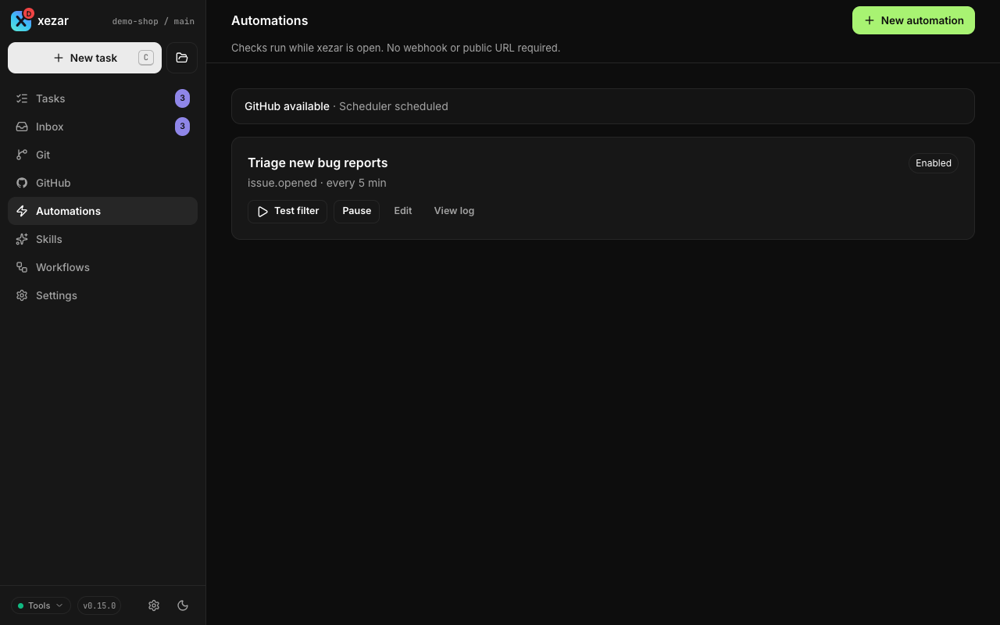

# GitHub and automations

Use GitHub in the cockpit to read issues and pull requests, hand work to an agent, and check the resulting changes. Bookmarklets bring a GitHub page into your task composer; optional automations watch for new GitHub activity while xezar is running.

## To connect GitHub

Install the GitHub CLI (`gh`) on the machine running xezar, and sign in there:

```sh
gh auth login
```

Open a project with a **github.com** remote. GitHub Enterprise hosts do not enable the GitHub view or Automations navigation. xezar uses `gh` for its GitHub views and PR actions. If you use token-based authentication, make `GITHUB_TOKEN` available in the environment that starts xezar; the token does not replace the `gh` executable. Missing tools, authentication failures, and unavailable repositories appear as an availability reason in the cockpit.

## To browse issues and pull requests

1. Select the project and open **GitHub**.
2. Choose **Issues** or **Pull requests**. The initial list shows open items.
3. Search by number, title, or author, and use the label filter to narrow the list. An exact number such as `#448` asks GitHub for an item outside the open list only when there are no local matches. Local number matching uses substrings, so open #1448 prevents that lookup for #448. Use **Issues** for closed issues and **Pull requests** for merged PRs.
4. Open an item to read its description and conversation. For a PR, open **Changes** to inspect the changed files and diff.


## To hand an issue to an agent

1. Open the issue and find **Hand this to the agent**. On PRs, the panel is on **Conversation**.
2. Choose a workflow, select skills, and choose an available agent and model.
3. Add the result you want to the instructions box, which starts with the item reference; xezar re-attaches that reference if you delete it. You can insert a [prompt template](08-inbox-notifications-templates.md#to-reuse-prompt-templates).
4. Choose **Run agent on this issue** or **Run agent on this PR**, or press **⌘Enter / Ctrl+Enter**. Enter alone adds a line to the instructions.

A selected workflow determines the steps; without one, selected skills become one step each, capped at eight, or xezar uses `quick-task` if none are selected. If the provider is unavailable, follow **Configure providers** before starting. See [Tasks and runs](02-tasks-and-runs.md) and [Workflows](05-workflows.md).

Open the task's **Changes** view and choose **Create PR**. If the optional review gate is on and the task is at `review`, its review panel instead offers **Draft PR**. Both save the final changes, push the branch to `origin`, and create a draft targeting the task's base branch. **Create PR** is disabled while the task is active or GitHub is unavailable; publication requires a worktree and branch, so a task run with Worktree off is refused. Success marks the task **done**. Resolve any reported commit, push, or authentication error before trying again. Creating a draft does not merge it.

The push uses Git's own credentials. `GITHUB_TOKEN` authenticates `gh`; `GITHUB_TOKEN` and `GH_TOKEN`, when set, are also forwarded to every agent process, so give them only the access those tasks need.

## Filing an issue from the cockpit

On the **GitHub** tab, choose **New issue** at the end of the **Issues** and **Pull requests** tabs. When an Issues search finds no items, the empty result also offers **New issue**. Describe the problem or requested outcome, then choose **Start drafting**. The control starts an ordinary task using the nearest available issue-filing skill; it does not create an issue directly.

The task turns the brief and any supplied evidence into a well-formed draft. It covers the outcome or problem, type, impact, scope, reproduction steps and expected versus actual behaviour for a bug, testable acceptance criteria, evidence, and related items. It searches open and closed issues for duplicates before proposing the draft. A duplicate is reported rather than changed.

Starting a draft is not filing. The cockpit starts this task non-autonomously. In an interactive task, the task shows the destination, title, body, labels, and assumptions, then asks a person to **Create** or **Revise**; nothing is created without that approval. A leader uses the same rule: starting the task alone is not approval. A brief that explicitly authorizes filing can allow the skill to file within those stated bounds; otherwise it retains a draft. Approval to file does not approve implementation or broaden the work.

This entry is available only when the GitHub tab is available. Without `gh`, authentication, or a reachable repository, the tab reports its availability reason and the control is unavailable. If no issue-filing skill is installed, no issue draft is produced – when the brief and other task prerequisites are met, **Start an ordinary task** starts a plain task instead and leaves the brief intact. Offline, a cached skill can still be selected, but the task cannot search GitHub or create an issue until the required GitHub access is available. You can instead prepare the issue outside the cockpit and file it when access returns.

The task creates at most one new issue. It does not edit, comment on, relabel, reopen, or close an existing issue, and it does not implement the issue it drafts. Use issue triage for an existing report, and use a separate task for any follow-on work.

## To launch from a GitHub page with a bookmarklet

1. Open the project's **Settings → Bookmarklets**.
2. Drag **xezar (<repo>): this PR/issue** or a skill button to your browser's bookmarks bar. Use **Copy** to copy its bookmarklet URL.
3. Keep this cockpit running. On a GitHub issue or PR page, click the saved bookmark.

The generic launcher prefills the composer. Skill launchers can use **One-click launch (auto-submit)**; a valid launch key is required for auto-submit, and an invalid key only prefills the composer. Re-drag the buttons after changing that option. A bookmark points to the cockpit and project that generated it, so create it from the project you intend to use.

## To enable and test an automation

Set this in the environment the running server reads; the flag is read live (since 0.17.0;
#678), so turning it on starts the poller and opens the routes at the next automations action,
with no restart. To start a server with automations enabled from the outset:

```sh
XEZ_AUTOMATIONS=1 xezar
```

Automations are off by default. Enabling them allows GitHub polling and task launches; the server must remain running. No webhook or public URL is required.

1. Open **Automations → New automation**.
2. Enter a name and prompt. The current editor creates a **New issue** watch: every **5 minutes**, looking back **7 days**, with a maximum of **25 records**, using `quick-task`.
3. Keep **Save and enable from a current-time baseline** unchecked and choose **Save automation** to create it paused.
4. Choose **Test filter** on its card. The result reports matches without launching tasks and writes a preview log row. After Enable, the test only counts items newer than the baseline, so it usually reports zero immediately afterwards.
5. Choose **Enable** when ready. Enabling starts from the current time: existing matches are not launched. The first check runs one full interval after **Enable**. Use **Pause** to stop checks; enabling again sets a fresh baseline, skipping everything that arrived during the pause.

For example, a prompt can say `Summarize {{github.url}} and suggest a next step.` The eight supported placeholders are `{{github.kind}}`, `{{github.number}}`, `{{github.title}}`, `{{github.url}}`, `{{github.author}}`, `{{github.assignees}}`, `{{github.labels}}`, and `{{github.event}}`; unknown placeholders are rejected. Appended untrusted context contains event metadata, not the issue body. When editing an existing automation, save the name and prompt, then use its card’s **Enable** action to enable it. The editor lets you change the name and prompt; it does not expose controls for changing the displayed event, interval, or filter bounds.



## To inspect the automation log

Choose **View log** on the automation. Each record shows its result and time, an explanation when available, and links to the GitHub item or launched task when present. Results include a baseline, preview, launch, no match, duplicate, or error. Rate-limit failures appear as **Error**. A completed scheduled check writes **No match** with “Scheduled check completed.” even when it launched tasks; inspect the launch records to see what ran. Check GitHub availability and log timestamps when checks are not producing work. The scheduler status at the top only indicates whether any automation is enabled; it does not prove polling is happening.

## Related settings / env / config

- **Settings → Agents**: providers, default agent/models, team skills, and base branch.
- **Settings → Bookmarklets / Prompt templates**: launchers and reusable instructions.
- `GITHUB_TOKEN`: optional token authentication for GitHub actions through `gh`.
- `XEZ_AUTOMATIONS=1`: enables automations at server startup; there is no Automations switch in Resources.
- [Settings reference](10-settings-reference.md) and the [environment contract](../../.env.example).

Next: [Inbox, notifications, and prompt templates](08-inbox-notifications-templates.md)

Describes xezar 0.16.0.
