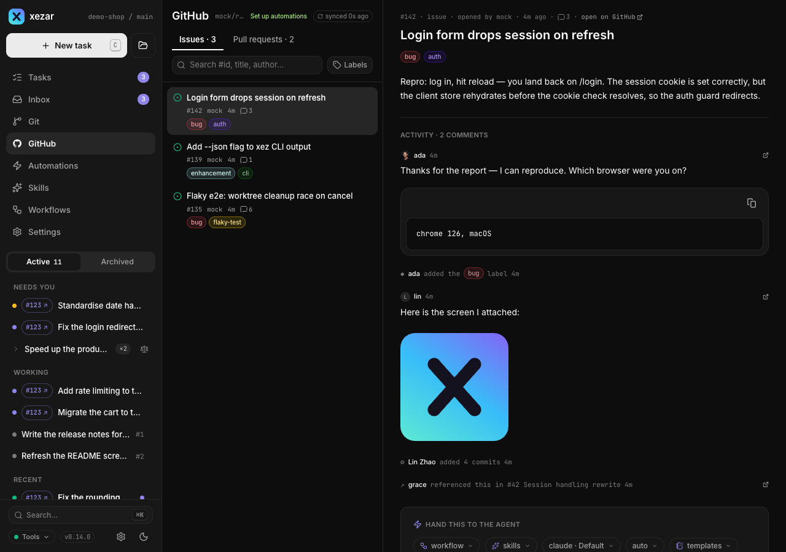
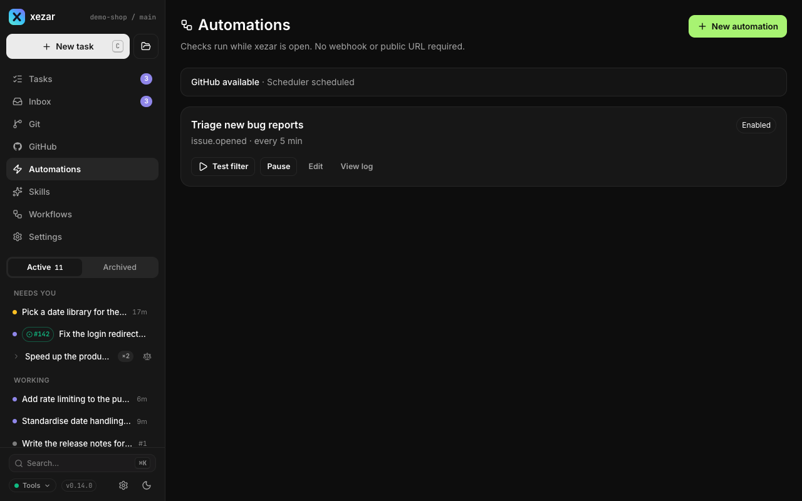

# GitHub and automations

Use GitHub in the cockpit to read issues and pull requests, hand work to an agent, and check the resulting changes. Bookmarklets bring a GitHub page into your task composer; optional automations watch for new GitHub activity while xezar is running.

## To connect GitHub

Install the GitHub CLI (`gh`) on the machine running xezar, and sign in there:

```sh
gh auth login
```

Open a project with a GitHub remote. xezar uses `gh` for its GitHub views and PR actions. If you use token-based authentication, make `GITHUB_TOKEN` available in the environment that starts xezar; the token does not replace the `gh` executable. Missing tools, authentication failures, and unavailable repositories appear as an availability reason in the cockpit.

## To browse issues and pull requests

1. Select the project and open **GitHub**.
2. Choose **Issues** or **Pull requests**. The initial list shows open items.
3. Search by number, title, or author, and use the label filter to narrow the list. An exact number such as `#448` can find a closed issue or merged PR outside the open list.
4. Open an item to read its description and conversation. For a PR, open **Changes** to inspect the changed files and diff.



## To hand an issue to an agent

1. Open the issue and find **Hand this to the agent**. The same panel is available on PRs.
2. Choose a workflow, select skills, and choose an available agent and model.
3. Write the result you want in the instructions box. You can insert a [prompt template](08-inbox-notifications-templates.md#to-reuse-prompt-templates).
4. Use the panel's run button, or press **⌘Enter / Ctrl+Enter**. Enter alone adds a line to the instructions.

A selected workflow determines the steps; without one, selected skills form the task, or xezar uses `quick-task` if none are selected. If the provider is unavailable, follow **Configure providers** before starting. See [Tasks and runs](02-tasks-and-runs.md) and [Workflows](05-workflows.md).

For a task with a worktree and branch, **Draft PR** saves the final changes, pushes the branch to `origin`, and creates a draft targeting the task's base branch. Resolve any reported commit, push, or authentication error before trying again. Creating a draft does not merge it.

## To launch from a GitHub page with a bookmarklet

1. Open the project's **Settings → Bookmarklets**.
2. Drag the generic launcher or a skill button to your browser's bookmarks bar. You can also copy its bookmarklet URL.
3. Keep this cockpit running. On a GitHub issue or PR page, click the saved bookmark.

The generic launcher prefills the composer. Skill launchers can use **One-click launch (auto-submit)**; re-drag the buttons after changing that option. A bookmark points to the cockpit and project that generated it, so create it from the project you intend to use.

## To enable and test an automation

Start xezar with automations enabled, or restart your existing server with this environment variable:

```sh
XEZ_AUTOMATIONS=1 xezar
```

Automations are off by default. Enabling them allows GitHub polling and task launches; the server must remain running. No webhook or public URL is required.

1. Open **Automations → New automation**.
2. Enter a name and prompt. The current editor creates a **New issue** watch: every **5 minutes**, looking back **7 days**, with a maximum of **25 records**, using `quick-task`.
3. Keep **Save and enable from a current-time baseline** unchecked and choose **Save automation** to create it paused.
4. Choose **Test filter** on its card. The result reports matches without launching tasks.
5. Choose **Enable** when ready. Enabling starts from the current time: existing matches are not launched. Use **Pause** to stop this automation.

For example, a prompt can say `Summarize {{github.url}} and suggest a next step.` Other available placeholders include `{{github.number}}`, `{{github.title}}`, and `{{github.labels}}`. GitHub content is appended as untrusted context. The editor lets you change the name and prompt; it does not expose controls for changing the displayed event, interval, or filter bounds.



## To inspect the automation log

Choose **View log** on the automation. Each record shows its result and time, an explanation when available, and links to the GitHub item or launched task when present. Results include a baseline, preview, launch, no match, duplicate, rate limit, or error. Check the GitHub availability and scheduler status at the top of the automation list when checks are not producing work.

## Related settings / env / config

- **Project Settings → Agents**: providers, default agent/models, team skills, and base branch.
- **Project Settings → Bookmarklets / Prompt templates**: launchers and reusable instructions.
- `GITHUB_TOKEN`: optional token authentication for GitHub actions through `gh`.
- `XEZ_AUTOMATIONS=1`: enables automations at server startup; there is no Automations switch in Resources.
- [Settings reference](10-settings-reference.md) and the [environment contract](../../.env.example).

Describes xezar 0.15.0.
