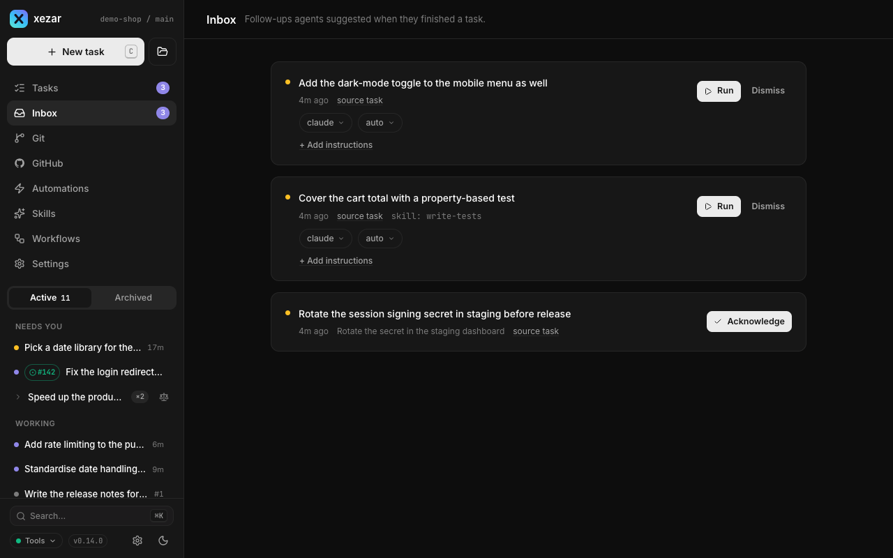

# Inbox, notifications, and prompt templates

Use the Inbox to turn an agent's suggested follow-up into another task, browser notifications to notice when a task needs you, and prompt templates to reuse instructions. These controls help you decide what to do next and supply the instructions for that work.

## To enable the follow-up Inbox

Open **Global settings → Resources → Follow-up Inbox** and choose **On**. Turning it on applies to newly started tasks without restarting xezar; it does not enable follow-ups for runs already started. Turning it off also reaches running tasks at their next step or Continue. Refresh already-open cockpit tabs so they receive live Inbox updates. In the new-task composer, leave the **Follow-ups** chip on to ask that task's agent for follow-ups when it finishes. The chip remembers your choice between tasks; when off, that task is not asked. Each task's own Notes journal works whether the Inbox is on or off.

The Inbox is off by default. You can also start xezar with:

```sh
XEZ_FOLLOWUPS=1 xezar
```

The stored workspace `followups` choice wins over the environment: **On** and **Off** remain explicit choices. Select **Follow XEZ_FOLLOWUPS** to remove that override and inherit the startup environment again.

## To turn a follow-up into a task

1. Open the project's **Inbox** and read a suggestion. Follow its source-task or PR link when you need context.
2. Expand **Add instructions** to add your requirements, or insert a template. These instructions are appended to the suggested task text.
3. Choose an available agent and model where offered, then choose **Run**. The agent pill appears when there is more than one usable agent to choose from; a locked model is read-only. **Run** remains disabled until a provider is connected; follow **Configure providers** if needed.
4. xezar opens the new task. It uses the suggested skill if that skill is available, otherwise `quick-task`.

Choose **Dismiss** to remove a runnable suggestion without starting it. Informational notes offer **Acknowledge** instead. Extra instructions belong to the open card and do not survive a page reload.



## To receive browser notifications

1. Open **Global settings → Notifications**.
2. Turn on **Notify when an agent needs you**.
3. Allow notifications when the browser asks. If permission was already denied, change the cockpit's permission in the browser's site settings.

Notifications are off by default. With notifications enabled and permission granted, a task changing into waiting, review, or failure can notify you while the tab is hidden or its window is minimised. A visible window behind another app does not count. Usage-limit failures with an auto-resume scheduled do not notify. Loading a task that already needs attention does not replay an old notification, and repeated updates with the same status do not notify again.

Notification coverage after switching projects has not been verified; use the cockpit's attention indicators to check tasks. Cross-project notification delivery is not guaranteed.

The preference is shared through workspace UI state, but browser permission is separate. If the browser does not support notifications, the toggle is unavailable. Delivery can also be unavailable in browsers that cannot create these page notifications; use the cockpit's attention indicators to check tasks there.

## To reuse prompt templates

1. Open **Settings → Prompt templates**.
2. Edit a built-in entry, or enter a label and instruction text and choose **Add template**.
3. Optionally choose skills under **apply with…**. Selecting a matching skill fills an untouched prompt automatically in the new-task composer and GitHub panel, but not the Inbox box; text you have typed is preserved.
4. Choose **Save**. Every template needs both a label and text.

For example, create **Test changed behavior** with `Add regression tests for the behavior you change.` Insert it from the template menu in the new-task composer, GitHub hand-over panel, or Inbox's **Add instructions** box. In the composer, open the notebook icon labeled **Insert a prompt template**. The menu is hidden when there are no templates. Manual insertion adds the snippet at the cursor with blank-line spacing.

Remove entries you no longer need and save, or choose **Reset to defaults**, then **Save**, to restore the built-ins and discard custom templates and skill links. Templates are saved for the project; see [Skills](06-skills.md) for the skills they can be assigned to.

## Related settings / env / config

- **Global settings → Resources → Follow-up Inbox**: `followups` in `~/.xezar/config.json`; absent means inherit `XEZ_FOLLOWUPS`.
- **Global settings → Notifications**: `notifications.enabled` in workspace UI state, separate from browser permission.
- **Settings → Prompt templates**: `promptTemplates` in the project's `.local/xezar/ui-state.json`.
- [Settings reference](10-settings-reference.md) and the [environment contract](../../.env.example).

Next: [Projects](09-projects.md)

Describes xezar 0.16.0.
