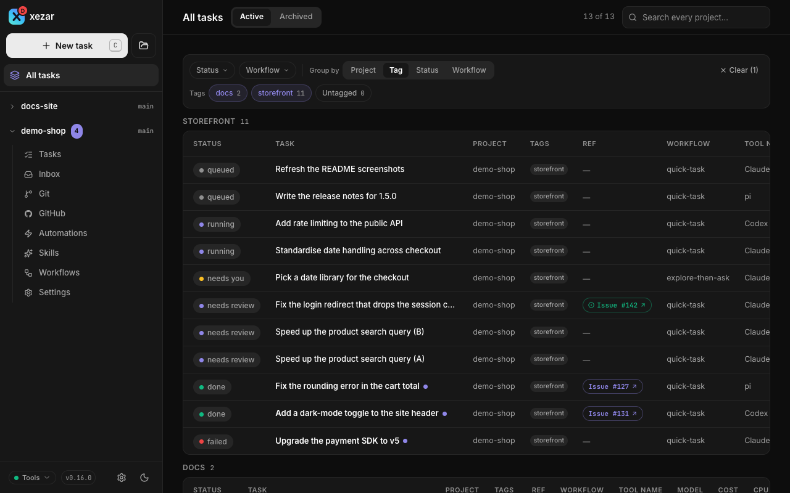

# Projects

Use one cockpit for several repositories or ordinary folders. The workspace registry remembers each project's location, tags, and optional task limit, while All tasks gives you a view across projects.

## To work with several projects

Start xezar in a project, then use the sidebar's project groups to open another registered project. Project pages keep tasks and settings scoped to that project. The registry lives in `~/.xezar/config.json`; starting xezar in a normal project registers it automatically. Task worktrees and your home directory itself are not registered as projects.

Switching projects updates the address bar and moves you straight to the destination project's own page — no reload, and no page from the project you left carries over. Any in-progress filter or search text on the page you left is not applied to the destination project; each project's page starts from its own clean state. Opening a task from **All tasks** (see below) always lands you in the task's own project, even if you were looking at a different one when you clicked it.

## To add a project in the cockpit

Open the icon-only **Add project** button and choose one of its alternatives:

- **Open local folder…**: browse to the folder on the machine running xezar and choose **Add project**. An ordinary folder does not have to be a Git repository.
- **Clone from GitHub…**: enter the repository, review or edit **Folder name** (initially the repository name), and choose **Clone**.

**Global settings → Projects** controls the **Default browse folder** and **Default checkout folder**. The folder picker cannot navigate above its browse root; GitHub checkouts land under the checkout folder using the chosen folder name. Cloning runs `gh repo clone` on the server machine, requires `gh` and its GitHub access, accepts only github.com repositories, and refuses an existing target folder.

## To add or remove projects from the terminal

These commands edit the registry directly and work without a running server:

```sh
xezar projects
xezar projects add /path/to/repository
xezar projects add
xezar projects remove PROJECT_ID
```

Replace the path and `PROJECT_ID` with your own values; the list command prints the IDs. With no directory argument, `add` registers the Git root of `--repo` when supplied, otherwise of the current directory (or the directory itself outside Git). An explicit `add <dir>` registers that exact folder. Adding a non-folder, your home directory itself, or a task worktree is refused. Adding the same resolved folder again keeps its existing entry.

To remove a project in the cockpit, open **Global settings → Projects**, choose its remove button, and confirm **Remove from list**. You can also remove the current project from its Settings overview. Removal unregisters it; its folder, Git history, and `.local/xezar/` task history stay on disk. Removal also deletes the registry tags and **Max parallel** cap: set them again after re-adding, and recreate bookmarklets made for the old project ID.

The cockpit refuses removal of the project it started in or one with queued, running, or waiting tasks. The registry-only CLI does not check those task states and can remove the usual startup project; starting xezar there again registers it again.

## To group related projects with tags

In **Global settings → Projects**, add the same tag to related repositories, such as `storefront` on a web app and its API. Tags ignore case for duplicates and trim surrounding spaces. They are sorted, limited to 20 tags, and cut to 32 characters each.

You can replace a project's complete tag list from the terminal:

```sh
xezar projects tag PROJECT_ID storefront api
```

Run `xezar projects tag PROJECT_ID` with no tags to clear them. Tags group projects; they do not move their files or combine their task histories.

## To see work across projects in All tasks

Open **All tasks**. Search across projects, filter the list, and choose grouping by project, tag, status, or workflow. Switch between **Active** and **Archived**, then open a task to return to its own project.

The filters, grouping, search text, and Active/Archived choice are kept in the URL, so you can bookmark a useful view. A shared tag brings related repositories into the same view; **Untagged** filters tasks belonging to projects without tags and appears only when some tag exists in the workspace.



## To limit one project's parallel tasks

Open the project's Settings overview and set **Max parallel tasks**, or edit **Max parallel** on its row in **Global settings → Projects**. Choose **Inherit workspace** to use the workspace limit.

The project limit narrows **Global settings → Resources → Max parallel tasks**. For example, with a workspace limit of two and a project limit of one, that project can run one task while another project uses the remaining slot. Raising a project limit above the workspace limit does not raise the overall ceiling. The registry stores this choice as `projects[].maxParallel`; it is not the legacy `maxParallel` key in the repository's `.xezar/config.json`.

A non-Git folder runs one task at a time. See [Worktrees and Git](03-worktrees-and-git.md) for task isolation.

## To handle a missing project

A deleted or moved folder is labeled **folder not found**, and its project pages cannot start a working project context. In the sidebar's project groups, that project's row stays listed alongside your other projects but does not expand into a nav — there is nothing behind it to open. Restore the folder at its recorded path, or remove the stale registry entry and add the new location, then restore its tags and cap and recreate its bookmarklets. A folder that exists without Git is shown as **no git repo**, which is different from **folder not found**. The CLI uses **not a git repo** and **missing** for these states.

## To keep a project's xezar setup inside the project — single-project mode

Use single-project mode when a repository should carry its own xezar setup, so that everyone who clones it runs with the same settings, agent accounts and limits, with no setup step on their machine.

Start xezar once with the flag in the project folder:

```sh
xezar --single-project
```

The project then keeps its setup in its own `.xezar/` folder: `config.json`, `workspace.json`, `agent-accounts.json` and `workspace-ui.json`, which you can commit. Working files stay in `.local/xezar/`, and xezar does not open `~/.xezar`. The time this clone was last opened and the port its cockpit last used live in `.local/xezar/machine-state.json` instead, so a normal launch leaves `git status` clean and teammates never conflict over them. One exception: the very first start that opts a folder in still writes `workspace.json` once, filling in the schema version and the default limits (the memory limit is sized to this machine), so check that first write before you commit it — no later start rewrites it. You need the flag only the first time; after that the presence of `.xezar/workspace.json` decides, so every start in that folder, or in a clone of the repository, is in the mode. The terminal prints one line naming the mode and both folders. A linked Git worktree, a folder under `.local/xezar/worktrees/` and your home directory itself never enter the mode.

The `.xezar` folder itself must be a real directory: if it is a symbolic link, or resolves outside the project, xezar refuses to start (and the import step below skips every file rather than write through it). Any of the four state files that is itself a symbolic link is refused and named in the terminal, never written through or replaced.

The first run in a folder without `.xezar/workspace.json` asks once, in the terminal, whether to copy your global setup (`~/.xezar`, or your `XEZ_HOME`) into the project. Answer `y` to copy your workspace settings, agent accounts and GUI preferences; your project list is not copied, and only this folder's own account choice is kept. Files already in the project are never overwritten, and an unreadable global file is skipped and named. Any other answer imports nothing. Without a terminal, for example in a script or CI, nothing is imported and one line says so. The copy is one-time and one-way: nothing is kept in sync afterwards, and a folder that already holds `workspace.json`, such as a clone, is never asked.

In the mode the workspace holds exactly this one project. Adding, cloning, editing and removing projects, and browsing host folders, are refused in the cockpit, the CLI and the MCP tools. The cockpit shows a **Single project** badge, and Global settings reads **Workspace settings**. Agent logins, `gh`, `git` and your global skill libraries stay on the machine. An agent account that the project names but whose folder does not exist on this machine is shown as **Unavailable**, and a task that asks for it is refused rather than run with another login. See [Settings reference](10-settings-reference.md) and [Configuration reference](11-configuration-reference.md).

This mode does not change hosted-mode behaviour: a cockpit reached through `xezar server-install` or started with `XEZ_REMOTE=1` keeps refusing local-machine-only affordances with its own `409`, independently of whether single-project mode is on. The two refusals come from separate settings and neither overrides the other.

`XEZ_SINGLE_PROJECT=1` still exists with its old meaning and is not deprecated. The difference: `XEZ_SINGLE_PROJECT=1` narrows the cockpit to one project but keeps using your global state in `~/.xezar`, while `--single-project` moves that state into the project folder.

## Related settings / env / config

- **Settings overview**: folder, status, task cap, and removal.
- **Global settings → Projects**: registry, tags, caps, browse root, and checkout root.
- `~/.xezar/config.json`: `projects[]` and workspace resource limits; `XEZ_HOME` selects a different workspace home.
- `XEZ_BROWSE_ROOT` / `XEZ_PROJECTS_DIR`: set browse/checkout locations **before the first start**. Startup registration saves these defaults into workspace config; change them afterwards in **Global settings → Projects**, not by changing the variables.
- `XEZ_SINGLE_PROJECT=1`: restricts the cockpit to its startup project and disables registry add/remove/tag operations, including the CLI mutations. It also disables Max parallel edits, cloning, and folder browsing. Startup registration still happens for `serve`, `run`, and even `xezar projects`.
- `--single-project`: moves the project's xezar setup into its own `.xezar/` folder; see [single-project mode](#to-keep-a-projects-xezar-setup-inside-the-project--single-project-mode).
- [Settings reference](10-settings-reference.md) and the [environment contract](../../.env.example).

Next: [Settings reference](10-settings-reference.md)

Describes xezar 0.16.0.
