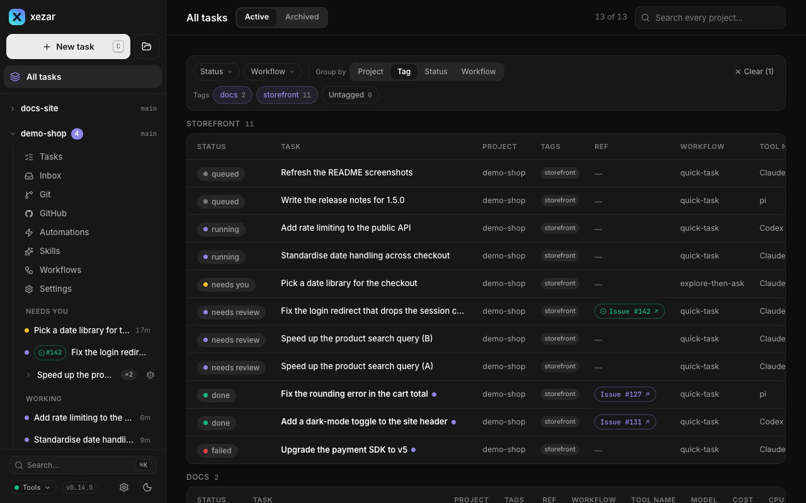

# Projects

Use one cockpit for several repositories or ordinary folders. The workspace registry remembers each project's location, tags, and optional task limit, while All tasks gives you a view across projects.

## To work with several projects

Start xezar in a project, then use the sidebar's project groups to open another registered project. Project pages keep tasks and settings scoped to that project. The registry lives in `~/.xezar/config.json`; starting xezar in a normal project registers it automatically. Task worktrees and your home directory itself are not registered as projects.

## To add a project in the cockpit

1. Choose **Add project → Open local folder**.
2. Browse to the folder on the machine running xezar and choose **Add project**. An ordinary folder does not have to be a Git repository.
3. To make a new checkout instead, choose **Add project → Clone from GitHub**, enter the repository, review the target folder, and choose **Clone**.

**Global settings → Projects** controls the **Default browse folder** and **Default checkout folder**. The folder picker cannot navigate above its browse root; GitHub checkouts land under the checkout folder using the project name. Cloning uses the server machine's GitHub access.

## To add or remove projects from the terminal

These commands edit the registry directly and work without a running server:

```sh
xezar projects
xezar projects add /path/to/repository
xezar projects add
xezar projects remove PROJECT_ID
```

Replace the path and `PROJECT_ID` with your own values; the list command prints the IDs. With no directory argument, `add` uses `--repo` when supplied, otherwise the current project directory. Adding the same resolved folder again keeps its existing entry.

To remove a project in the cockpit, open **Global settings → Projects**, choose its remove button, and confirm **Remove from list**. You can also remove the current project from its Settings overview. Removal unregisters it; its folder, Git history, and `.local/xezar/` task history stay on disk.

The cockpit refuses removal of the project it started in or one with running tasks. The registry-only CLI can remove the usual startup project; starting xezar there again registers it again.

## To group related projects with tags

In **Global settings → Projects**, add the same tag to related repositories, such as `storefront` on a web app and its API. Tags ignore case for duplicates and trim surrounding spaces.

You can replace a project's complete tag list from the terminal:

```sh
xezar projects tag PROJECT_ID storefront api
```

Run `xezar projects tag PROJECT_ID` with no tags to clear them. Tags group projects; they do not move their files or combine their task histories.

## To see work across projects in All tasks

Open **All tasks**. Search across projects, filter the list, and choose grouping by project, tag, status, or workflow. Switch between **Active** and **Archived**, then open a task to return to its own project.

The filters and grouping are kept in the URL, so you can bookmark a useful view. A shared tag brings related repositories into the same view; use **Untagged** to find projects without tags.



## To limit one project's parallel tasks

Open the project's Settings overview and set **Max parallel tasks**, or edit **Max parallel** on its row in **Global settings → Projects**. Choose **Inherit workspace** to use the workspace limit.

The project limit narrows **Global settings → Resources → Max parallel tasks**. For example, with a workspace limit of two and a project limit of one, that project can run one task while another project uses the remaining slot. Raising a project limit above the workspace limit does not raise the overall ceiling. The registry stores this choice as `projects[].maxParallel`; it is not the legacy `maxParallel` key in the repository's `.xezar/config.json`.

A non-Git folder runs one task at a time. See [Worktrees and Git](03-worktrees-and-git.md) for task isolation.

## To handle a missing project

A deleted or moved folder remains listed as missing, and its project pages cannot start a working project context. Restore the folder at its recorded path, or remove the stale registry entry and add the new location. A folder that exists without Git is shown as **not a git repo**, which is different from missing.

## Related settings / env / config

- **Project Settings overview**: folder, status, task cap, and removal.
- **Global settings → Projects**: registry, tags, caps, browse root, and checkout root.
- `~/.xezar/config.json`: `projects[]` and workspace resource limits; `XEZ_HOME` selects a different workspace home.
- `XEZ_BROWSE_ROOT` / `XEZ_PROJECTS_DIR`: inherited browse/checkout locations when no stored choice supersedes them.
- `XEZ_SINGLE_PROJECT=1`: restricts the cockpit to its startup project and disables registry add/remove/tag operations, including the CLI mutations.
- [Settings reference](10-settings-reference.md) and the [environment contract](../../.env.example).

Describes xezar 0.15.0.
