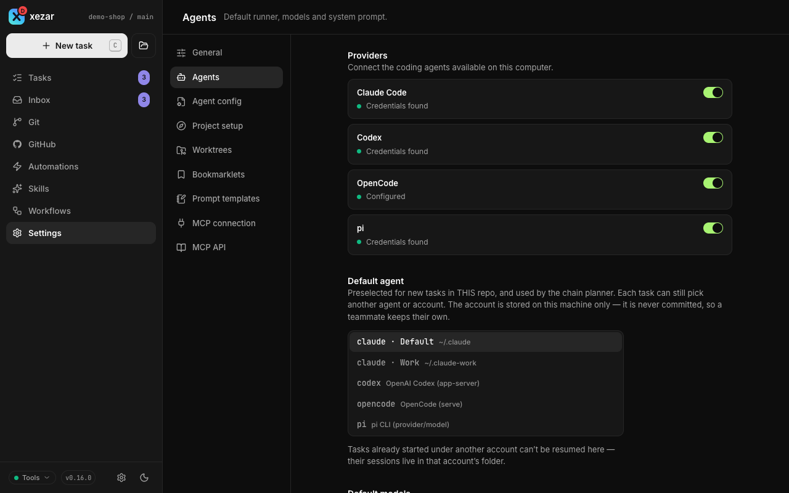
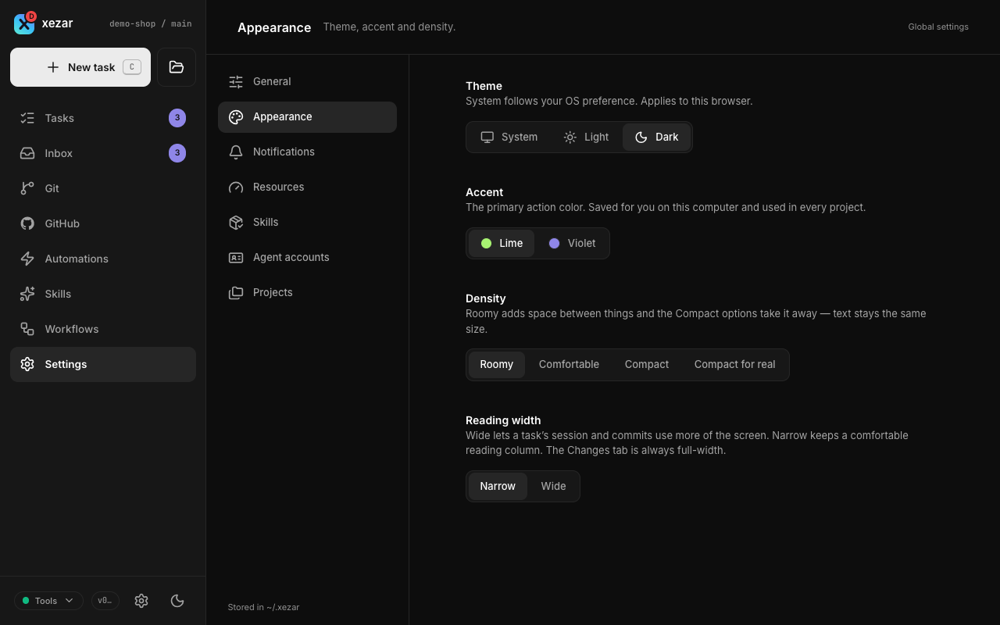
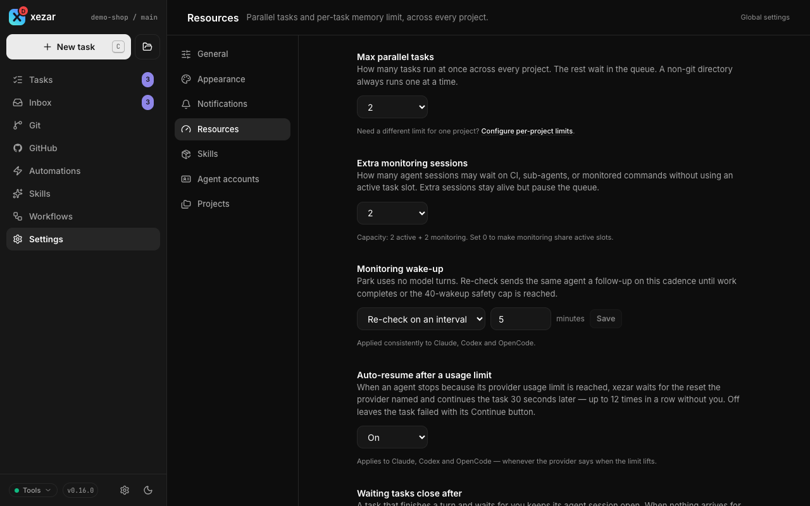
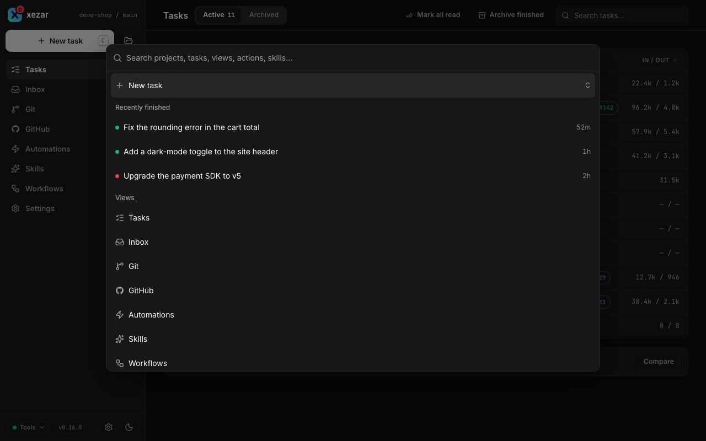

# Settings reference

Use project Settings for the repository you are working in and Global settings for shared workspace choices. This page names each section and the task it helps you perform, including the Settings overview and the command palette.

## To change project settings

Open **Settings** for the intended project. Its sections live under `/p/<projectId>/settings/`.

### To inspect the project — General overview

The Settings overview shows the project folder, registry facts, status, branch when known, and dates. Set **Max parallel tasks** to narrow the workspace ceiling, or use **Remove from workspace** to unregister the project without deleting files. The cockpit refuses removal of the startup project or one with queued, running, or waiting tasks. In single-project mode, the overview keeps the project information and omits registry-management controls. See [Projects](09-projects.md).

### To choose how tasks run — Agents

- **Providers**: inspect connection state. **Connect** appears for **Not connected**; a missing CLI shows installation steps. The enable switch is machine-wide: it writes `disabledProviders` in `~/.xezar/config.json` and affects every project.
- **Default agent / Default runner** and **Default models**: choose the project's defaults. If model selection is locked to native agent settings, the control shows the native model read-only. A default-agent account selection is saved separately in `~/.xezar/agent-accounts.json`.
- **System prompt**: enter extra run instructions and save them. For Codex and OpenCode, they are prepended to the first message.
- **Live title updates**: allow the namer to refresh task titles. A manual rename stops automatic updates for that task.
- **Review changes before finishing**: pause a task with changes for review. This is off by default; autonomous tasks skip it.
- **Planner and namer models**: choose the Claude aliases used for these background jobs; these fields are ignored when the project's default agent is not Claude.
- **Team skill repositories**: enter one source per line and save. Sources may be `owner/name`, a Git URL, or a local path, with `@branch` for a different ref. With no `skillsRepos` key, the box displays `qodeca/xezar-skills` and the shared catalog supports per-skill opt-in. Saving any list, even that unchanged default, writes the key, disables per-skill opt-in, and hides **Manage skills**. **Use the shared catalog** removes that explicit choice and restores the catalog. An explicitly saved empty list uses no team skills; project skills take precedence.
- **Base branch**: choose where new task worktrees branch from and draft PRs target. The Git view offers the same setting.

See [Agent backends](04-agent-backends.md), [Workflows](05-workflows.md), and [Skills](06-skills.md).

### To inspect or edit native files — Agent config

Choose an agent tab, then a configuration file under **Settings**, **MCP**, or **Memory & instructions**. Read the scope and precedence notes before editing, and use **Save** for an editable file or **Create** for a missing file. These are the agent's own files, so choosing a user-level file can affect more than this project. Hosted mode makes this section read-only and explains that edits belong on the machine owning the checkout.

### To reclaim task folders — Worktrees

Set **Keep last N worktrees** and save. Zero means unlimited; older finished worktrees can be reclaimed, but running and in-review tasks are protected, so the count can exceed the limit. **Reclaim now** removes eligible folders beyond the keep limit and keeps their branches; with zero, it reclaims nothing. Per-row **Delete** removes both the folder and its branch, including local-only work that is not recoverable afterwards. Delete refuses active runs but can delete an in-review worktree; review protection applies to retention and Reclaim now. See [Worktrees and Git](03-worktrees-and-git.md).

### To start from GitHub — Bookmarklets

Drag a generic or skill launcher to your bookmarks bar. The generic launcher prefills a task; **One-click launch (auto-submit)** applies to skill launchers. Re-drag after changing the option, and keep the originating cockpit running. See [GitHub and automations](07-github-and-automations.md#to-launch-from-a-github-page-with-a-bookmarklet).

### To reuse instructions — Prompt templates

Add or edit labeled snippets, optionally assign them to skills with **apply with…**, then **Save**. A matching skill fills an untouched prompt automatically in the new-task composer and GitHub panel, not the Inbox box. **Reset to defaults** restores built-in entries in the form; save to keep that reset and discard custom templates and skill links. See [Inbox, notifications, and templates](08-inbox-notifications-templates.md#to-reuse-prompt-templates).

### To connect a project leader — MCP connection

Read **Bound project** and follow the card for your client under **One-time setup**; all four client cards are shown. **Connection status** reports the project's leader and available attach controls. One client can own the project's leader connection at a time. The MCP client and xezar must be on the same machine.

### To read tool capabilities — MCP API

Browse the tool reference, filter it, and expand a tool to inspect its inputs and reported effects. This is a read-only reference: opening an entry does not execute the tool.

## To change global settings

Open **Global settings**. Its sections live under `/settings/global/` and apply across projects, with browser-specific choices called out below.

In [single-project mode](09-projects.md#to-keep-a-projects-xezar-setup-inside-the-project--single-project-mode), this area reads **Workspace settings**, keeps the same sections and URLs, and saves into the project's own files instead of `~/.xezar`. Each section names its file:

| Section | File in single-project mode |
| --- | --- |
| Resources, Terminal, Skills, and the workspace defaults | `.xezar/workspace.json` |
| Agent accounts | `.xezar/agent-accounts.json` |
| Appearance and Notifications | `.xezar/workspace-ui.json` |
| Project Settings (Agents and the other project sections) | `.xezar/config.json`, as in every mode |
| Projects | Not available: the workspace holds only this project. |

### To change the display — Appearance

| Control | Choices and effect |
| --- | --- |
| Theme | **System**, **Light**, **Dark**. System follows your OS preference; theme is saved in this browser. |
| Accent | **Lime**, **Violet**. Changes the primary action color. |
| Density | **Roomy → Comfortable → Compact → Compact for real**. Changes spacing while keeping text the same size. |
| Reading width | **Narrow**, **Wide**. Wide gives task sessions and commits more room; Changes always uses the full width. |

The controls apply directly. Accent, density, and reading width are saved in workspace UI state and mirrored in browser storage for the next page load. If a save fails, the cockpit restores the last server-confirmed choice.

### To notice tasks needing attention — Notifications

Turn on **Notify when an agent needs you** and allow browser permission. Notifications are off by default and fire on attention-state changes while the tab is hidden or its window is minimised; usage-limit failures awaiting auto-resume are excluded. A denied browser permission needs changing in site settings even when the workspace preference is on. See [Browser notifications](08-inbox-notifications-templates.md#to-receive-browser-notifications).

### To control task and disk use — Resources

| Control | What to do |
| --- | --- |
| Max parallel tasks | Set the total active-task ceiling across projects; default **2**. Extra tasks queue. |
| Extra monitoring sessions | Set how many monitoring sessions can remain outside the active-task cap; default **2**. |
| Monitoring wake-up | Choose **Re-check** on a cadence (default **5 minutes**) or park until resumed. Re-check has a 40-wakeup safety cap. |
| Auto-resume after a usage limit | Leave on to continue after the provider's stated reset, plus 30 seconds, up to 12 consecutive retries. Off leaves the failed task with Continue. |
| Waiting tasks close after | Set an idle-session timeout (default **15 minutes**) or never close on idle. The task remains available for Continue after its session closes. |
| Per-task memory limit | Limit the whole task process tree in MiB. The default is derived from host memory, bounded between **1024 and 8192 MiB**. An empty field saves no limit. |
| Keep last N worktrees, by default | Set retention for projects without their own choice; default **10**, **0** means unlimited. |
| Follow-up Inbox | Choose **On**, **Off**, or **Follow XEZ_FOLLOWUPS**. On applies to newly started tasks; Off also affects running tasks at their next step or Continue. Refresh an open tab for live Inbox updates. |
| Extra variables agents receive | Save a comma-separated list of additional environment variable names, or choose **Follow XEZ_ENV_PASSTHROUGH**. An explicitly empty list forwards no extra variables. |
| New task defaults | Set **Autonomous by default** and **Use a worktree by default** to **Inherit environment**, **On**, or **Off**. They inherit `XEZ_AUTONOMOUS_DEFAULT` and `XEZ_WORKTREE_DEFAULT`, respectively. Explicit task choices and task constraints still take precedence. |

Open the project’s **Settings → Worktrees** table to inspect disk use and reclaim eligible task folders. A project's own Worktrees choice overrides default retention; its registry cap narrows the total concurrency limit. A project memory override, `memoryLimitMb` in `.xezar/config.json`, can supersede the workspace memory ceiling; no cockpit control sets it. In single-project mode there is no **Configure per-project limits** link under Max parallel tasks, because the workspace holds only this project; limits saved here go to `.xezar/workspace.json` and apply exactly as written on every machine that uses the project.

Automations have no control here: start the server with `XEZ_AUTOMATIONS=1` to enable them.

### To choose how xezar starts in a terminal — Terminal

Each control applies the next time you start xezar; the cockpit you are using keeps running as it is. **Not set — use the default** removes your choice, so the matching environment variable decides when it is set, and the built-in default otherwise. The line under each control names the value the next start will use and, when a variable decides it, which one.

| Control | Choices and effect |
| --- | --- |
| Instance mode | **One cockpit for every project** (the default) opens everything you have registered. **One cockpit per project** serves the project it was started in; your other projects appear as links to their own cockpit, and each cockpit applies its own task limit. Falls back to `XEZ_INSTANCE`. With `XEZ_SINGLE_PROJECT=1` the cockpit already serves one project, so a choice here only affects a cockpit you start elsewhere. In single-project mode the project always serves one project, so the section shows that as text and offers no choice. |
| Terminal output | **Automatic** shows the live panel in a wide terminal, one line per event in a narrow one, and plain lines when the output is not a terminal. **Live panel** and **One line per event** fix the choice. Falls back to `XEZ_OUTPUT`. |
| Colour | **Automatic**, **Always**, or **Never**. A non-empty `NO_COLOR` turns colour off whatever is chosen here. Falls back to `XEZ_COLOR`. |
| Log level | **Everything, for debugging**, **Activity** (the default), **Warnings and errors**, or **Errors only**. Falls back to `XEZ_LOG_LEVEL`. |

A command-line flag (`--instance`, `--output`, `--color`, `--log-level`) outranks every choice here for that start. When a flag started this cockpit in a different instance mode, the section says which mode it is running in. See the [CLI reference](12-cli-reference.md#live-activity-in-the-terminal).

### To control installed skill updates — Skills

Use **Update xezar-skills automatically** to save an on/off workspace override and read the installation/update status beneath it. **Use default** removes the override: `XEZ_SKILLS_AUTO_UPDATE` then supplies the inherited value, otherwise updates are on. The updater applies to tracked xezar-skills installations and leaves other skills and untracked folders alone. See [Skills](06-skills.md).

### To manage logins and fallback models — Agent accounts

Choose a provider tab to inspect installation, version, and accounts. Use its login controls or add an account with a label and separate configuration folder where supported. **Defaults for new projects** supplies the agent and models when a project has not chosen its own. Account records live separately in `~/.xezar/agent-accounts.json`; see [Agent backends](04-agent-backends.md).

In single-project mode, account records live in the project's `.xezar/agent-accounts.json`, and the defaults card reads **Defaults for this project**. An account the project names whose configuration folder does not exist on this machine reads **Unavailable — this account's folder does not exist on this machine: `<folder>`. Connect signs in and creates it, or pick another account for the task.** A task that asks for that account is refused before the agent starts, with the message `Agent account “<label>” is unavailable —` followed by the same sentence; xezar does not quietly use the default login instead. Outside single-project mode, a newly added account whose folder does not exist yet still reads **folder not created yet; Connect will make it**.

### To manage registered folders — Projects

Set the default browse and checkout folders, and edit registered projects' tags or parallel-task caps. Removal unregisters a project and drops its tags and cap while leaving its files intact. This section is hidden under `XEZ_SINGLE_PROJECT=1` and in single-project mode (`--single-project`), where `/settings/global/projects` is not available. See [Projects](09-projects.md) for adding, cloning, removal, and missing-folder recovery.

### To find shortcut settings — Keyboard

Keyboard is a hidden placeholder: there is no routed Keyboard settings page or shortcut editor in this release. Use the command palette below for navigation.

## To jump or act with the command palette

Press **⌘K / Ctrl+K** to open the palette. Search for a view, project, task, or skill, then select a result. The palette offers **New task** and **Toggle theme**. With an empty search, **Recently finished** lists finished tasks you have not opened since they finished. Project and **All tasks** results appear only with more than one registered project. Selecting a skill opens the new-task composer with that skill selected. With several projects, project and task results can take you into another project's scope; unavailable views are filtered by the cockpit's capabilities.

## Related settings / env / config

- `.xezar/config.json`: project agent defaults, system prompt, review gate, base branch, team skills, worktree retention, `liveTitleUpdates`, `plannerModel` / `namerModel`, and `memoryLimitMb`.
- `~/.xezar/config.json`: workspace resources, project registry, fallback agent/models, stored Inbox choice, skill-update choice, `disabledProviders`, `composerDefaults`, `agentEnvPassthrough`, `browseRoot` / `projectsDir`, and `modelsLocked`.
- `cli.instance`, `cli.output`, `cli.color` and `cli.logLevel` in `~/.xezar/config.json` are set under **Global settings → Terminal**. Each project's cockpit port has no control in Settings: set it with `--port`, `XEZ_PORT` or `xezar projects port`; see the [CLI reference](12-cli-reference.md#live-activity-in-the-terminal).
- `~/.xezar/ui-state.json`: global appearance and notification preferences; project `.local/xezar/ui-state.json`: prompt templates.
- In single-project mode, the three `~/.xezar` files above are the project's `.xezar/workspace.json`, `.xezar/agent-accounts.json` and `.xezar/workspace-ui.json`; see [Configuration reference](11-configuration-reference.md#to-find-where-the-files-live-in-each-layout).
- Browser storage: theme and the appearance mirror. Native agent configuration files are separate from xezar's settings.
- `XEZ_REVIEW_GATE`, `XEZ_TITLE_UPDATES`, `XEZ_FOLLOWUPS`, `XEZ_ENV_PASSTHROUGH`, `XEZ_SKILLS_AUTO_UPDATE`, `XEZ_AUTONOMOUS_DEFAULT`, and `XEZ_WORKTREE_DEFAULT` provide defaults where the corresponding stored setting has no opinion. See the [environment contract](../../.env.example) for precedence and startup details.

Next: [Configuration reference](11-configuration-reference.md)

Describes xezar 0.16.0.
