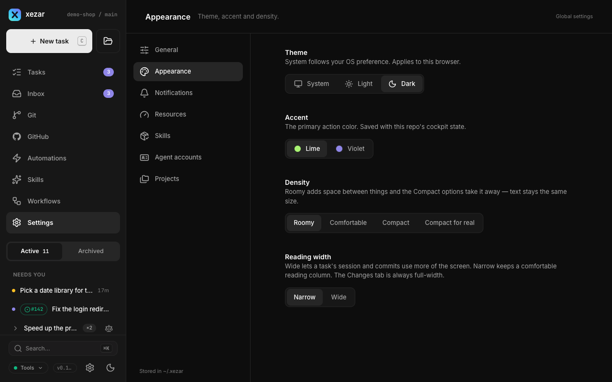
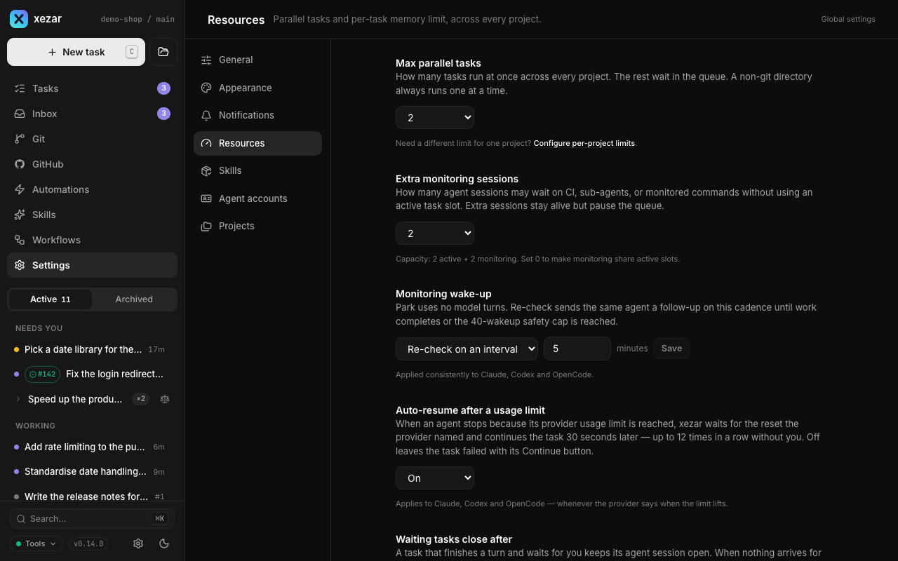
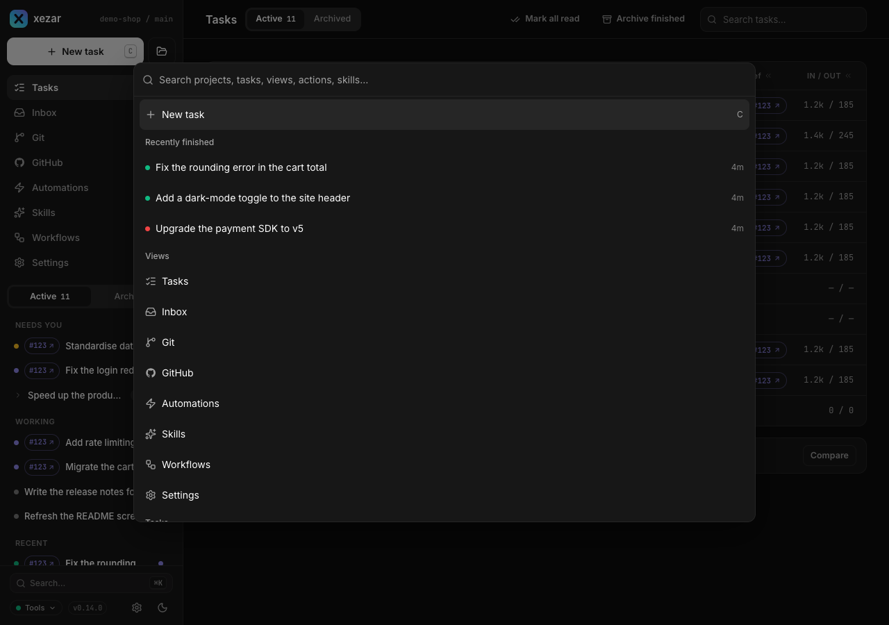

# Settings reference

Use project Settings for the repository you are working in and Global settings for shared workspace choices. This page names each section and the task it helps you perform, including the Settings overview and the command palette.

## To change project settings

Open **Settings** for the intended project. Its sections live under `/p/<projectId>/settings/`.

### To inspect the project — General overview

The Settings overview shows the project folder, registry facts, status, branch when known, and dates. Set **Max parallel tasks** to narrow the workspace ceiling, or use **Remove from workspace** to unregister the project without deleting files. The startup project cannot be removed through the cockpit. In single-project mode, the overview keeps the project information and omits registry-management controls. See [Projects](09-projects.md).

### To choose how tasks run — Agents

- **Providers**: inspect connection state, connect a provider, or enable/disable its use.
- **Default agent / Default runner** and **Default models**: choose the project's defaults. If model selection is locked to native agent settings, the model picker is unavailable.
- **System prompt**: enter extra instructions appended to every run and save them.
- **Live title updates**: allow the namer to refresh task titles. A manual rename stops automatic updates for that task.
- **Review changes before finishing**: pause a task with changes for review. This is off by default; autonomous tasks skip it.
- **Planner and namer models**: choose the Claude aliases used for these background jobs; these fields are ignored when the project's default agent is not Claude.
- **Team skill repositories**: enter one source per line and save. Sources may be `owner/name`, a Git URL, or a local path, with `@branch` for a different ref. An empty list uses no team skills; project skills take precedence.
- **Base branch**: choose where new task worktrees branch from and draft PRs target. The Git view offers the same setting.

See [Agent backends](04-agent-backends.md), [Workflows](05-workflows.md), and [Skills](06-skills.md).

### To inspect or edit native files — Agent config

Choose an agent tab, then a configuration file under its listed scope. Read the scope and precedence notes before editing, and use **Save** for an editable file. These are the agent's own files, so choosing a user-level file can affect more than this project. Hosted mode makes this section read-only and explains that edits belong on the machine owning the checkout.

### To reclaim task folders — Worktrees

Set **Keep last N worktrees** and save. Zero means unlimited; older finished worktrees can be reclaimed, but running and in-review tasks are protected, so the count can exceed the limit. The worktree table lets you delete an eligible folder or choose **Reclaim now** for folders beyond the keep limit. Branches are kept. See [Worktrees and Git](03-worktrees-and-git.md).

### To start from GitHub — Bookmarklets

Drag a generic or skill launcher to your bookmarks bar. The generic launcher prefills a task; **One-click launch (auto-submit)** applies to skill launchers. Re-drag after changing the option, and keep the originating cockpit running. See [GitHub and automations](07-github-and-automations.md#to-launch-from-a-github-page-with-a-bookmarklet).

### To reuse instructions — Prompt templates

Add or edit labeled snippets, optionally assign them to skills with **apply with…**, then **Save**. A matching skill fills an untouched prompt automatically. **Reset to defaults** restores built-in entries in the form; save to keep that reset. See [Inbox, notifications, and templates](08-inbox-notifications-templates.md#to-reuse-prompt-templates).

### To connect a project leader — MCP connection

Read **Bound project**, choose the appropriate client under **One-time setup**, and follow the instructions shown for that client. **Connection status** reports the project's leader and available attach controls; **Operation outcomes** reports recent operations. One client can own the project's leader connection at a time. The MCP client and xezar must be on the same machine.

### To read tool capabilities — MCP API

Browse the tool reference, filter it, and expand a tool to inspect its inputs and reported effects. This is a read-only reference: opening an entry does not execute the tool.

## To change global settings

Open **Global settings**. Its sections live under `/settings/global/` and apply across projects, with browser-specific choices called out below.

### To change the display — Appearance

| Control | Choices and effect |
| --- | --- |
| Theme | **System**, **Light**, **Dark**. System follows your OS preference; theme is saved in this browser. |
| Accent | **Lime**, **Violet**. Changes the primary action color. |
| Density | **Roomy → Comfortable → Compact → Compact for real**. Changes spacing while keeping text the same size. |
| Reading width | **Narrow**, **Wide**. Wide gives task sessions and commits more room; Changes always uses the full width. |

The controls apply directly. Accent, density, and reading width are saved in workspace UI state and mirrored in browser storage for the next page load. If a save fails, the cockpit restores the last server-confirmed choice.

### To notice tasks needing attention — Notifications

Turn on **Notify when an agent needs you** and allow browser permission. Notifications are off by default and fire on attention-state changes while the tab is in the background. A denied browser permission needs changing in site settings even when the workspace preference is on. See [Browser notifications](08-inbox-notifications-templates.md#to-receive-browser-notifications).

### To control task and disk use — Resources

| Control | What to do |
| --- | --- |
| Max parallel tasks | Set the total active-task ceiling across projects; default **2**. Extra tasks queue. |
| Extra monitoring sessions | Set how many monitoring sessions can remain outside the active-task cap; default **2**. |
| Monitoring wake-up | Choose **Re-check** on a cadence (default **5 minutes**) or park until resumed. Re-check has a 40-wakeup safety cap. |
| Auto-resume after a usage limit | Leave on to continue after the provider's stated reset, plus 30 seconds, up to 12 consecutive retries. Off leaves the failed task with Continue. |
| Waiting tasks close after | Set an idle-session timeout (default **15 minutes**) or never close on idle. The task remains available for Continue after its session closes. |
| Per-task memory limit | Limit the whole task process tree in MiB. The default is derived from host memory, bounded between **1024 and 8192 MiB**. An empty field saves no limit. |
| Keep last N worktrees, by default | Set retention for projects without their own choice; default **10**, **0** means unlimited. |
| Follow-up Inbox | Choose **On**, **Off**, or **Follow XEZ_FOLLOWUPS**. Applies to the next task; refresh an open tab for live Inbox updates. |
| Extra variables agents receive | Save a comma-separated list of additional environment variable names, or choose **Follow XEZ_ENV_PASSTHROUGH**. An explicitly empty list forwards no extra variables. |
| New task defaults | Choose the default **Autonomous** and **Use a worktree** options. Explicit task choices and task constraints still take precedence. |

Open the project’s **Settings → Worktrees** table to inspect disk use and reclaim eligible task folders. A project's own Worktrees choice overrides default retention; its registry cap narrows the total concurrency limit. A project memory override can supersede the workspace memory ceiling.

Automations have no control here: start the server with `XEZ_AUTOMATIONS=1` to enable them.

### To control installed skill updates — Skills

Use **Update xezar-skills automatically** to save an on/off workspace override and read the installation/update status beneath it. **Use default** removes the override: `XEZ_SKILLS_AUTO_UPDATE` then supplies the inherited value, otherwise updates are on. The updater applies to tracked xezar-skills installations and leaves other skills and untracked folders alone. See [Skills](06-skills.md).

### To manage logins and fallback models — Agent accounts

Choose a provider tab to inspect installation, version, and accounts. Use its login controls or add an account with a label and separate configuration folder where supported. **Defaults for new projects** supplies the agent and models when a project has not chosen its own. Account records live separately in `~/.xezar/agent-accounts.json`; see [Agent backends](04-agent-backends.md).

### To manage registered folders — Projects

Set the default browse and checkout folders, and edit registered projects' tags or parallel-task caps. Removal only unregisters a project. This section is hidden in single-project mode. See [Projects](09-projects.md) for adding, cloning, removal, and missing-folder recovery.

### To find shortcut settings — Keyboard

Keyboard is a hidden placeholder: there is no routed Keyboard settings page or shortcut editor in this release. Use the command palette below for navigation.

## To jump or act with the command palette

Press **⌘K / Ctrl+K** to open the palette. Search for a view, project, task, or skill, then select a result. The palette offers **New task**, recent finished tasks, and **Toggle theme**. Selecting a skill opens the new-task composer with that skill selected. With several projects, project and task results can take you into another project's scope; unavailable views are filtered by the cockpit's capabilities.

## Related settings / env / config

- `.xezar/config.json`: project agent defaults, system prompt, review gate, base branch, team skills, and worktree retention.
- `~/.xezar/config.json`: workspace resources, project registry, fallback agent/models, stored Inbox choice, and skill-update choice.
- `~/.xezar/ui-state.json`: global appearance and notification preferences; project `.local/xezar/ui-state.json`: prompt templates.
- Browser storage: theme and the appearance mirror. Native agent configuration files are separate from xezar's settings.
- `XEZ_REVIEW_GATE`, `XEZ_TITLE_UPDATES`, `XEZ_FOLLOWUPS`, `XEZ_ENV_PASSTHROUGH`, and `XEZ_SKILLS_AUTO_UPDATE` provide defaults where the corresponding stored setting has no opinion. See the [environment contract](../../.env.example) for precedence and startup details.

Describes xezar 0.15.0.
