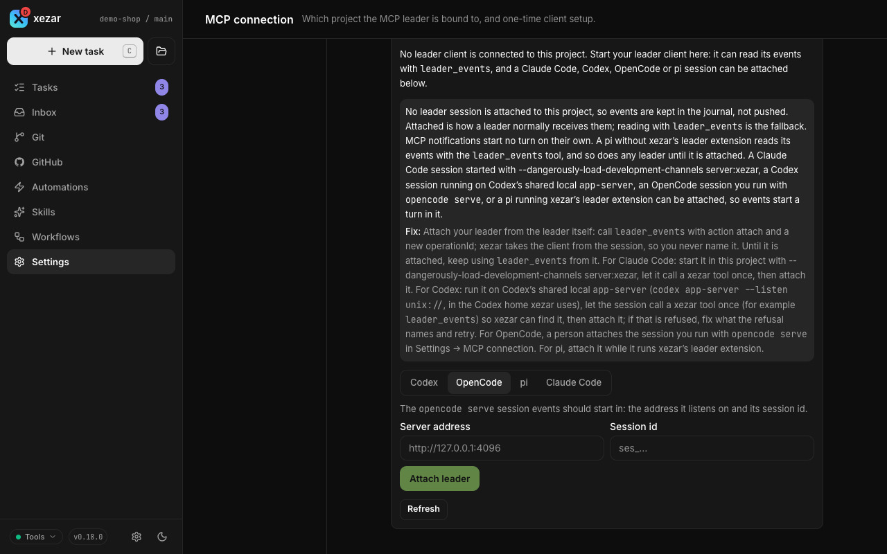

# MCP project leader

Use a project leader when you want a coding-agent session to coordinate tasks through xezar: discover the project, start work, read results and respond to task events. The leader is a session you start in your agent application; `xezar mcp` connects it to the running cockpit on the same machine.

## Before setup: check that the running build carries leader delivery

The published npm package has carried the leader door since 0.15.0: `leader_events` actions `attach` and `status`, and pushed project events. A cockpit running an older build does not have it, so check the running cockpit's capabilities before relying on the steps below:

1. In **Settings → MCP connection**, confirm that **Connection status** and **Attach leader** are present; or connect the MCP bridge, call `health` and `discover_project`, then confirm that `leader_events` accepts action `status`.
2. If `status` is an unknown action, or the settings card has no attachment control, that running build predates 0.15.0 and cannot complete the instructions below. Update to 0.15.0 or later, restart the cockpit and start a new client session.

`discover_project` establishes which project and effective capabilities this MCP session is bound to. `leader_events` `status` is the authoritative check for this session's attachment and push capability.

## To choose the leader's role

The operating rule is **xezar MCP tools for project coordination**. The leader does not drive the cockpit UI or call the HTTP API for ordinary work. It should be attached so project events reach it automatically; `leader_events` is the fallback when it is not attached or needs to catch up. Use `gh` for GitHub facts such as labels, review verdicts and merge state.

A connection is bound to one project, with one owning client at a time. The cockpit remains usable by a person alongside the leader. Configuring MCP, acquiring ownership and attaching for push delivery are distinct: having a config file does not prove the session is connected, and a connected session is not automatically attached.

Use these four labels in setup results; none implies the next one:

| State | Evidence |
| --- | --- |
| **Files prepared** | The chosen client's project snippet exists in a reviewable candidate. It may still need integration, trust, sign-in or an adapter. |
| **Connected** | That client made a real xezar MCP tool call for this project. A generated snippet or process start is not evidence. |
| **Attached** | `leader_events` action `attach` succeeded and `status` says this calling session owns it; for OpenCode, the person-attached target appears in status. |
| **Delivery verified** | While attached, the session received a real pushed event or called `leader_events` action `read` and inspected its replay or gap answer. Old durable cursor numbers alone do not prove the current session. |

Do not summarize these as “ready” while a later row is pending. Report the server's blocker and fix,
an unavailable `gh` or network-dependent package resolution as unavailable, and a read-only home as
no authority to mutate personal configuration. Hosted mode cannot perform local attachment. These
limits do not prevent independent tasks or preparation of a reviewable project-only snippet.

## To run a leader in each client

Configure the chosen client from the project root and start its session there. The cockpit and the client session can start in either order: until the cockpit serves the project, a tool call answers that xezar is not running or that the folder is not a xezar project yet, and the first call after the cockpit is up reaches it with no `/mcp` reconnect – also when the cockpit is started with `--single-project` in a folder that had no xezar state when the session began. The client launches `npx -y @qodeca/xezar mcp` over stdio; the bridge forwards calls to the project's running cockpit. It is not another cockpit server. A cockpit started in another folder also serves a project added to it with **Add project**, once that project has been opened in the cockpit; after the cockpit restarts, open the project again (or start the cockpit in the project folder) before the client calls a tool.

xezar writes `.local/xezar/mcp-connection.json` automatically, but **none of these clients discovers that file**. Each client still needs its own registration below. Use one owning client per project.

The first-contact order for every client is `health` → `discover_project` → attach → `leader_events` `status`. For Claude Code, Codex and pi, attach is this MCP call with a new client-generated `operationId`; xezar derives the client from the calling session:

```json
{ "action": "attach", "operationId": "leader-attach-example-0001" }
```

Then verify attachment and push capability:

```json
{ "action": "status" }
```

`status` reports whether this session is attached and can receive pushes, its delivery cursors and any blocker. Reuse an operation ID only to repeat the same call after a lost answer; an old attach receipt does not attach a new session.

### Claude Code

**Prerequisites.** Run Claude Code and the cockpit on the same machine. Channels need a claude.ai or Anthropic Console API-key login, do not work on Bedrock, Vertex or Foundry, must be enabled by a Team or Enterprise administrator, and are off while `CLAUDE_CODE_DISABLE_NONESSENTIAL_TRAFFIC` is set. Pull with `leader_events` when Channels are unavailable.

**Register `xezar mcp`.** From the project root, local scope keeps the entry outside the repository:

```sh
claude mcp add --scope local xezar -- npx -y @qodeca/xezar mcp
```

If the project should carry the registration, use `claude mcp add --scope project xezar -- npx -y @qodeca/xezar mcp`; that writes project `.mcp.json` and each user must approve it.

**Launch.** Registration is not loaded into an already-running session. Start a **new** session after registering, with the exact per-launch flag:

```sh
claude --dangerously-load-development-channels server:xezar
```

Claude Code shows the development-channel warning on every launch. Accept it only when you intend to let xezar inject project events into this session. If `status` reports `claude-code-channel-not-advertised`, run `/mcp`, reconnect `xezar`, then attach again; restarting Claude Code while the cockpit is running does the same. Without the flag, read the journal instead of expecting a push.

In a project set up by xezar-skills' `xez-onboard-opinionated` skill, start the leader with the
launcher that kit installs at the project root, `scripts/xezar-leader.sh`, or by hand with
`XEZAR_LEADER=1 claude --dangerously-load-development-channels server:xezar`. `XEZAR_LEADER` is that
kit's own variable, not xezar's: its session-start hook loads the leader guide only when
`XEZAR_LEADER=1` is set, so every other Claude Code session in the project stays ordinary.

That kit-onboarded project keeps its model and lane routing in `.xezar/routing.json`; its schema is
`.xezar/routing.schema.json`. The leader reads it with `node .xezar/checks/route.mjs`: `--check`
validates the file, `--rows` lists classification rows without lane data,
`node .xezar/checks/route.mjs <row id>` prints that row's lane order, and `--table` prints a human
view. `--file <path>` is only for onboarding before the first
merge, and labels its output `source=unmerged`. Earlier kit versions used the prose
routing guidance form. The kit's account-limits table records each runner/login pair as `ok`,
`unknown`, or `out`, with its reset time; the leader reads it as described in the kit's routing
guide, and it will supply xezar's agent-quota status when that
status ships.

xezar 0.19.0 is the minimum engine for xezar-skills 3.0.0; projects that must stay on 0.18 stay on xezar-skills 2.1.1.

From 0.19.0, `xezar lease gates --probe` is the supported check for gate serialisation: it prints one
JSON line such as `{"lease":{"gates":true},"slots":1}` and exits 0 when the lease is available.
Non-zero exit or a different output means the installed xezar has no gate lease. Parse that JSON and
ignore unrecognised keys; the human-readable `usage:` text is not a contract.

**First contact.** Call `health`, then `discover_project`. Call `leader_events` with action `attach` and a fresh operation ID, then action `status`. Check `self.attached`, `canPush` and any blocker; this is **attached**, not yet **delivery verified**.

**What a push looks like.** A real event appears in the session as a `<channel source="xezar" …>` message. It identifies xezar as the source, distinguishes the event from user instruction or approval, and names the cursor to acknowledge. This is the delivery evidence; after accounting for it, call `leader_events` action `ack` with that cursor and a fresh operation ID.

**Restart and compaction recovery.** After a cockpit restart, call a real tool, check `status`, attach with a new operation ID, then call `read` with no cursor. After a client restart or context compaction, also begin with `read` and no cursor. Page with `nextCursor` while `hasMore` is true, deduplicate by `eventId`, reconcile current task state, and acknowledge only the processed cursor. Historical counters do not prove current delivery.

**Tips and tricks.** Start the cockpit before the new Claude Code session so the bridge can advertise the channel. A `claude-code-bridge-too-old` blocker means the client must restart the current bridge. A `claude-code-push-unconfirmed` blocker does not mean the row was lost: inspect the session and journal, then acknowledge only after the event has been handled.

### Codex

**Prerequisites.** Run Codex and the cockpit on the same machine, trust the project, and use the same Codex home for xezar and the shared app-server: `CODEX_HOME` when set, otherwise `~/.codex`.

**Register `xezar mcp`.** Add this project-scoped block to `.codex/config.toml`:

```toml
[mcp_servers.xezar]
command = "npx"
args = ["-y", "@qodeca/xezar", "mcp"]
```

Accept Codex's trust prompt for the project. Do not use `codex mcp add` for this registration: it writes machine-scope configuration rather than the project file.

**Launch.** Start the shared local app-server under the same Codex home xezar uses:

```sh
codex app-server --listen unix://
```

Then open the Codex TUI in the project. A plain TUI has joined the shared server in verified cases. If attach reports that the thread is not loaded, or the TUI remains in-process/unknown, reconnect it explicitly:

```sh
codex --remote unix://
```

That `--remote` form is conditional troubleshooting, not a universal launch requirement; evidence includes both a working plain TUI and a profile that needed the explicit remote connection.

**First contact.** From the intended TUI session call `health`, then `discover_project`; this real call lets xezar identify the loaded thread. Call `leader_events` `attach` with a fresh operation ID, then `status`. Follow the exact blocker if xezar reports a different Codex home, an unloaded thread, an open approval/question, or an unknown thread state.

**What a push looks like.** A project event starts a new turn in that existing Codex session. The event text identifies xezar, tells the leader to read current state before acting, and includes the cursor for `leader_events` `ack`. A successful attach or a delivery counter without that current-session turn is not push proof.

**Restart and compaction recovery.** After either side restarts, make a real tool call, check `status`, attach with a new operation ID, and call `read` with no cursor. Page, deduplicate, reconcile and acknowledge as described for Claude Code. Then verify one new started turn; an old loaded-thread or cursor count is not current delivery evidence.

**Tips and tricks.** Start the app-server before the TUI. Do not enter a socket path, port, home or thread ID into xezar; it discovers the calling session and refuses ambiguous or wrong-home targets. When push is blocked, journal reads remain available and do not require reconnecting the TUI to another server.

### pi

**Prerequisites.** pi is not an MCP client by itself. Install the tested adapter version once, and use a globally installed xezar package if you want the exact packaged extension path below:

```sh
pi install npm:pi-mcp-adapter@2.32.1
```

Verify `pi list` includes `npm:pi-mcp-adapter`. On startup in this project, pi should report `MCP: 1 servers connected` (or a higher number when other servers are configured).

**Register `xezar mcp`.** Add this project-scoped configuration to `.pi/mcp.json`:

```json
{
  "settings": { "directTools": true },
  "mcpServers": {
    "xezar": {
      "command": "npx",
      "args": ["-y", "@qodeca/xezar", "mcp"],
      "lifecycle": "keep-alive"
    }
  }
}
```

`directTools` exposes the tools to the model. `keep-alive` connects at startup and retains project ownership while idle; without it the adapter releases an idle bridge after ten minutes.

The adapter reads six files in this order, with later entries winning: `~/.config/mcp/mcp.json`, `~/.agents/mcp.json`, `~/.agents/mcp/mcp.json`, `~/.pi/agent/mcp.json`, project `.mcp.json`, then project `.pi/mcp.json`. Keep the xezar entry in the last file unless you intentionally want a broader scope.

**Launch.** The MCP adapter exposes tools; pushed turns additionally require xezar's packaged leader extension. Load the file from a global xezar installation for one launch:

```sh
pi --extension "$(npm root -g)/@qodeca/xezar/scripts/pi-leader-extension.ts"
```

Or copy that same shipped file to `~/.pi/agent/extensions/` for every project, or to project `.pi/extensions/` for this project only:

```sh
cp "$(npm root -g)/@qodeca/xezar/scripts/pi-leader-extension.ts" ~/.pi/agent/extensions/
# project-only alternative, run from the project root:
cp "$(npm root -g)/@qodeca/xezar/scripts/pi-leader-extension.ts" .pi/extensions/
```

In a running pi, `/reload` rebuilds the extension runtime. Because reload also tears down its socket, attach again afterward with a new operation ID.

**First contact.** Start pi in the project root. Call `health`, `discover_project`, `leader_events` `attach` with a fresh operation ID, then `status`. If pi reports no xezar tools, re-check `pi list`, the startup MCP notice and the six-file precedence before diagnosing attachment.

**What a push looks like.** The extension starts a turn in the existing pi session containing the xezar event and the cursor to acknowledge. Without the extension, no MCP notification can start that turn; use `leader_events` `read` instead.

**Restart and compaction recovery.** After xezar, pi, `/reload`, `/new`, `/resume`, `/fork` or `/clone` rebuilds the runtime, call a real tool, check `status`, attach with a new operation ID, and `read` with no cursor. Page, deduplicate, reconcile and acknowledge before relying on a new push.

**Tips and tricks.** Any pi **you** start in this project with the `keep-alive` entry can hold the project's one leader connection, so exit an unintended owner before switching clients. A pi that xezar starts for a task is not one of them — see "To keep your leader while tasks run in the same folder". If `approveTools` covers a xezar tool, answer the approval in your pi window. The leader extension does not answer it, and a headless driver that does not answer can leave pi waiting indefinitely.

### OpenCode

**Prerequisites.** Run OpenCode and the cockpit on the same machine. Use one loopback `opencode serve` instance for the project; xezar attaches to an existing session and never launches one.

**Register `xezar mcp`.** Add this local server entry to project `opencode.json`:

```json
{
  "$schema": "https://opencode.ai/config.json",
  "mcp": {
    "xezar": {
      "type": "local",
      "command": ["npx", "-y", "@qodeca/xezar", "mcp"],
      "enabled": true
    }
  }
}
```

The file is project scope. The written form is deterministic; `opencode mcp add` is interactive.

**Launch.** Choose an explicit loopback address so the value to enter in xezar is unambiguous, then start the server and pick the session **before** opening a TUI on it — `opencode attach <url>` with no `--session` starts a **new** session, so attaching blind can land the TUI on a session xezar was never told about:

```sh
opencode serve --hostname 127.0.0.1 --port 4096
curl --fail --silent http://127.0.0.1:4096/session
```

OpenCode's [documented server API](https://opencode.ai/docs/server/) says `GET /session` lists that server's sessions. Choose the `id` of the session whose `directory` is the project root. If none exists yet, create one deterministically instead of attaching blind:

```sh
curl --fail --silent -X POST http://127.0.0.1:4096/session
```

Then attach the TUI to that exact session with the CLI's own `--session` flag ([CLI reference](https://opencode.ai/docs/cli/)):

```sh
opencode attach http://127.0.0.1:4096 --session <id>
```

The **Server address** is therefore `http://127.0.0.1:4096` and the **Session id** is the `id` you picked or created. In xezar, a person opens **Settings → MCP connection → Connection status**, chooses OpenCode when the client picker is shown, enters that address and session ID, then chooses **Attach leader**. xezar checks the session exists and refuses one whose directory is another project. If `OPENCODE_SERVER_PASSWORD` is set, the server requires HTTP basic auth on these requests, so a plain `curl` with no credentials fails.

**First contact.** In the intended OpenCode session call `health`, then `discover_project`. OpenCode is the attachment exception: `leader_events` cannot supply its HTTP address, so the person performs the attach in Settings. Back in the OpenCode session, call `leader_events` action `status` to inspect attachment and delivery, then call `read` once to establish the replay path.

**What a push looks like.** xezar submits the event through OpenCode's `prompt_async` route, which starts a turn in the named existing session. The turn identifies xezar, carries only the xezar tools, and names the acknowledgement cursor. A wrong-project, missing or stale session is refused rather than replaced.

**Restart and compaction recovery.** After xezar or `opencode serve` restarts, confirm the address and session still exist, reattach them in Settings, then call `status` and `read` with no cursor in the OpenCode session. After compaction, read, page, deduplicate, reconcile and acknowledge in the same way. Verify one new started turn; the prior person-driven attach is not proof after restart.

**Tips and tricks.** Keep the chosen `serve` port stable so the settings value remains meaningful. If the attach is refused because the session is not found, or status reports it later, open the intended project session and select its new ID; for `wrong-project`, which names the directory the session does belong to, select the session whose `directory` exactly matches the project. An address that does not answer is refused at attach as well, and nothing is attached: restart the server at the recorded loopback address and attach again. Once a leader is attached, a server that stops answering keeps it attached — xezar retains the events and retries. Xezar applies an xezar-tools-only permission map to the attached session, including later messages you type in that session; use another OpenCode session for unrelated work that needs other tools.



## To stop an attachment

Claude Code, Codex and pi can detach their own session through MCP:

```json
{ "action": "stop", "operationId": "leader-stop-example-0001" }
```

Use a new operation ID for each new attach, stop or acknowledgement. `status` takes no operation ID. A person can replace or stop a person-attached OpenCode target from **Settings → MCP connection**.

## To choose among the eleven tools

The [tool registry](../../packages/xezar/src/mcp/tools/index.ts) has ten service tools, plus the bridge's `health` tool: **eleven total**. Use [MCP API](../features/mcp-server/mcp-api.md) for exact arguments, action names and required operation IDs; it is also available in project **Settings → MCP API**.

| Tool | Use it for |
| --- | --- |
| `health` | Check whether the bound project's cockpit is running, and read `cockpitUrl`, the address to give the person, when it is known. |
| `discover_project` | Read project identity, capabilities, limits and available actions, and `cockpit`, the addresses of the pages a person uses, when they are known. |
| `task_read` | Inspect tasks and their history. |
| `task_create` | Create a task with explicit source and execution options; use action `start` with the project's issue-filing skill and `autonomous: false` to start the same approval-required issue draft as **New issue** on the GitHub tab. |
| `execution_control` | Control execution and communicate with a task session. |
| `organise_work` | Organize tasks, including queue and archive operations. |
| `handoff_git` | Supported repository, commit, push, PR and merge operations, subject to their checks. |
| `read_results_evidence` | Read task results, changes and evidence. |
| `project_config` | Read or change supported project configuration, and read the shared settings as effective limits and capabilities. Its most-used reads are in [Actions a leader reaches for often](#actions-a-leader-reaches-for-often). |
| `local_handoff` | Open supported task/project destinations on the xezar host. |
| `leader_events` | Attach or stop this session, check attachment status, read significant project events and acknowledge those handled. |

Read `discover_project` before assuming an action is available. Inspect each mutation's result; requesting a task or operation is not proof that downstream work succeeded.

### Actions a leader reaches for often

Five of them answer questions a leader asks before it dispatches anything — which models it may name, which login a task will run under, and whether this project's setup is complete. The [MCP API](../features/mcp-server/mcp-api.md) has their exact arguments:

| Action | What it answers |
| --- | --- |
| `project_config` `list_models` | Per agent tool, every model id **exactly as that tool's own `--model` flag takes it**, whether the list could be read and, when it could not, why. Narrow it with `provider`, or omit that for every tool. It reads the same list the composer's model picker offers, so a model named from it is one xezar can actually dispatch to. `local` and `vision` appear only where the tool's own data proves them; a missing one means unknown, never "no". |
| `project_config` `get_account` | `accounts` is one row per agent — the account this project's tasks use. `profiles` is every account per agent, with the login the tool finds by itself marked `builtIn` and exactly one marked `selected`: the one tasks really run under. `problems` is every stored account choice that names no account, with its raw handle and a one-line `fix`; tasks still run, on the built-in login. No answer carries a label that looks like an e-mail address, or an account's folder. |
| `project_config` `import_global_accounts` | Copies the accounts of the person's machine-wide xezar setup into this project — the same merge as `xezar accounts import-global`. It only adds accounts the project lacks, never replaces one, answers how many were added and kept but never which, and works only where the project keeps its own setup. It needs an `operationId` and nothing else. |
| `project_config` `check_skill_updates` | What team-skill updates are available. It reports; it does not apply. Updates apply by themselves while skills auto-update is on, which `set_workspace_config` with `skillsAutoUpdate: true` turns on. |
| `discover_project` → `onboarding.globalImport` | In a project that keeps its own setup: whether those accounts were already copied in (`done`, `declined` or `unknown`) and how many could still be (`importable`, a count and never which). The same two facts the Agent accounts pane shows a person. |

`import_global_accounts` is the one that changes something; the rest only read.

### When an action is refused

A refused action answers, on the first call, with what to do instead: the text says `Next step: …` and the answer carries the same sentence as `nextStep`. It is one of three things:

- a tool call you can make yourself, such as `local_handoff` for opening the project in a desktop application;
- a command for the person to run on the machine that runs xezar, such as `xez providers connect <provider>` to sign an agent tool in, or `xez projects add <folder>` to register another project;
- a cockpit page for the person to open, with its address when xezar knows it.

The cockpit's address comes from the MCP only: `discover_project` carries `cockpit` (the project page, and the providers, agent accounts and MCP connection pages), and `health` carries `cockpitUrl`. Both are the running cockpit's real address, and both are left out when it is not known, such as in hosted mode, where the public address is behind a reverse proxy. `GET /api/v1/health` never carries it. You still work through the tools only: an address is for the person.

`project_config` `set_provider_enabled` answers `scope` and `live`. `scope` is `machine` when the switch applies to every project on this machine, and `project` when this project keeps its own setup (single-project mode) and the switch is saved in the project's own settings file, shared with everyone who works on the project. `live` is `true`: the next task sees the change with no restart.

## To recover with `leader_events`

Attached leaders receive pushed events: channel messages for Claude Code, started turns for Codex, OpenCode and pi. If no leader is attached, or delivery is blocked, pull the journal:

```json
{ "action": "read" }
```

Process every event in the page using the returned current task state, then acknowledge that response's `nextCursor` with a client-generated operation ID. Individual events do not carry a cursor:

```json
{
  "action": "ack",
  "cursor": "<nextCursor from the processed page>",
  "operationId": "leader-ack-example-0001"
}
```

Replace the cursor placeholder; use a new operation ID for a new acknowledgement and reuse it only to repeat that same acknowledgement. A read does not acknowledge anything, so unacknowledged events can appear again. If `hasMore` is `true`, read the next page immediately after acknowledging the processed page; otherwise do not poll. Read again on your next connection or when a pushed event names a gap. If the response reports a gap, reconcile the supplied current state and recovery guidance before acknowledging `gap.resumeCursor`. Treat cursors as opaque; another project's cursor is refused.

After a xezar restart, the journal and explicit acknowledgement can survive but the attachment does
not. The per-client restart checklists above restore the progression **files prepared → connected →
attached → delivery verified** without treating old counters as current proof. `task.stalled` is only
an advisory observation and stops nothing. A task completion does not prove a pending reviewer
verdict. Replay is at-least-once within retained durable state, bounded by the retention and page
limits below; a gap is a recovery state, not delivery proof, until its current state has been
reconciled.

## Give the leader a project guide that survives compaction

A leader's session can be cleared, resumed or compacted, and each time it may come back with an
empty conversation. Standing rules and the current state of the work must not depend on the model
remembering them. Give the leader a **project guide**: a short committed document it reloads
automatically, plus a live note it reads from the project's runtime folder.

**What to put in it.** Keep it short — it loads at every start and every compaction, so its size
compounds. Put in the things that change rarely and must not be re-derived: how work is routed,
which checks are mandatory, the merge order, recovery steps after a restart, the decisions only the
owner may make, how to write a task brief, and a short checklist to run before dispatching work.
Cite the source of each rule. Live state — open pull requests, their heads and verdicts, running
tasks, the next action per item — belongs in a separate note that is rewritten as the work moves,
not in the guide.

**Let the client load it.** Claude Code can run a command at session start from the project's own
`.claude/settings.json`. Register a `SessionStart` hook with the matchers
`startup|resume|clear|compact`, pointing at a small script. The script prints one JSON object:

```json
{
  "hookSpecificOutput": {
    "hookEventName": "SessionStart",
    "additionalContext": "…project guide…\n\n…live state note…\n\n…owner decisions…"
  }
}
```

`additionalContext` is one string; put the guide first and the live state last. A hook that prints
nothing changes nothing.

**Guard it so task agents never load it.** A hook committed in the project folder is discovered by
every session started under it, including the sessions xezar starts for tasks — and an isolated
working copy usually lives *inside* the project folder, so a parent-folder walk finds the hook there
too. Make the script print nothing unless it is the leader's own session: detect a task session from
the environment xezar sets, from the working copy's git directory differing from the common git
directory, or from a path under the worktree folder, and stay silent in all of them. Silence is the
safe default; the guard is what makes committing the hook safe.

xezar-skills' own onboarding kit goes one step further: its guard also requires a positive opt-in, a
`XEZAR_LEADER=1` variable set by the launcher it installs (or by hand), so only the session actually started
as the leader loads the guide rather than every session that merely sits outside a task worktree – a
pattern worth copying for a hook of your own.

**When the client has no hook.** Codex and pi do not run a session-start command. Start the guide
with a short first section addressed to those sessions: read this guide and the live note
immediately after every start and every compaction, before dispatching anything. Keep that section
first and imperative — it is the whole fallback.

**Add the recurring checks.** Some checks have to happen on a schedule even when nothing arrives: is
anything waiting on a decision only the leader can make, and has a usage limit reset. That schedule
is session state and does not survive a restart, so list each recurring check with its cadence and
its prompt in the guide, and have the leader re-create what is missing on every start and compaction.
A tick that changes nothing should do nothing, and the checks unblock existing work rather than
starting new work.

## To keep your leader while tasks run in the same folder

A task xezar starts is not the leader, and since 0.16.0 no task can take the leader's place.

Every task xezar starts — Claude Code, Codex, pi or OpenCode — is now started with your `xezar`
MCP entry switched off for that one client. Nothing in your own files changes: xezar never edits
`.mcp.json`, `.pi/mcp.json`, `opencode.json` or any config in your home folder. It passes the
client a one-run instruction to leave that single server alone, and takes it away again when the
task ends.

This matters most when a task runs **in the project folder itself** rather than in its own working
copy (the composer's **Worktree** switch turned off). Before 0.16.0 such a task connected your
`xezar` entry like any other client, and because a `keep-alive` entry connects the moment the
client starts — no prompt, no tool call — the task held the project's one leader slot for as long
as it ran. Your own leader session was then refused with "project occupied" until the task
finished. Tasks that run in their own working copy get the same treatment, so the behaviour no
longer depends on which switch you used.

What stays as it was: every other MCP server your project declares still loads in a task, and a
task's own model still sees those tools. Two details differ per client:

- **Claude Code.** A task now sees only the MCP servers your project's own `.mcp.json` declares.
  Servers you added for yourself in `~/.claude.json` no longer load inside a task — the same rule
  Codex tasks have followed since 0.15.0. Declare a server in the project file to use it in tasks.
- **pi and OpenCode.** A server named `xezar` is always switched off in a task, even if the entry
  lives in a file xezar does not read, so it may appear as "disabled" in that client's server list
  during a task. Give an unrelated server a different name if you want it in tasks.

If a config file cannot be read at all — a syntax error, a permission problem — the task still
starts. It says so once in the task's transcript rather than failing, and for Claude Code it starts
with no project MCP servers until the file is fixed.

## To understand the limits

- The client and cockpit must be on the same machine, and MCP is unavailable in hosted mode. An HTTP URL for a remote cockpit is not an MCP endpoint.
- One client owns the project at a time. There is no **Force takeover** or **Disconnect other client** control. End the owning client normally before connecting another.
- Attachment targets an existing client session. It does not start a leader agent process or establish GitHub authorization.
- A blocked or unconfirmed push is not proof that the model acted. Read the status and journal, then verify resulting task state.
- A xezar-launched task is never the leader, on any backend: Codex's per-thread isolation disables xezar's bridge, home MCP servers, plugins and apps, and Claude Code, pi and OpenCode tasks have their own seam that switches the `xezar` entry off for that one client. Configure the leader in your own client session. See "To keep your leader while tasks run in the same folder".
- Setup commands here match the shipped settings guidance. Vendor-client behavior has not been newly live-tested for this guide; the pi adapter version is a recorded compatibility point, and Codex's explicit `--remote unix://` path remains conditional because the recorded evidence is mixed.

## Related settings / env / config

- Project **Settings → MCP connection**: setup, status and attachment; **MCP API**: read-only tool reference.
- [CLI reference](12-cli-reference.md#to-connect-an-agent-mcp): `xezar mcp` itself, and the terminal lines that carry the same event names a leader receives (`task.done`, `task.stalled`, `verdict.posted` and the rest).
- [MCP API reference](../features/mcp-server/mcp-api.md), [connection UI source](../../packages/web/src/routes/settings/mcp-connection-section.tsx), [leader control source](../../packages/web/src/routes/settings/mcp-leader-control.tsx).
- [Environment contract](../../.env.example): `XEZ_HOME`, `CODEX_HOME` and hosted-mode settings. Client config belongs to the agent; xezar runtime connection files belong under `.local/xezar/`.

Next: [Remote access](14-remote-access.md)

Describes xezar 0.18.0.
