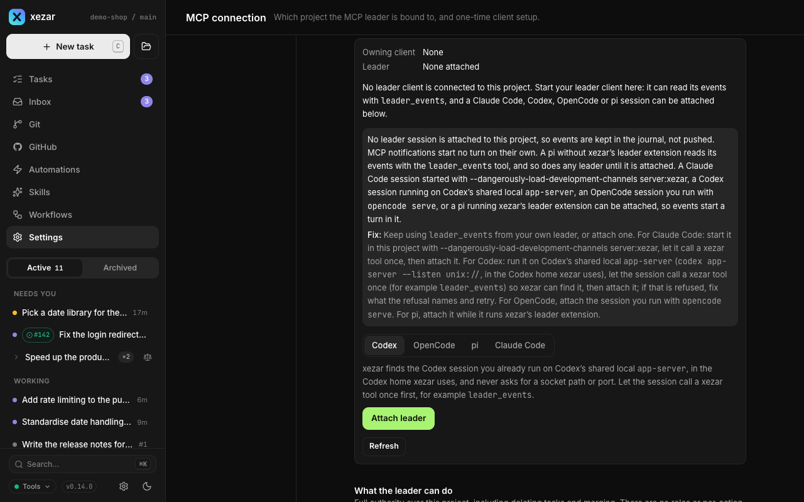

# MCP project leader

Use a project leader when you want a coding-agent session to coordinate tasks through xezar: discover the project, start work, read results and respond to task events. The leader is a session you start in your agent application; `xezar mcp` connects it to the running cockpit on the same machine.

## To choose the leader's role

The operating rule is **xezar MCP tools for project coordination**. The leader does not drive the cockpit UI or call the HTTP API for ordinary work. It should be attached so project events reach it automatically; `leader_events` is the fallback when it is not attached or needs to catch up. Use `gh` for GitHub facts such as labels, review verdicts and merge state.

A connection is bound to one project, with one owning client at a time. The cockpit remains usable by a person alongside the leader. Configuring MCP, acquiring ownership and attaching for push delivery are distinct: having a config file does not prove the session is connected, and a connected session is not automatically attached.

## To start `xezar mcp` from your agent

Start the local cockpit first. Then configure the agent below from the project root and start its session there. The client launches `npx -y @qodeca/xezar mcp` over stdio; it forwards calls to the project's running service. Do not start it as another cockpit server.

xezar writes `.local/xezar/mcp-connection.json` automatically, but **none of these clients discovers that file**. The following client configuration is still required. The same setup is shown in project **Settings → MCP connection**.

### Claude Code

Register the bridge once from the project root:

```sh
claude mcp add --scope local xezar -- npx -y @qodeca/xezar mcp
```

Local scope writes outside the repository. The project-scope alternative writes `.mcp.json`, requires per-user approval and is also read by pi's MCP adapter.

For event delivery, start the leader with:

```sh
claude --dangerously-load-development-channels server:xezar
```

Accept the development-channel warning only if you intend to allow xezar to inject events into that session. Let the session call a xezar tool once, then choose **Attach leader** in Connection status. The setup card includes **Claude Code recovery guidance** for channel availability and unacknowledged delivery. Without the channel flag, use `leader_events`.

### Codex

Add this to the project's `.codex/config.toml`:

```toml
[mcp_servers.xezar]
command = "npx"
args = ["-y", "@qodeca/xezar", "mcp"]
```

Trust the project in Codex; untrusted project configuration is not loaded. Prefer this project-scoped setup to `codex mcp add`, which writes a machine-scope entry.

For push delivery, run Codex's shared local app-server under the same Codex home xezar uses (`CODEX_HOME`, otherwise `~/.codex`):

```sh
codex app-server --listen unix://
```

Open your Codex TUI session in the project, let it call a xezar tool once, then choose **Attach leader**. xezar discovers the session; the control does not ask you for a socket path or port. If refused, follow the reported blocker and **Fix:** guidance.

### OpenCode

Add this local server entry to project `opencode.json`:

```json
{
  "$schema": "https://opencode.ai/config.json",
  "mcp": {
    "xezar": {
      "type": "local",
      "command": ["npx", "-y", "@qodeca/xezar", "mcp"],
      "enabled": true
    }
  }
}
```

For push delivery, use the session you already run through `opencode serve`. In Connection status choose OpenCode when the client picker is shown, enter **Server address** (`baseUrl`) and **Session id** (`sessionId`) for that session, then choose **Attach leader**. xezar starts turns in that session; attaching does not launch a replacement agent for you.

### pi

Install the MCP adapter once. The setup card records 2.32.1 as the tested adapter version:

```sh
pi install npm:pi-mcp-adapter@2.32.1
```

Add the following to the project's `.pi/mcp.json`:

```json
{
  "settings": { "directTools": true },
  "mcpServers": {
    "xezar": {
      "command": "npx",
      "args": ["-y", "@qodeca/xezar", "mcp"],
      "lifecycle": "keep-alive"
    }
  }
}
```

`directTools` exposes the tools to the model. `keep-alive` connects at startup and holds the connection while idle; without it the adapter gives up the project after ten idle minutes. Any pi started in this folder can therefore occupy the project's leader connection, including an in-place pi task. Other clients must wait for that pi to exit. Keep the entry project-local.

For push delivery, also load xezar's [pi leader extension](../../packages/xezar/scripts/pi-leader-extension.ts). Substitute the real path to the extension in your xezar installation:

```sh
pi --extension /path/to/xezar/scripts/pi-leader-extension.ts
```

Alternatively, place the extension in project `.pi/extensions/` or global `~/.pi/agent/extensions/`. Then choose **Attach leader** for pi. The MCP adapter exposes tools; the leader extension supplies the event-delivery path. Without the extension, read events with `leader_events`.

If you put xezar tools behind the adapter's `approveTools`, answer approval prompts in your pi window. The leader extension does not answer them. A headless pi driven by another program can wait indefinitely if that program never answers.

## To inspect Settings → MCP connection and attach

Open this section for the project the leader should own. It shows **Bound project**, **Local-only scope**, the four **One-time setup** cards and **Connection status**. The status names **Owning client**, **Leader**, any blocker and its **Fix:**. **Refresh** rereads status; a failed refresh is explicitly last-known status.

Use **Attach leader** after the client has connected. The control derives the client from ownership/attachment when known; otherwise it offers a client picker. OpenCode additionally needs the server address and session ID. Attachment is the current setup exception to the MCP-only operating rule: the person uses this cockpit control. `leader_events` itself has only `read` and `ack` actions.



## To choose among the eleven tools

The [tool registry](../../packages/xezar/src/mcp/tools/index.ts) has ten service tools, plus the bridge's `health` tool: **eleven total**. Use [MCP API](../features/mcp-server/mcp-api.md) for exact arguments, action names and required operation IDs; it is also available in project **Settings → MCP API**.

| Tool | Use it for |
| --- | --- |
| `health` | Check whether the bound project's cockpit is running. |
| `discover_project` | Read project identity, capabilities, limits and available actions. |
| `task_read` | Inspect tasks and their history. |
| `task_create` | Create a task with explicit source and execution options. |
| `execution_control` | Control execution and communicate with a task session. |
| `organise_work` | Organize tasks, including queue and archive operations. |
| `handoff_git` | Supported repository, commit, push, PR and merge operations, subject to their checks. |
| `read_results_evidence` | Read task results, changes and evidence. |
| `project_config` | Read or change supported project configuration. |
| `local_handoff` | Open supported task/project destinations on the xezar host. |
| `leader_events` | Read significant project events and acknowledge those handled. |

Read `discover_project` before assuming an action is available. Inspect each mutation's result; requesting a task or operation is not proof that downstream work succeeded.

## To recover with `leader_events`

Attached leaders receive pushed events: channel messages for Claude Code, started turns for Codex, OpenCode and pi. If no leader is attached, or delivery is blocked, pull the journal:

```json
{ "action": "read" }
```

Read the returned events and current task state, act on them, then acknowledge the last handled event's returned cursor with a client-generated operation ID:

```json
{
  "action": "ack",
  "cursor": "<returned cursor>",
  "operationId": "leader-ack-example-0001"
}
```

Replace the cursor placeholder; use a new operation ID for a new acknowledgement and reuse it only to repeat that same acknowledgement. A read does not acknowledge anything, so unacknowledged events can appear again. If the response reports a gap, reconcile the supplied current state and recovery guidance before acknowledging its `resumeCursor`. Treat cursors as opaque; another project's cursor is refused.

## To understand the limits

- The client and cockpit must be on the same machine, and MCP is unavailable in hosted mode. An HTTP URL for a remote cockpit is not an MCP endpoint.
- One client owns the project at a time. There is no **Force takeover** or **Disconnect other client** control. End the owning client normally before connecting another.
- Attachment targets an existing client session. It does not start a leader agent process or establish GitHub authorization.
- A blocked or unconfirmed push is not proof that the model acted. Read the status and journal, then verify resulting task state.
- A xezar-launched Codex task is not the leader: its per-thread isolation disables xezar's bridge, home MCP servers, plugins and apps. Configure the leader in your own client session.
- Setup commands here match the shipped settings guidance. Vendor-client behavior has not been newly live-tested for this guide; the pi adapter version above is a recorded compatibility point.

## Related settings / env / config

- Project **Settings → MCP connection**: setup, status and attachment; **MCP API**: read-only tool reference.
- [MCP API reference](../features/mcp-server/mcp-api.md), [connection UI source](../../packages/web/src/routes/settings/mcp-connection-section.tsx), [leader control source](../../packages/web/src/routes/settings/mcp-leader-control.tsx).
- [Environment contract](../../.env.example): `XEZ_HOME`, `CODEX_HOME` and hosted-mode settings. Client config belongs to the agent; xezar runtime connection files belong under `.local/xezar/`.

Describes xezar 0.15.0.
